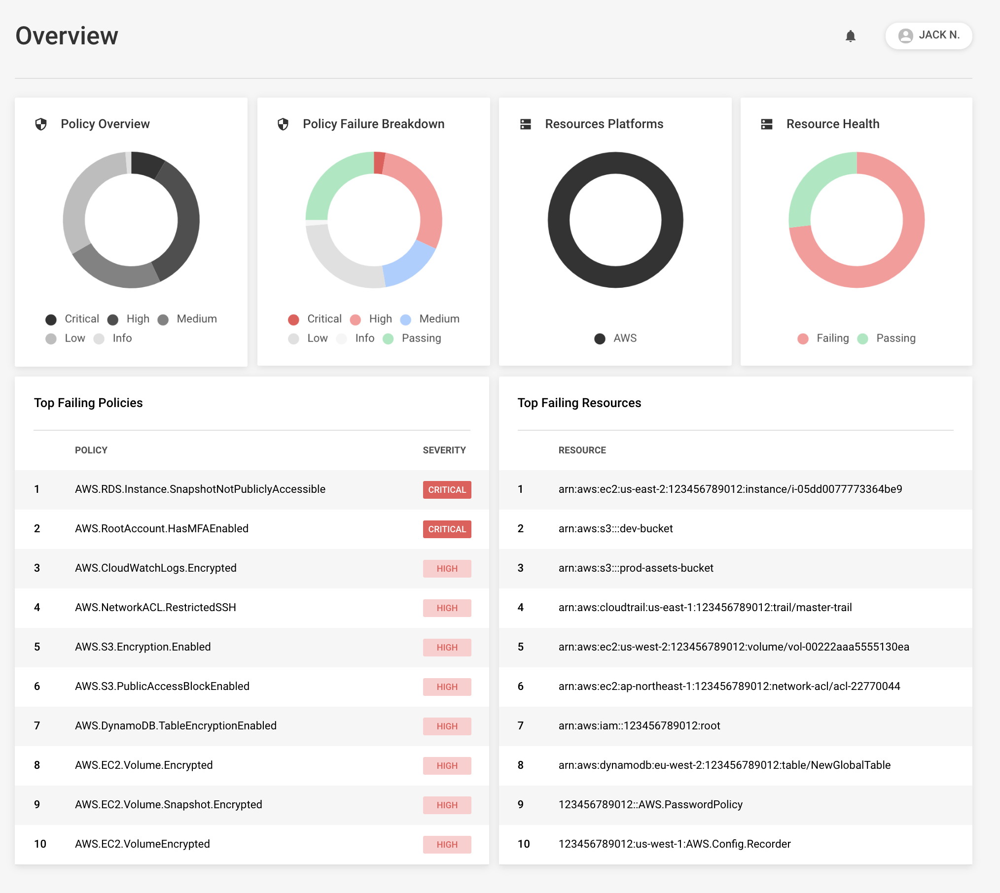
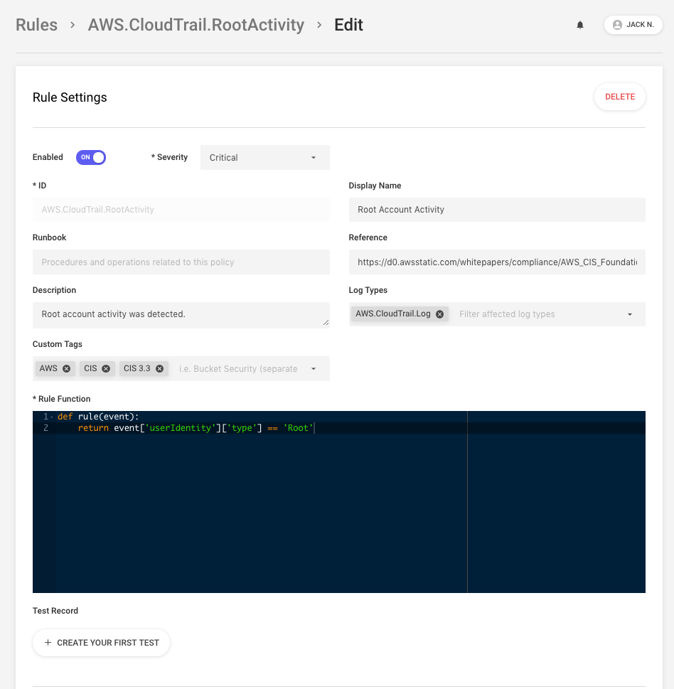
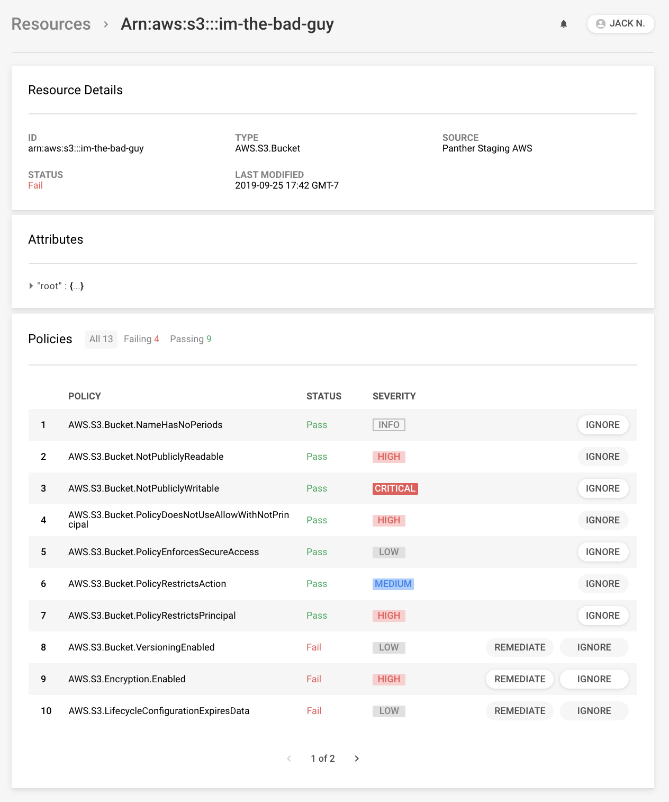

  

  <b>A Cloud-Native SIEM for the Modern Security Team</b>

  <a href="https://docs.runpanther.io">Documentation</a> |
  <a href="https://docs.runpanther.io/quick-start">Quick Start</a> |
  <a href="https://blog.runpanther.io">Blog</a>

  
  
  
  

---

## About Us

We are a San Francisco based [startup](https://www.crunchbase.com/organization/panther-labs) comprised of security engineers who have spent years building large-scale detection and response for cloud-first companies including Airbnb, Amazon, Riverbed, and more. Panther was founded by the core architect of [StreamAlert](https://github.com/airbnb/streamalert/), a cloud-native solution for automated log analysis open-sourced by Airbnb.

Panther is the next step for security teams who need a modern alternative to traditional SIEMs. We designed Panther for massive scale, with a rich and intuitive user experience, in-browser Python rule editing, first-class AWS support, and more.

Our mission is to provide an open platform to effectively protect businesses from cybersecurity threats.

## Use Cases

Panther is the destination for all security data to enable threat detection, compliance, historical search, and security investigations. Panther's core features include:

- **[Log Analysis](https://runpanther.io/log-analysis):** Real-time detection of suspicious activity with [Python rules](https://github.com/panther-labs/panther-analysis/tree/master/analysis/rules)
- **[Compliance](https://runpanther.io/compliance/):** Real-time monitoring and enforcement of AWS infrastructure best practices with [Python policies](https://github.com/panther-labs/panther-analysis/tree/master/analysis/policies)
- **Alerting:** Send notifications to your team when new issues are identified
- **Automatic Remediation:** Correct insecure infrastructure as soon as possible

Panther is designed to provide flexible detection logic, secure and scalable infrastructure run within your AWS cloud, support for common security tooling, and automation for painless deployments.

_NOTE: Panther is currently in beta._

## Deployment

Follow our [Quick Start Guide](https://docs.runpanther.io/quick-start) to deploy Panther to your AWS account in a matter of minutes!

## Screenshots

<i>Compliance Overview</i>

 

<i>Rules Editor</i>

 

<i>Resource Viewer</i>

 

## Contributing

We welcome all contributions! Please read the [contributing guidelines](https://github.com/panther-labs/panther/blob/master/docs/CONTRIBUTING.md) before submitting pull requests.

## License

Panther is dual-licensed under the AGPLv3 and Apache-2.0 [licenses](https://github.com/panther-labs/panther/blob/master/LICENSE).

#### FOSSA

