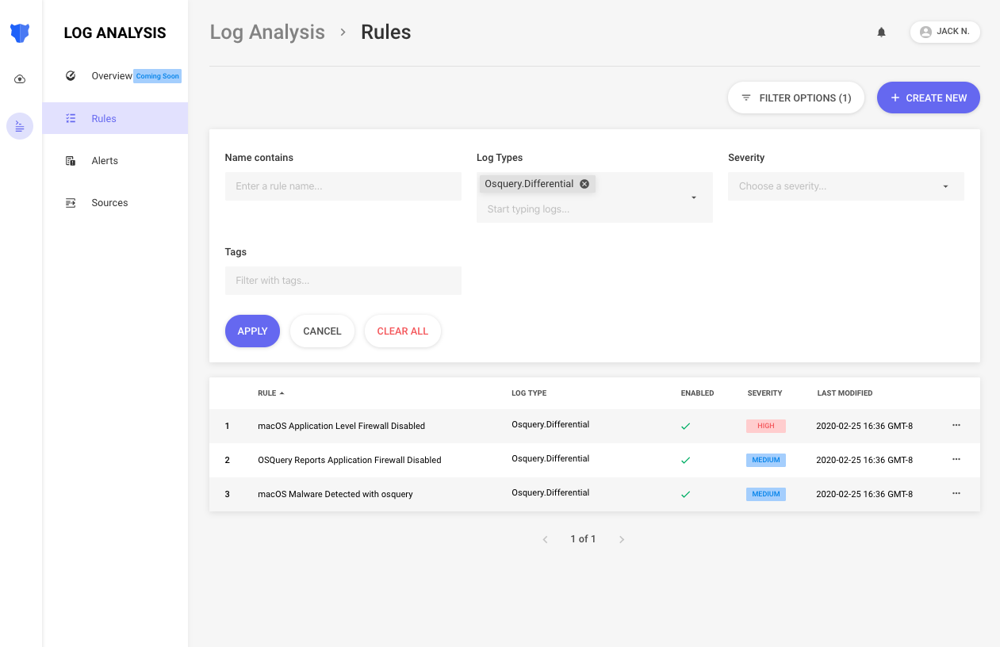
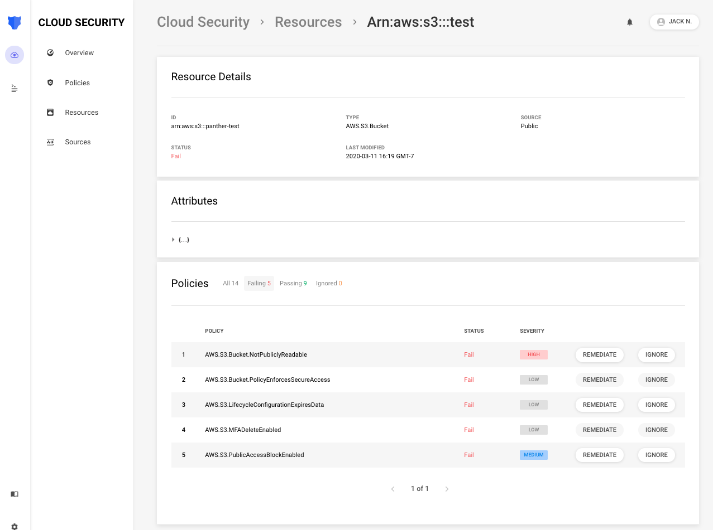

<p align="center">
  <a href="https://www.runpanther.io"></a>
</p>

<p align="center">
  <h3 align="center">A Cloud-Native SIEM for the Modern Security Team</h3>
</p>

<p align="center">
  <a href="https://docs.runpanther.io/quick-start">Quick Start</a> |
  <a href="https://docs.runpanther.io">Documentation</a> |
  <a href="https://blog.runpanther.io">Blog</a> |
  <a href="https://slack.runpanther.io/">Chat with us on Slack!</a>
</p>

<p align="center">
  <!-- ALL-CONTRIBUTORS-BADGE:START - Do not remove or modify this section -->
<a href="#contributors"></a>
<!-- ALL-CONTRIBUTORS-BADGE:END -->
  <a href="https://panther-labs-oss-slackin.herokuapp.com/"></a>
  <a href="https://circleci.com/gh/panther-labs/panther"></a>
  <a href="https://app.fossa.com/projects/git%2Bgithub.com%2Fpanther-labs%2Fpanther?ref=badge_shield" alt="FOSSA Status"></a>
  <a href="https://cla-assistant.io/panther-labs/panther" alt="CLA Assistant"></a>
  <a href="https://magefile.org"></a>
</p>

<p align="center">
  Panther is a platform for detecting threats with log data, improving cloud security posture, and conducting investigations.
</p>

## Use Cases

Security teams can use Panther for:

|         Use Case         | Description                                                                               |
| :----------------------: | ----------------------------------------------------------------------------------------- |
|  Continuous Monitoring   | Analyze logs in real-time and identify suspicious activity that could indicate a breach   |
|       Alert Triage       | Pivot across all of your security data to understand the full context of an alert         |
|      Searching IOCs      | Quickly search for matches against IOCs using standardized data fields                    |
| Securing Cloud Resources | Identify misconfigurations, achieve compliance, and model security best practices in code |

## Deployment

Follow our [Quick Start Guide](https://docs.runpanther.io/quick-start) to deploy Panther in your AWS account in a matter of minutes!

Use our [Tutorials](https://github.com/panther-labs/tutorials) to learn about security logging and data ingestion.

Panther uses Python for analysis, and each deployment is pre-installed with [150+ open source detections](https://github.com/panther-labs/panther-analysis).

## Log Analysis

Panther uses Python3 [rules](https://docs.runpanther.io/log-analysis/rules) to analyze logs from [popular security tools](https://docs.runpanther.io/log-analysis/supported-logs) such as [osquery](https://github.com/osquery/osquery) and [OSSEC](https://github.com/ossec/ossec-hids).

The example below identifies malware on macOS with the `osx-attacks` query pack:

```python
from fnmatch import fnmatch

APPROVED_PATHS = {'/System/*', '/usr/*', '/bin/*', '/sbin/*', '/var/*'}


def rule(event):
    if 'osx-attacks' not in event.get('name'):
      return False

    if event.get('action') != 'added':
        return False

    process_path = event.get('columns', {}).get('path')
    # Send an alert if the process is running outside of any approved paths
    return not any([fnmatch(process_path, p) for p in APPROVED_PATHS])


def title(event):
    # Show the query name that caused the alert
    return 'Malware [{}] detected via osquery'.format(event.get('name'))


def dedup(event):
    # Group similar infections in the fleet
    return event.get('name')
```

If this rule returns `True`, an alert will dispatch to your team based on the defined severity.

## Cloud Security

Panther also supports analyzing cloud [resources](https://docs.runpanther.io/policies/resources) with [policies](https://docs.runpanther.io/policies/policies). This can be used to detect vulnerable infrastructure along with modeling security best practices:

```python
REGIONS_REQUIRED = {'us-east-1'}


def policy(resource):
    regions_enabled = [detector.split(':')[1] for detector in resource['Detectors']]
    for region in REGIONS_REQUIRED:
        if region not in regions_enabled:
            return False

    return True
```

Returning `True` means that a resource is compliant, and returning `False` will `Fail` the policy and trigger an alert.

## Screenshots


<p align="center"><i>Rule Search:</i> Show running detections</p>


<p align="center"><i>Rule Editor:</i> Write and test Python detections in the UI</p>


<p align="center"><i>Alert Viewer:</i> Triage generated alerts</p>


<p align="center"><i>Resource Viewer:</i> View attributes and policy statuses</p>

## About Us

### Team

We are a San Francisco based [startup](https://www.crunchbase.com/organization/panther-labs) comprising security practitioners who have spent years building large-scale detection and response capabilities for companies such as Amazon and Airbnb. Panther was founded by the core architect of [StreamAlert](https://github.com/airbnb/streamalert/), a cloud-native solution for automated log analysis open-sourced by Airbnb.

### Why Panther?

It's no longer feasible to find the needle in the security-log-haystack _manually_. Many teams struggle to use traditional SIEMs due to their high costs, overhead, and inability to scale. Panther was built from the ground up to leverage the elasticity of cloud services and provide a highly scalable, performant, and flexible security solution at a much lower cost.

## Contributing

We welcome all contributions! Please read the contributing [guidelines](https://github.com/panther-labs/panther/blob/master/docs/CONTRIBUTING.md) before submitting pull requests.

## License

Panther source code is licensed under [AGPLv3](https://github.com/panther-labs/panther/blob/master/LICENSE).

### FOSSA Status

[](https://app.fossa.com/projects/git%2Bgithub.com%2Fpanther-labs%2Fpanther?ref=badge_large)

## Contributors ✨

Thanks goes to these wonderful people ([emoji key](https://allcontributors.org/docs/en/emoji-key)):

<!-- ALL-CONTRIBUTORS-LIST:START - Do not remove or modify this section -->
<!-- prettier-ignore-start -->
<!-- markdownlint-disable -->
<table>
  <tr>
    <td align="center"><a href="https://aggelos.dev"><br /><sub><b>Aggelos Arvanitakis</b></sub></a><br /><a href="https://github.com/panther-labs/panther/commits?author=3nvi" title="Code">💻</a> <a href="https://github.com/panther-labs/panther/commits?author=3nvi" title="Documentation">📖</a> <a href="#design-3nvi" title="Design">🎨</a> <a href="https://github.com/panther-labs/panther/issues?q=author%3A3nvi" title="Bug reports">🐛</a> <a href="#infra-3nvi" title="Infrastructure (Hosting, Build-Tools, etc)">🚇</a></td>
    <td align="center"><a href="https://www.linkedin.com/in/austinbyers/"><br /><sub><b>Austin Byers</b></sub></a><br /><a href="https://github.com/panther-labs/panther/commits?author=austinbyers" title="Code">💻</a> <a href="https://github.com/panther-labs/panther/commits?author=austinbyers" title="Documentation">📖</a> <a href="#security-austinbyers" title="Security">🛡️</a> <a href="https://github.com/panther-labs/panther/issues?q=author%3Aaustinbyers" title="Bug reports">🐛</a> <a href="#infra-austinbyers" title="Infrastructure (Hosting, Build-Tools, etc)">🚇</a></td>
    <td align="center"><a href="https://github.com/nhakmiller"><br /><sub><b>Nick</b></sub></a><br /><a href="https://github.com/panther-labs/panther/commits?author=nhakmiller" title="Code">💻</a> <a href="https://github.com/panther-labs/panther/commits?author=nhakmiller" title="Documentation">📖</a> <a href="#security-nhakmiller" title="Security">🛡️</a> <a href="https://github.com/panther-labs/panther/issues?q=author%3Anhakmiller" title="Bug reports">🐛</a> <a href="#infra-nhakmiller" title="Infrastructure (Hosting, Build-Tools, etc)">🚇</a></td>
    <td align="center"><a href="https://github.com/kostaspap"><br /><sub><b>Kostas Papageorgiou</b></sub></a><br /><a href="https://github.com/panther-labs/panther/commits?author=kostaspap" title="Code">💻</a> <a href="#security-kostaspap" title="Security">🛡️</a> <a href="https://github.com/panther-labs/panther/issues?q=author%3Akostaspap" title="Bug reports">🐛</a> <a href="#infra-kostaspap" title="Infrastructure (Hosting, Build-Tools, etc)">🚇</a></td>
    <td align="center"><a href="https://github.com/drixta"><br /><sub><b>Quan Pham</b></sub></a><br /><a href="https://github.com/panther-labs/panther/commits?author=drixta" title="Code">💻</a></td>
    <td align="center"><a href="https://github.com/alexmylonas"><br /><sub><b>Alex Mylonas</b></sub></a><br /><a href="https://github.com/panther-labs/panther/commits?author=alexmylonas" title="Code">💻</a> <a href="https://github.com/panther-labs/panther/issues?q=author%3Aalexmylonas" title="Bug reports">🐛</a></td>
    <td align="center"><a href="https://github.com/rleighton"><br /><sub><b>Russell Leighton</b></sub></a><br /><a href="https://github.com/panther-labs/panther/commits?author=rleighton" title="Code">💻</a> <a href="#security-rleighton" title="Security">🛡️</a> <a href="https://github.com/panther-labs/panther/issues?q=author%3Arleighton" title="Bug reports">🐛</a> <a href="#infra-rleighton" title="Infrastructure (Hosting, Build-Tools, etc)">🚇</a></td>
  </tr>
  <tr>
    <td align="center"><a href="https://github.com/sugandhalahoti"><br /><sub><b>Sugandha</b></sub></a><br /><a href="https://github.com/panther-labs/panther/commits?author=sugandhalahoti" title="Documentation">📖</a></td>
    <td align="center"><a href="https://github.com/kartikeypan"><br /><sub><b>Kartikey Pandey</b></sub></a><br /><a href="https://github.com/panther-labs/panther/commits?author=kartikeypan" title="Documentation">📖</a></td>
    <td align="center"><a href="https://github.com/stoggi"><br /><sub><b>Jeremy Stott</b></sub></a><br /><a href="https://github.com/panther-labs/panther/commits?author=stoggi" title="Code">💻</a> <a href="#security-stoggi" title="Security">🛡️</a> <a href="#infra-stoggi" title="Infrastructure (Hosting, Build-Tools, etc)">🚇</a> <a href="#ideas-stoggi" title="Ideas, Planning, & Feedback">🤔</a></td>
    <td align="center"><a href="https://www.twitter.com/jack_naglieri"><br /><sub><b>Jack Naglieri</b></sub></a><br /><a href="https://github.com/panther-labs/panther/commits?author=jacknagz" title="Code">💻</a> <a href="https://github.com/panther-labs/panther/commits?author=jacknagz" title="Documentation">📖</a> <a href="#security-jacknagz" title="Security">🛡️</a> <a href="#content-jacknagz" title="Content">🖋</a> <a href="#ideas-jacknagz" title="Ideas, Planning, & Feedback">🤔</a> <a href="#projectManagement-jacknagz" title="Project Management">📆</a></td>
    <td align="center"><a href="http://www.improbable.io"><br /><sub><b>Gavin</b></sub></a><br /><a href="https://github.com/panther-labs/panther/commits?author=gavinelder" title="Code">💻</a> <a href="#security-gavinelder" title="Security">🛡️</a> <a href="#infra-gavinelder" title="Infrastructure (Hosting, Build-Tools, etc)">🚇</a> <a href="#ideas-gavinelder" title="Ideas, Planning, & Feedback">🤔</a></td>
    <td align="center"><a href="https://github.com/Ryxias"><br /><sub><b>Ryxias</b></sub></a><br /><a href="https://github.com/panther-labs/panther/commits?author=Ryxias" title="Documentation">📖</a></td>
    <td align="center"><a href="https://github.com/sardev08"><br /><sub><b>Sargon Sada</b></sub></a><br /><a href="https://github.com/panther-labs/panther/commits?author=sardev08" title="Documentation">📖</a> <a href="https://github.com/panther-labs/panther/commits?author=sardev08" title="Code">💻</a></td>
  </tr>
  <tr>
    <td align="center"><a href="http://sergeax.ru/"><br /><sub><b>Sergey Aksenov</b></sub></a><br /><a href="https://github.com/panther-labs/panther/commits?author=SergeAx" title="Documentation">📖</a></td>
    <td align="center"><a href="https://github.com/glerb"><br /><sub><b>Patrick Hagan</b></sub></a><br /><a href="#infra-glerb" title="Infrastructure (Hosting, Build-Tools, etc)">🚇</a></td>
    <td align="center"><a href="https://github.com/alxarch"><br /><sub><b>Alexandros Sigalas</b></sub></a><br /><a href="https://github.com/panther-labs/panther/commits?author=alxarch" title="Code">💻</a> <a href="#security-alxarch" title="Security">🛡️</a></td>
  </tr>
</table>

<!-- markdownlint-enable -->
<!-- prettier-ignore-end -->

<!-- ALL-CONTRIBUTORS-LIST:END -->

This project follows the [all-contributors](https://github.com/all-contributors/all-contributors) specification. Contributions of any kind welcome!
