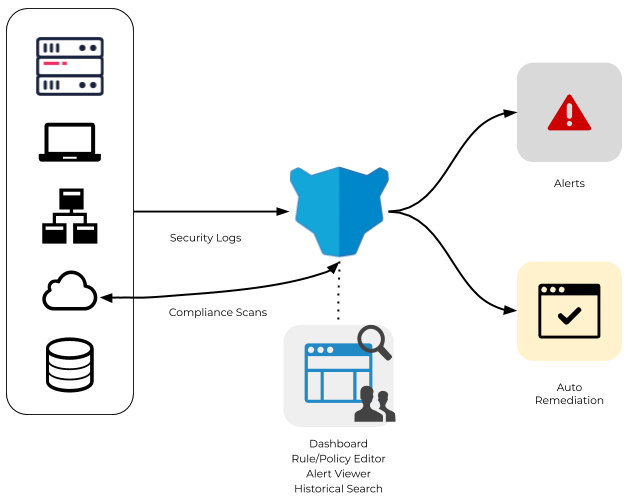
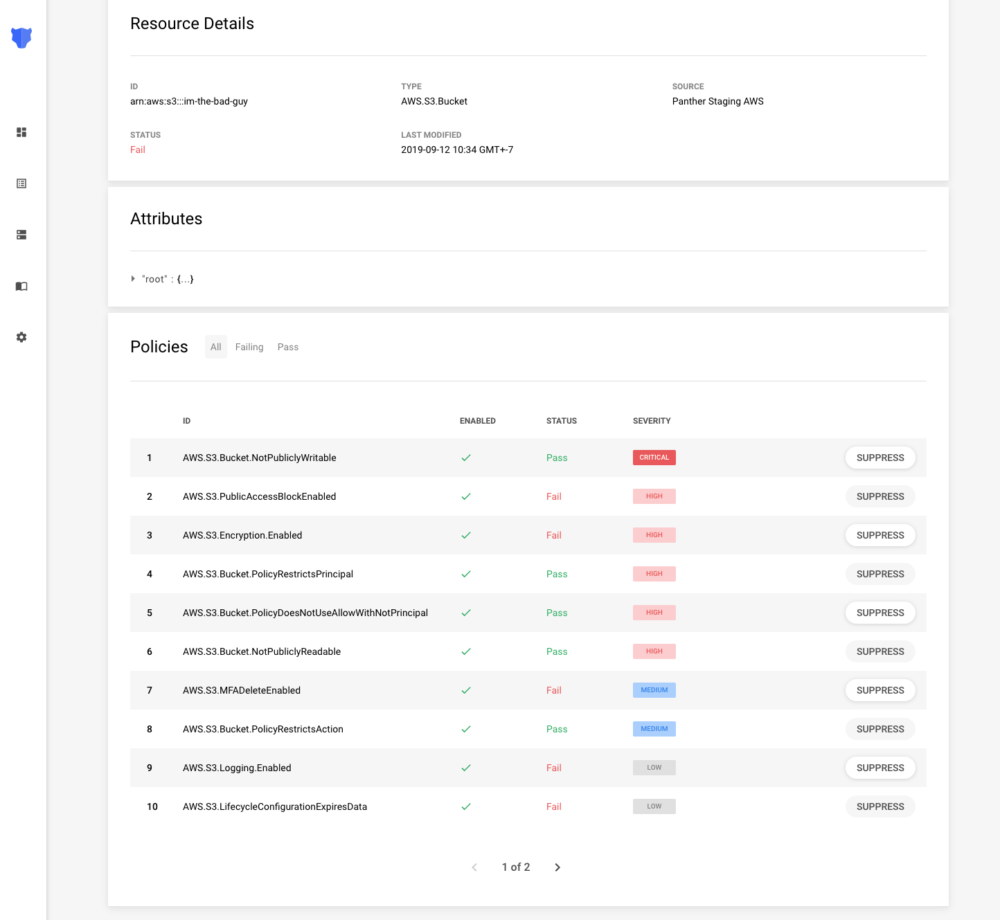
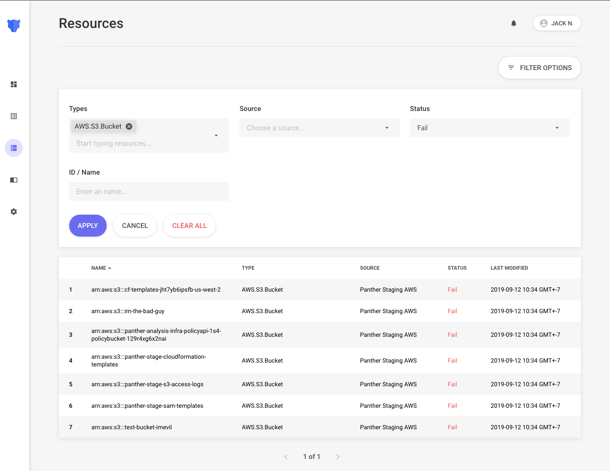

# Home

## What is Panther

Panther is a powerful, open-source, cloud-native SIEM designed to be:

- **Flexible:** Python-based detections and alerting support for PagerDuty, Slack, MS Teams, and more
- **Scalable:** Built on serverless technologies for cost and operational efficiency at scale
- **Fast**: Near real-time rules analysis, alerting, and automatic remediation
- **Integrated:** Analyze both security logs and cloud resources for total visibility
- **Automated:** Fast and simple deployments with AWS CloudFormation
- **Secure:** Least-privilege and encrypted infrastructure that you control

Panther's use-cases include:

- **Log Analysis:** Centralize and analyze log data with Rules for threats and suspicious activity
- **Incident Response:** Perform historical queries with SQL over long-term data for analytics, log correlation, and forensics.
- **Cloud Compliance:** Detect misconfigured cloud infrastructure and enforce best practices.
- **Auto Remediation:** Automatically correct non-compliance infrastructure

The following diagram offers a high-level overview of Panther's architecture:

### Log Analysis

Panther offers an intuitive way to detect suspicious activity by using **Rules**.

Each Rule evaluates to a given log type, and contains metadata to help analysts understand its purpose along with steps on how to respond.

Python code can be written and tested in the browser to analyze logs:

### Compliance

Panther also offers a feature to detect misconfigured AWS resources.

Each entity within an AWS account is defined as a **Resource**. Each Resource has a set of attributes that can be referenced in a Policy. The following screenshot shows how Panther lets you monitor all your Resources, Attributes, and Policies from a single pane of glass:

You can also easily search your **Resources** by using filters such as Type, Source, Status, or Name:

### Getting Started

To get setup with Panther, continue with the Quick Start on the next page.
