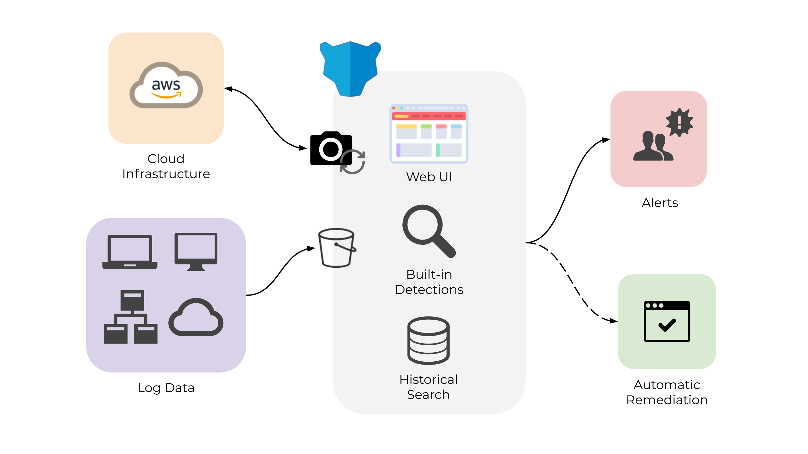

# Home

## What is Panther

Panther is a powerful, open-source, cloud-native SIEM designed to be:

- **Scalable:** Built on serverless technologies for cost and operational efficiency at scale
- **Fast**: Near real-time rules analysis, alerting, and remediation
- **Flexible:** Python-based detections and alerting support for PagerDuty, Slack, MS Teams, and more
- **Integrated:** Reduce the amount of tools needed to run your security team
- **Automated:** Stop threat hunting manually and quickly deploy with infrastructure as code
- **Secure:** Least-privilege and encrypted infrastructure that you control

Panther's use-cases include:

- **Log Analysis:** Centralize and analyze log data with Rules for threats and suspicious activity
- **Incident Response:** Perform historical queries with SQL over long-term data for analytics, log correlation, and forensics
- **Cloud Security:** Detect misconfigured cloud infrastructure and enforce best practices
- **Auto Remediation:** Automatically correct non-compliance infrastructure

The following diagram offers a high-level overview of Panther's architecture:

### Log Analysis

Panther offers an intuitive way to detect suspicious activity by using **Rules**.

Each Rule evaluates to a given log type and contains metadata to help analysts understand its purpose and how to respond.

Python code can be written and tested in the browser to analyze logs:

### Cloud Security

Panther also offers a feature to detect misconfigured AWS resources.

Each entity within an AWS account is defined as a **Resource**. Each Resource has a set of attributes that can be referenced in a Policy. The following screenshot shows how Panther lets you monitor all your Resources, Attributes, and Policies from a single pane of glass:

You can also easily search your **Resources** by using filters such as Type, Source, Status, or Name:

### Getting Started

To get set up with Panther, continue with [Quick Start](quick-start.md) on the next page.
