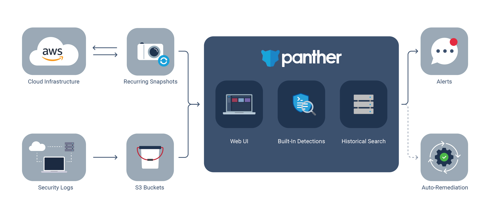

# Home

Panther detects threats with log data, improves cloud security posture, and powers investigations with a robust data warehouse.

Its main components are:

* [Log Analysis](log-analysis/log-processing/README.md) for collecting, parsing, and analyzing security data
* [Cloud Security](policies/scanning/README.md) identifying misconfigurations in AWS accounts and improving security posture
* [Historical Search](historical-search/README.md) for analytics on normalized log data, generated alerts, and common indicators

## Benefits

- Built on serverless technologies for high scale at low cost
- Python-based real-time detections
- SQL-based historical queries
- Low-latency alerting and remediation
- Simple deployments using infrastructure as code
- Secure, least-privilege, and encrypted infrastructure deployed within your AWS account

## Use Cases

Teams use Panther for:

|         Use Case         | Description                                                                               |
| :----------------------: | ----------------------------------------------------------------------------------------- |
|  Continuous Monitoring   | Analyze logs in real-time and identify suspicious activity that could indicate a breach   |
|       Alert Triage       | Pivot across all of your security data to understand the full context of an alert         |
|      Searching IOCs      | Quickly search for matches against IOCs using standardized data fields                    |
| Securing Cloud Resources | Identify misconfigurations, achieve compliance, and model security best practices in code |

## Concepts

|         Term         | Meaning                                                                               |
| :----------------------: | ----------------------------------------------------------------------------------------- |
| Event   | A normalized log from sources such as CloudTrail, Osquery, or Suricata   |
| Rule       | A Python function to detect suspicious activity         |
| Alert   | A notification to the team when a policy has failed or a rule has triggered  |
| Policy | A Python function representing the desired secure state of a resource |
| Resource      | A cloud entity, such as an IAM user, virtual machine, or data bucket                    |

## Get Started!

To get set up with Panther, continue to the [quick start](quick-start.md)!

## Enterprise

For teams needing 24x7 support, advanced analysis packs (PCI, MITRE ATT&CK), RBAC, and SSO, please reach out to us at `contact@runpanther.io` to learn more about Panther Enterprise.

### Hosted

For teams that need Panther hosted in single-tenant SaaS environment, please reach out to us at `contact@runpanther.io`.
