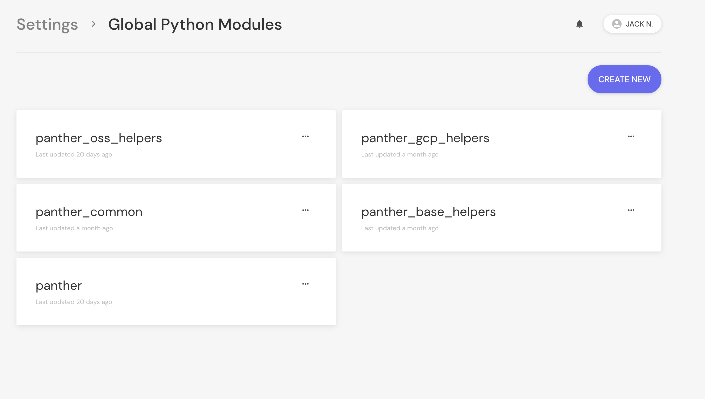
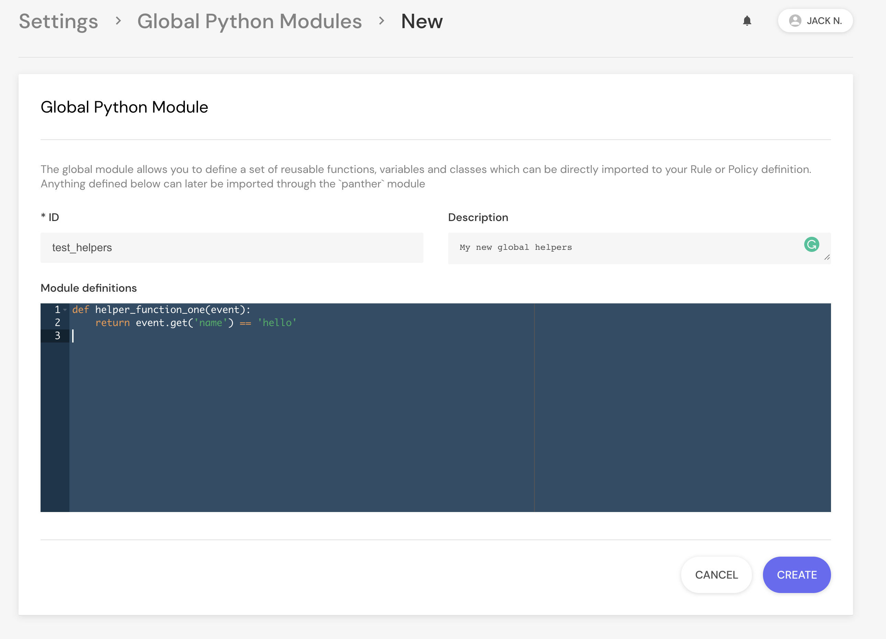

# Global Functions

You may find yourself repeating the same logic over and over again when writing rules or policies.

A common pattern in programming is to extract repeated code into helper functions, and Panther supports this pattern with the `global` analysis type.

## Built-in Globals

By default, Panther comes with two built-in globals named `panther` and `panther_oss_helpers`. `panther` is a default and already set up for you to define your custom logic, and `panther_oss_helpers` provides boilerplate helpers to common [caching](analysis/caching.md) and other use cases.

## Using Globals

To use globals, `import` them by their defined ID at the top of your analysis function body. Then, call the global as if it were any other python library.

For example:

```python
import panther_oss_helpers


def rule(event):
  return event['name'] == 'test-bucket'


def title(event):
  # Lookup the account name from an account Id
  account_name = panther_oss_helpers.lookup_aws_account_name(event['accountId'])
  return 'Suspicious request made to account ' + account_name
```

## Adding New Globals

New globals can be created either with the Panther Analysis Tool (found [here](analysis/panther-analysis-tool.md#globals)) or from within the Panther UI.

To create a new global, navigate to `Settings` > `Global Modules`:



Click `CREATE NEW`:



Type your Python functions, then click `CREATE`. This global can now be imported in your rules or policies.
