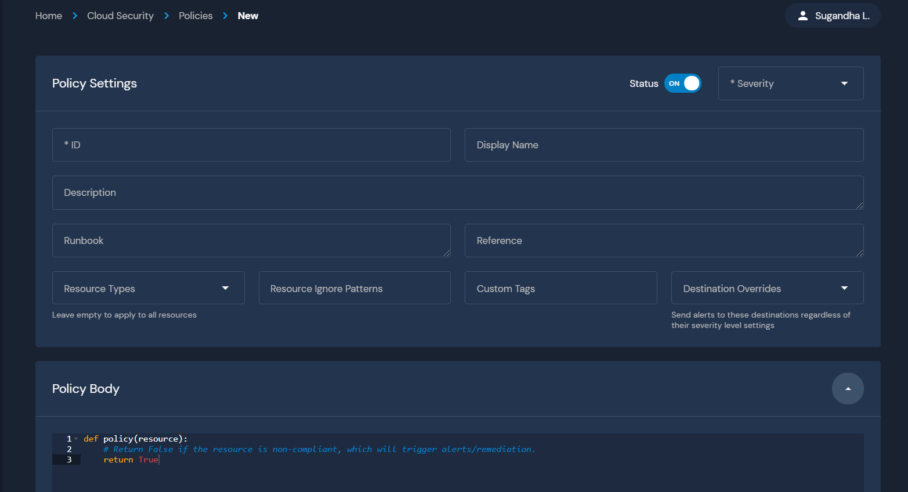
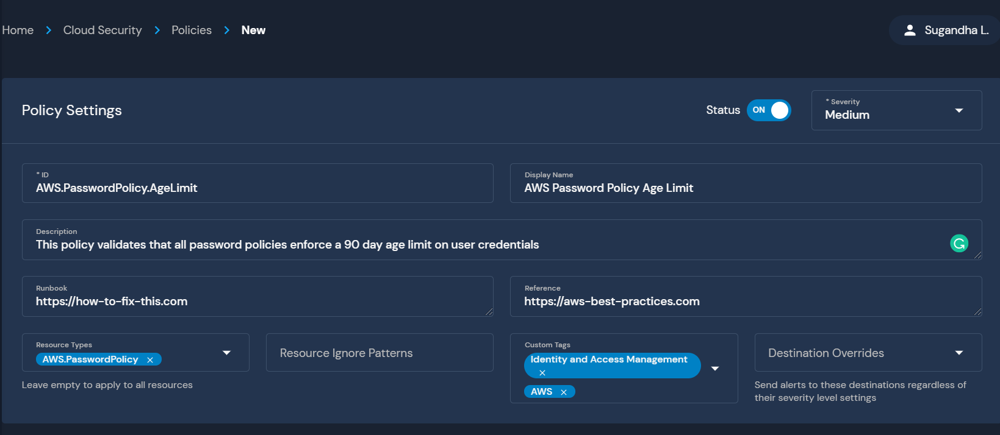
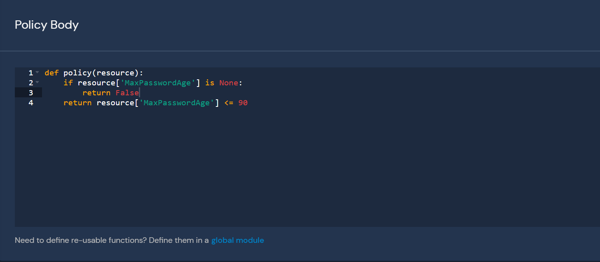
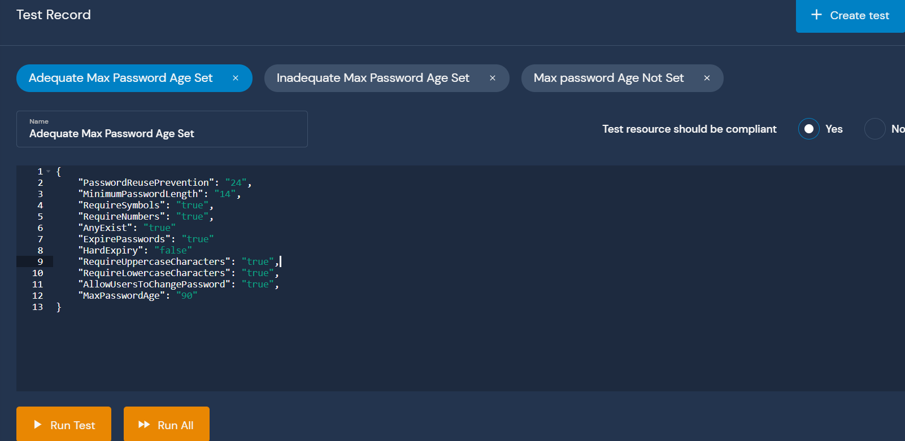
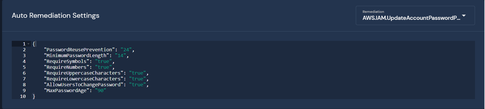
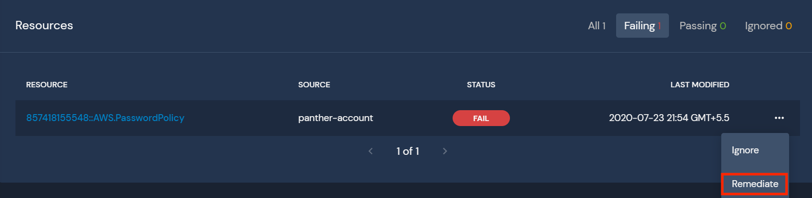

# Policies

Panther enables easy scanning, evaluating, and remediation of cloud infrastructure configurations.

**Policies** are Python3 functions used to identify misconfigured infrastructure and generate alerts for your team.

Optionally, policies can call automatic remediations to fix insecure infrastructure.

## Policy Components

- A `policy` function with a `resource` argument that returns `True` if the resource is compliant and the policy should not send an alert, or `False` if the resource is not complaint and the policy should send an alert
- Optionally, an automatic remediation configuration
- Metadata containing context for triage
- An association with a specific Resource Type

As an example, the policy below checks if an S3 bucket allows public read access:

```python
# A list of grantees that represent public access
GRANTEES = {
    'http://acs.amazonaws.com/groups/global/AuthenticatedUsers',
    'http://acs.amazonaws.com/groups/global/AllUsers'
}
PERMISSIONS = {'READ'}


def policy(resource):
    for grant in resource['Grants']:
        if grant['Grantee']['URI'] in GRANTEES and grant[
                'Permission'] in PERMISSIONS:
            return False

    return True
```

## Policy Writing Workflow

Panther policies can be written, tested, and deployed either with the UI or the [panther_analysis_tool](https://github.com/panther-labs/panther_analysis_tool) CLI utility.

Each policy takes a `resource` input of a given resource type from the [supported resources](../resources/README.md) page.

### Policy Body

The policy body MUST:
* Be valid Python3
* Define a `policy()` function that accepts one argument
* Return a `bool` from the policy function

```python
def policy(resource):
  return True
```

The Python body SHOULD:
* Name the argument to the `policy()` function `resource`

The Python body MAY:
* Import standard Python3 libraries
* Import from the user defined `aws_globals` module
* Import from the Panther defined `panther` module
* Define additional helper functions as needed
* Define variables and classes outside the scope of the rule function

Using the schemas in [supported resources](../resources/README.md) provides details on all available fields in resources. Top level keys are always present, although they may contain `NoneType` values.

#### Example Policy

For example, let's write a Policy on an [IAM Password Policy](../resources/aws/password-policy.md) resource:

```json
{
    "AccountId": "123456789012",
    "AllowUsersToChangePassword": true,
    "AnyExist": true,
    "ExpirePasswords": true,
    "HardExpiry": null,
    "MaxPasswordAge": 90,
    "MinimumPasswordLength": 14,
    "Name": "AWS.PasswordPolicy",
    "PasswordReusePrevention": 24,
    "Region": "global",
    "RequireLowercaseCharacters": true,
    "RequireNumbers": true,
    "RequireSymbols": true,
    "RequireUppercaseCharacters": true,
    "ResourceId": "123456789012::AWS.PasswordPolicy",
    "ResourceType": "AWS.PasswordPolicy",
    "Tags": null,
    "TimeCreated": null
}
```

This example policy alerts when the password policy does not enforce a maximum password age:

```python
def policy(resource):
    if resource['MaxPasswordAge'] is None:
        return False
    return resource['MaxPasswordAge'] <= 90
```

In the `policy()` body, returning a value of `True` indicates the resource is compliant and no alert should be sent. Returning a value of `False` indicates the resource is non-compliant and an alert or automatic remediation should be sent.

## First Steps with Policies

When starting your policy writing/editing journey, your team should decide between a UI or CLI driven workflow.

Then, configure the built in policies by searching for the `Configuration Required` tag. These policies are designed to be modified by you, the security professional, based on your organization's business logic.

## Writing Policies in the Panther UI

Navigate to Cloud Security > Policies, and click `Create New` in the top right corner. You have the option of creating a single new policy, or uploading a zip file containing policies created with the `panther_analysis_tool`. Clicking single will take you to the policy editor page.



### Set Attributes

Keeping with the Password Policy example above, set all the necessary rule attributes:



### Write Policy Body

Then write our policy logic in the `policy()` function.



### Configure Tests

Next, configure test cases to ensure our policy works as expected:



### Configure Automatic Remediation


Your source must be [configured to allow automatic remediation](../automatic-remediation/README.md#setup) for this setting to work


From the `Remediation` dropdown, select the remediation you wish to enable for this policy. Some remediations may support or require configurations to be set. On the following pages, you will find more detailed descriptions of each available remediation and their configuration settings.



To apply the remediation manually to fix a policy failure on an individual resource, select the "Remeidate" option on a failing resource when viewing the resources for the policy.



To apply the remediation to *all* currently failing resources, simply disable the policy then re-enable the policy to re-evaluate all resources immediately. Panther doesn't do this automatically for safety reasons.

This way you are able to enable an automatic remediation, test it out on a few resources to make sure everything is working as intended, then apply it to all failing resources (if desired) with the confidence that the exact policy and remediation configurations you intend to carry out are working as intended.

## Policy Writing Tips

### Constructing Test Resources

Manually building test cases is tedious and error prone. We suggest one of two alternatives:

1. Open `Cloud Security` > `Resources`, and apply a filter of the resource type you intend to emulate in your test. Select a resource in your environment, and on the `Attributes` card you can copy the full JSON representation of that resource by selecting copy button next to the word `root`.
2. Open the Panther [Resources documentation](../resources/README.md), and navigate to the section for the resource you are trying to emulate. Copy the provided example resource.

Paste this in to the resource editor if you're working in the web UI, or into the `Resource` field if you are working locally. Now you can manually modify the fields relevant to your policy and the specific test case you are trying to emulate.

Option 1 is best when it is practical, as this can provide real test data for your policies. Additionally, it is often the case that you are writing/modifying a policy specifically because of an offending resource in your account. Using that exact resource's JSON representation as your test case can guarantee that similar resources will be caught by your policy in the future.

### Debugging Exceptions

Debugging exceptions can be difficult, as you do not have direct access to the python environment running the policies.

When you see a policy that is showing the state `Error` on a given resource, that means that the policy threw an exception. The best method for troubleshooting these errors is to use option 1 in the **Constructing test resources** section above and create a test case from the resource causing the exception.

Running this test case either locally or in the web UI should provide more context for the issue, and allow you to rapidly modify the policy to debug the exception without having to run the policy against all resources in your environment.
