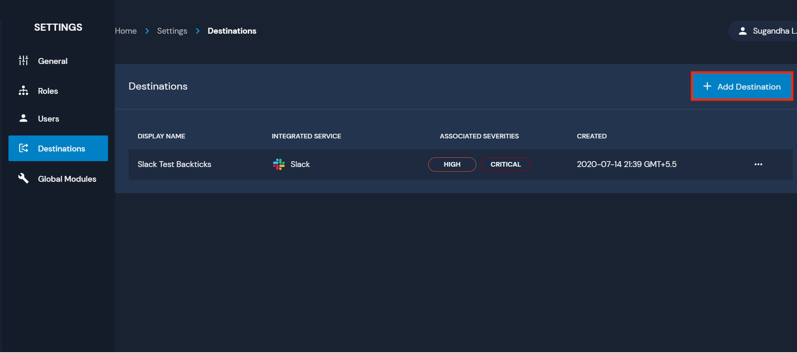
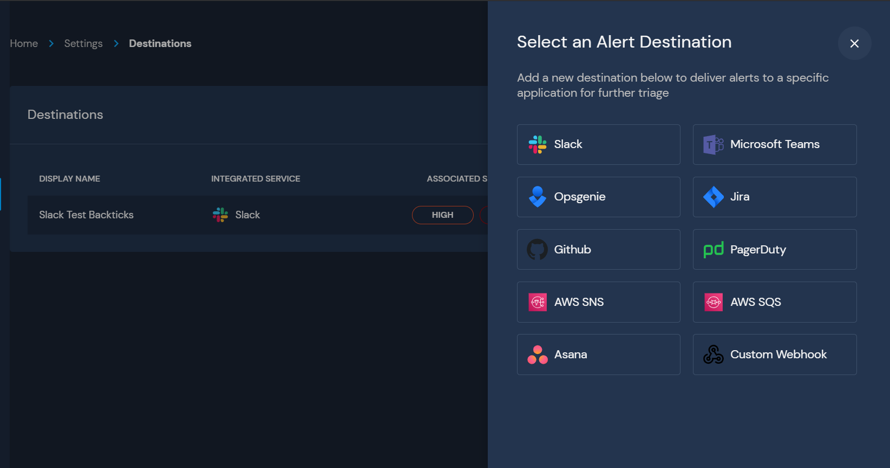
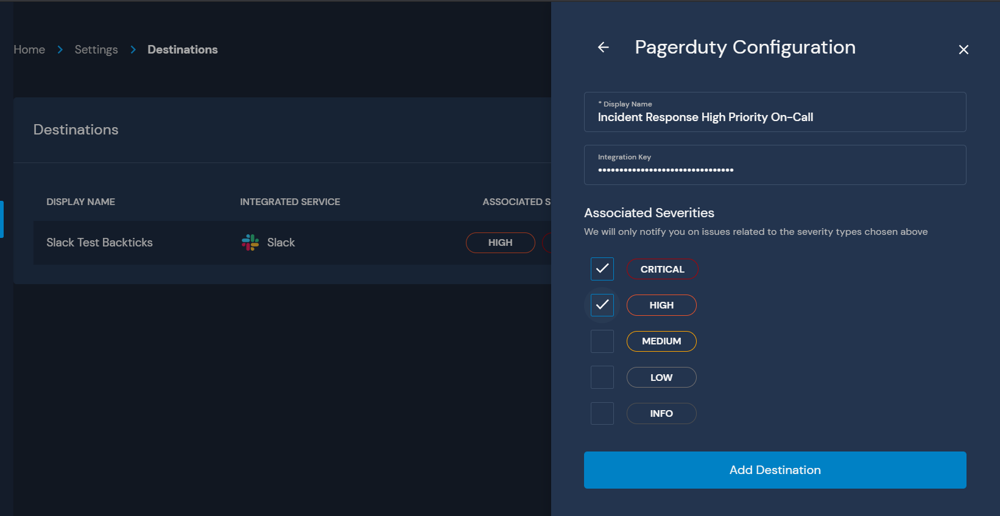
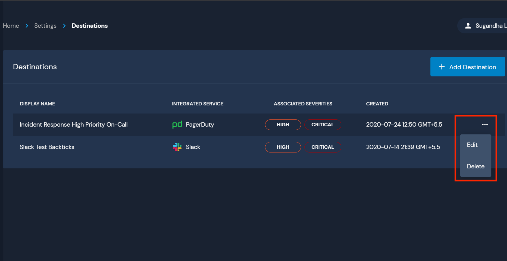

# Overview

Destinations are used to send alerts to your team.

When a policy fails on a resource or a rule triggers on an event, an alert is generated and sent to the configured destination. Alerts are routed based on severity.

For example, if a Rule is configured with a `Critical` severity, it will dispatch alerts to the  destinations configured to handle `Critical` alerts.

A single alert can dispatch to multiple destinations simultaneously, such as creating a Jira ticket, sending an email, and paging the on-call.

## Supported Destinations

|         Name         | Homepage                                                                               |
| :----------------------: | ----------------------------------------------------------------------------------------- |
|  Amazon Simple Notification Service (Email)   | https://aws.amazon.com/sns/   |
|       Amazon Simple Queue Service       | https://aws.amazon.com/sqs/         |
|      Github      | https://github.com/                    |
| Jira | https://www.atlassian.com/software/jira |
| Microsoft Teams | https://products.office.com/en-us/microsoft-teams/group-chat-software |
| OpsGenie | https://www.atlassian.com/software/opsgenie/what-is-opsgenie |
| PagerDuty | https://www.pagerduty.com/ |
| Slack | https://slack.com/ |

## Creating a New Destination

To create a destination, navigate to `Settings` > `Destinations` and select `Add Destination`.

You will then be prompted to select a destination type.

Multiple destinations of the same type may be configured, such as several Slack channels or email addresses. This allows for fine grained control of destination routing.

Next, add a `Display Name` to distinguish the destination from others in the Panther UI and select the associated severities for this destination.

Each destination type will have specific configuration options based on the system's API. See the destination specific setup instructions in the following pages for more details.

Finally, click the `Add Destination` button to save the configuration. You are now ready to receive alerts!

## Modifying or Deleting Destinations

An existing destination may be modified or deleted by selecting the triple dot button. From here, you can modify the display name, the severities, and the specific configurations. Alternatively, you can also delete the destination.

