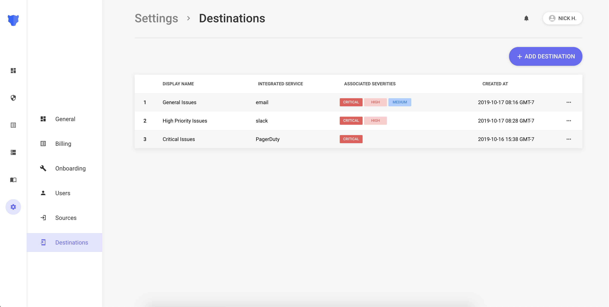
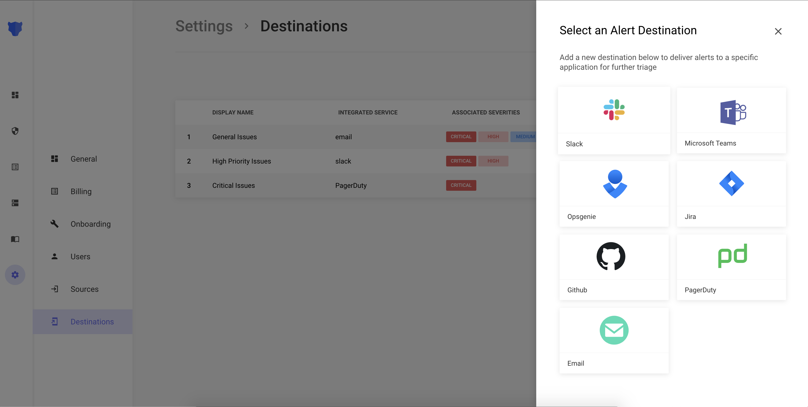
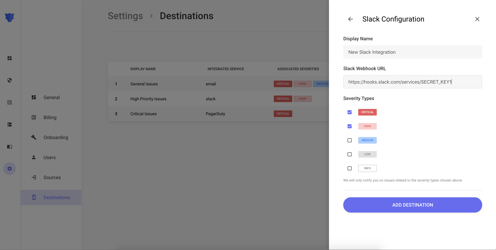

# Setup

## Creating a New Destination

The first step is configuring Panther to use one or more of the supported Destination types.

Navigate to the [Destinations](https://app.runpanther.io/settings/destinations) page, and select `ADD DESTINATION`.

You will be prompted to select a Destination type. You can have multiple Destinations of the same type configured, such as multiple Slack channels or email addresses. This allows more fine grained control of Destination routing.

Next, add a Display Name, to recognize the Destination from the Panther UI, and to select what severities will be routed to this Destination. Additionally, each Destination type will will have specific configurations needed to make the integration work. See the Destination specific setup instructions in the following pages for more details.

When you are done configuring the Destination, select the `ADD DESTINATION` button and you will see the new Destination configured, and ready to start sending alerts.

## Modifying an Existing Destination

An existing destination can be modified by going to the [Destinations](https://app.runpanther.io/settings/destinations) page and selecting the triple dot button next to the Destination you wish to modify. From here, you can modify the display name and the severities as well as the specific configurations for that Destination type.
