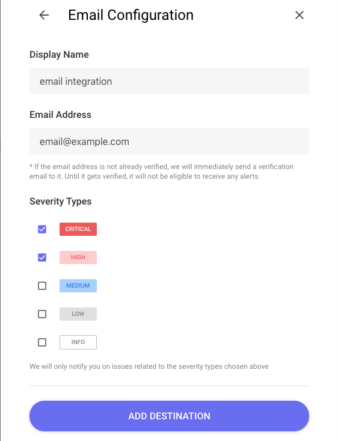
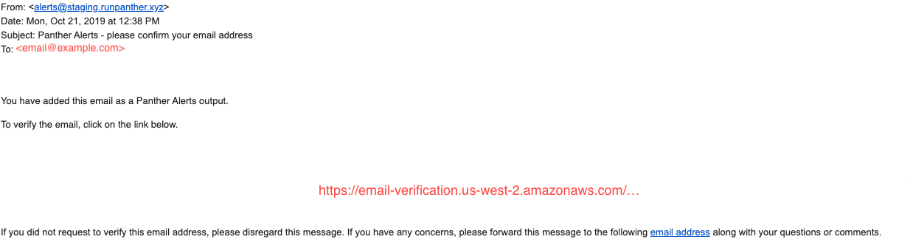

# Email

This page will walk you through configuring Email as a Destination for your Panther alerts.

The Email Destination requires a `Email Address`. When an alert is forwarded to an Email Destination, an email is sent to that address.

1. Email is the easiest integration to setup. First input the desired destination email address into the address box and add the destination. A confirmation email will be sent if the email address is not already verified within our system.

2. Confirm the destination email address by following the link in the confirmation email. Your email destination is now configured to receive Panther alerts.
