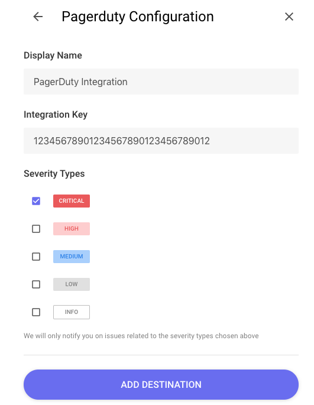
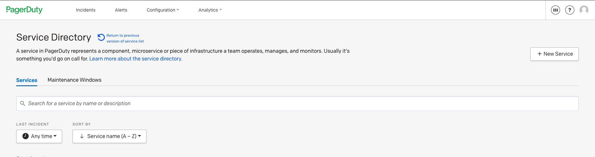
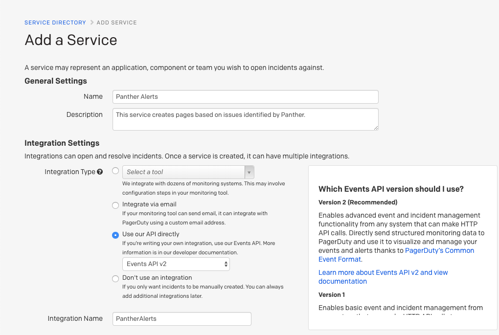

# PagerDuty

This page will walk you through configuring PagerDuty as a Destination for your Panther alerts.

The PagerDuty Destination requires an `Integration Key`. When an alert is forwarded to a PagerDuty Destination, it creates an incident.

The PagerDuty Destination allows you to page on call teams based on Panther alerts. We typically only recommend this Destination for higher severity issues that need to be addressed immediately.

1. To configure the PagerDuty Destination, go to the PagerDuty Services configuration page \([https://runpanther.pagerduty.com/service-directory](https://runpanther.pagerduty.com/service-directory)\) and select the `New Service` button.

2. You will be presented with a service configuration page. Select the `Use our API directly` option for the Integration Type, then configure the service with a name, description, escalation policy and any other settings as you see fit.

3. After the service has been created, you will be redirected to the Integrations page for that service from which you can copy out the integration key for the Panther Destinations configuration.

The PagerDuty configuration is now set and ready to receive alerts from Panther.
