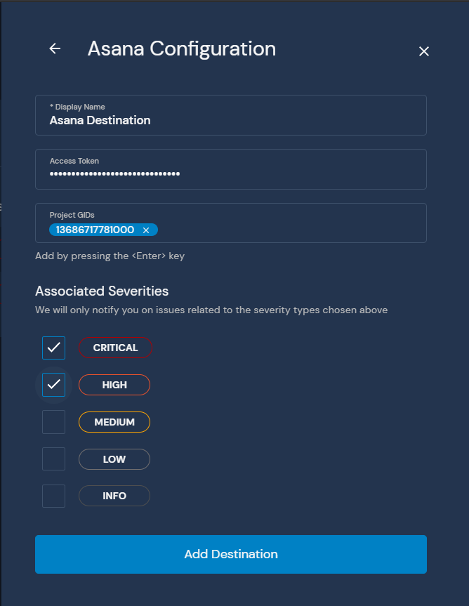
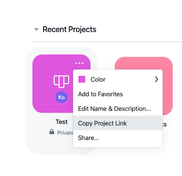

# Asana

This page will walk you through configuring [Asana](https://asana.com) as a destination for your Panther alerts.

The Asana destination requires an `Access Token` and one or more `Project GID`. When an alert is forwarded to an Asana destination, a new task is created in the specified project(s):

The Asana Destination requires the use of an Asana user account. To add an Asana destination, first, select a user to be the reporter of the issue. If possible and in order to ensure continuity, a service account should be created specifically for this purpose.

A `Project GID` is a unique identifier for the project where Panther will be creating new issues. The easiest way is to retrieve it from the project's URL.
Select the project you want and click `Copy Project Link`:

The copied link should look like
`https://app.asana.com/0/1160306557000000/board`. The Project GID is the 16-digit number seen in the URL.

The `Access Token` is the token of the user that will be creating the issues. This can be acquired by going to [https://app.asana.com/0/developer-console](https://app.asana.com/0/developer-console) while logged in as the user and clicking on `New Access Token`:

After creating the token, you will have an opportunity to copy it. As Asana warns, this token should be treated just as sensitively as a password and you will not be able to access it again in the future.
