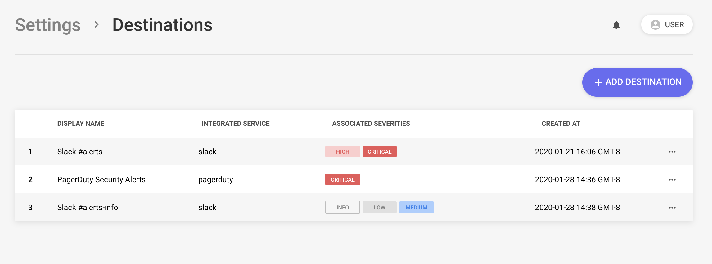

# Background

Destinations are used to send alerts about suspicious activity or vulnerable infrastructure.

Whenever a policy fails on a resource or a rule triggers on an event, an alert is generated and sent to the configured Destination.

Alerts are routed based on rule/policy severity. For example, if a Rule is configured with a `Critical`, it will dispatch alerts to the default Destinations configured to handle `Critical` alerts.


A single failure may dispatch to multiple destinations simultaneously, such as creating a Jira ticket, sending an email, and paging the on-call.


Supported Destinations:

- [Slack](https://slack.com/)
- [PagerDuty](https://www.pagerduty.com/)
- [Github](https://github.com/)
- [Jira](https://www.atlassian.com/software/jira)
- [OpsGenie](https://www.atlassian.com/software/opsgenie/what-is-opsgenie)
- [Amazon Simple Notification Service (Email)](https://aws.amazon.com/sns/)
- [Amazon Simple Queue Service](https://aws.amazon.com/sqs/)
- [Microsoft Teams](https://products.office.com/en-us/microsoft-teams/group-chat-software)
