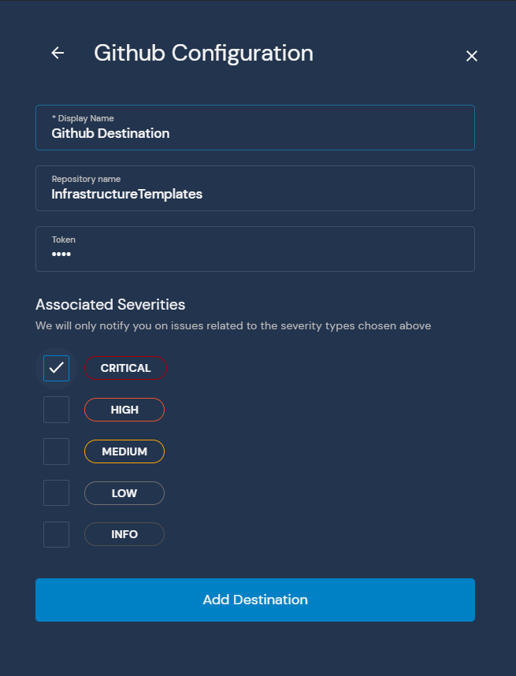
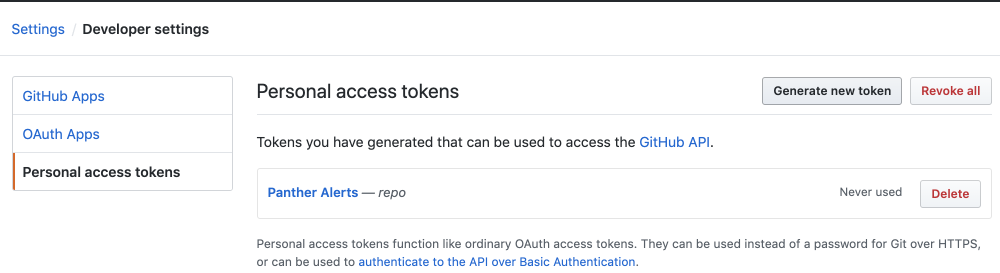

# GitHub

This page will walk you through configuring GitHub as a Destination for your Panther alerts.

The GitHub Destination requires a `Repository name` and an API `Token`.

When an alert is forwarded to a GitHub Destination, it creates an issue in the repository. The repository must have issues enabled for this destination to function properly.

The integration is most useful when infrastructure is defined in code such as with AWS CloudFormation or with Terraform.

Follow GitHub's documentation available [here](https://help.github.com/en/github/authenticating-to-github/creating-a-personal-access-token-for-the-command-line) on generating an API token. Before you start, we recommend creating a dedicated Panther Alerts service account on GitHub.

First enter the repository name into the Panther destination configuration. This will be in the form `owner/repo_name`

Using the service account, or the account of any developer that has access to the repo, first go to `Settings` and then `Developer settings`:

From the developer settings page, go to `Personal access tokens` and select the `Generate new token` button:

From the token configuration screen, name the token and select the `repo` permissions checkbox. This is a fairly broad permission, but GitHub does not currently support fine-grained permissions for creating issues. If this level of access is a concern, consider creating a dedicated issue tracking repository per GitHub's recommendations [here](https://help.github.com/en/github/creating-cloning-and-archiving-repositories/creating-an-issues-only-repository).

Select the `Generate Token` button, and copy the token out into the Panther Destinations configuration. GitHub will not allow you to access this token again, you will need to re-generate it if it is lost:

Now your GitHub destination is configured and ready to create issues when new alerts are received.
