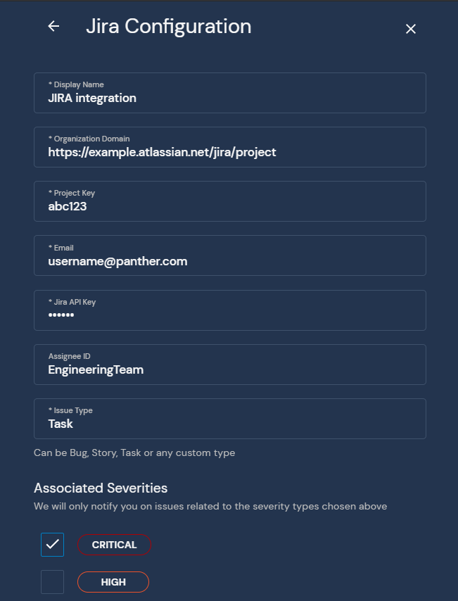
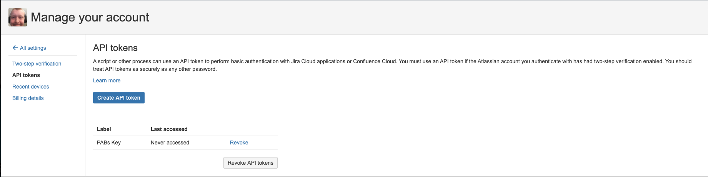

# Jira

This page will walk you through configuring Jira as a Destination for your Panther alerts.

The Jira Destination requires an `Organization Domain`, `Project Key`, `User Name`, `Jira API Key`, and `Assignee ID`. When an alert is forwarded to a Jira Destination, a task is created and assigned to the specified assignee in the specified project:

The Jira Destination is integrated through the use of a Jira user account. To perform the Jira integration, first select a user to be the reporter of the issue. If possible, a service account should be created specifically for this purpose in order to ensure continuity. Most of the fields can be filled out based on the Project URL and a few usernames. The example project URL we will use is:

`https://example.atlassian.net/projects/PROJ`

The Organization Domain is everything up to and including `.atlassian.net` in the project URL. In the case of our example, this would be `https://example.atlassian.net`.

The Project Key is the project identifier within your organization, which can be retrieved from the project settings page or from the URL as the portion immediately after `/projects/`. In the case of our example, this would `PROJ`.

The User Name is the Jira user name of the user that will be creating the new issues.

The Jira API Key is the API key of the user that will be creating the issues. This can be acquired by going to [https://id.atlassian.com/manage/api-tokens](https://id.atlassian.com/manage/api-tokens) while logged in as the user and selecting the `Create API Token` button:

After creating the token, you will have an opportunity to copy it. As Jira warns this token should be treated just as sensitively as a password and you will not be able to access it again in the future:

The assignee ID is the name of the user or group that the issue will be assigned to.
