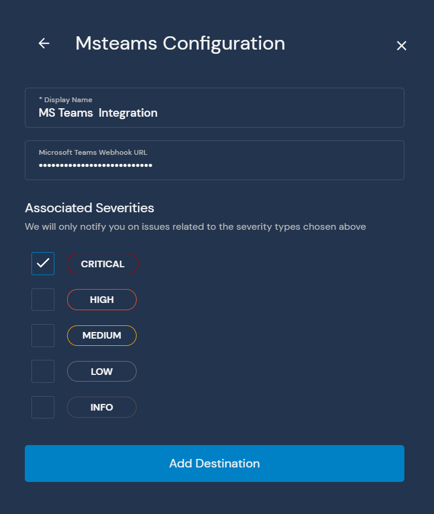
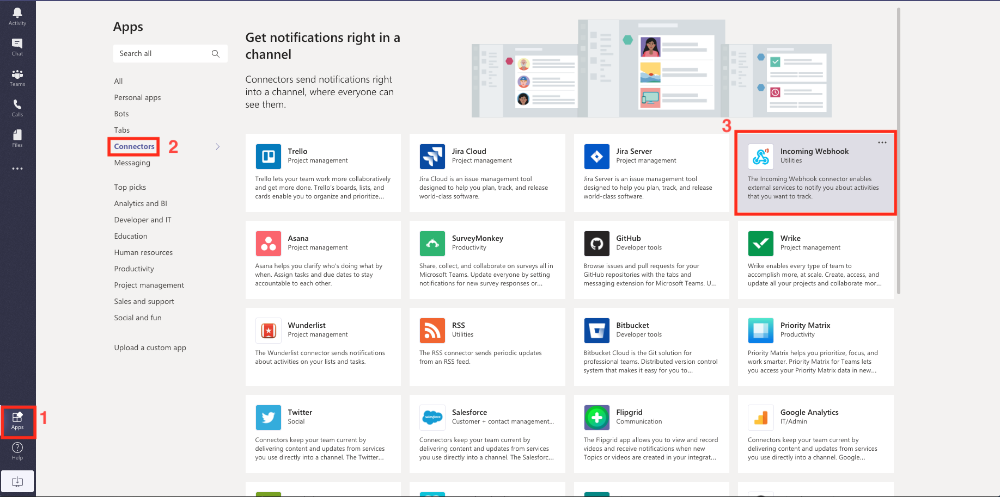
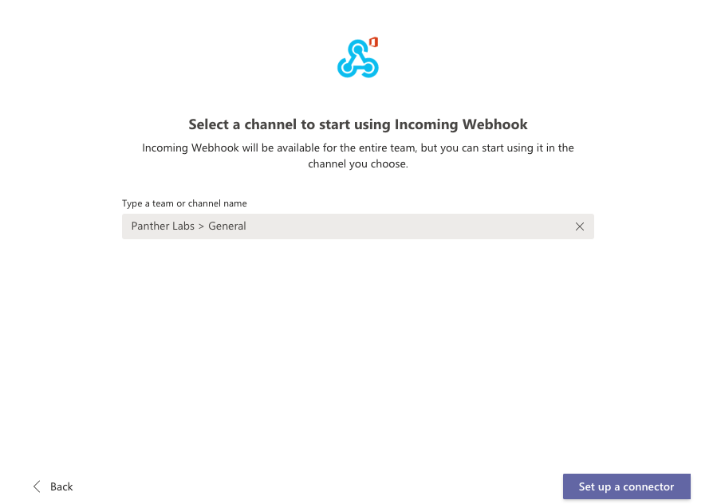
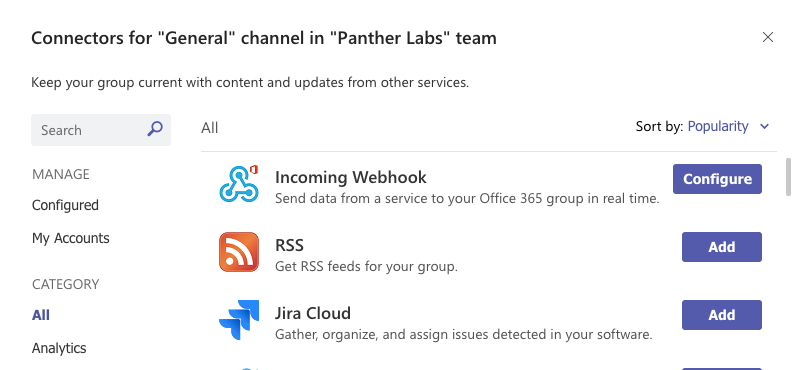
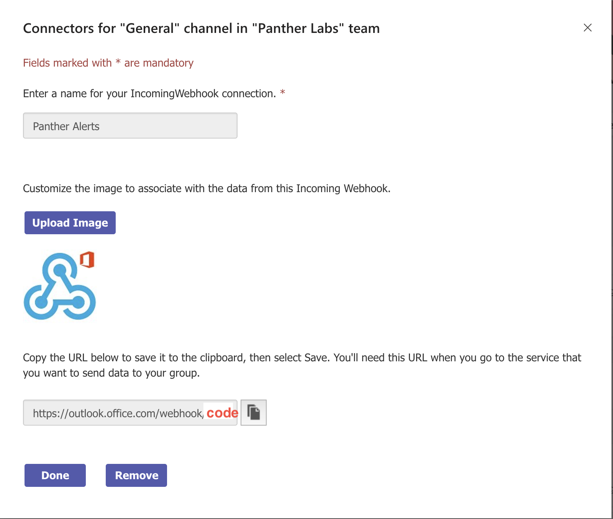

# Microsoft Teams

This page will walk you through configuring MS Teams as a Destination for your Panther alerts.

The MS Teams Destination requires a `Microsoft Teams Webhook URL`. When an alert is forwarded to an MS Teams Destination, it sends a message to the specified Webhook URL:

The Microsoft Teams Destination is configured via a custom connector with a Webhook URL. First, ensure that your team has the option to add Incoming Webhooks as a connector. Go the `Apps` settings at the bottom left of you Teams client, then select `Connectors` and then `Incoming Webhook`:

Select the `Add to a team` button and you will be prompted to select a team to add the Incoming Webhook connector to, select the appropriate team and select `Setup a connector`:

Select the `Configure` button next to Incoming Webhook, and configure the name, description, and other settings as appropriate:

You will be prompted to name the integration, and optionally upload an image to display. After filling out these settings, select the `Create` button:

You will then be presented with the webhook URL. Copy this out into the Panther Destinations page and select the `Done` button:

Your MS Teams destination is now ready to receive notifications when Policies and Rules send alerts:

