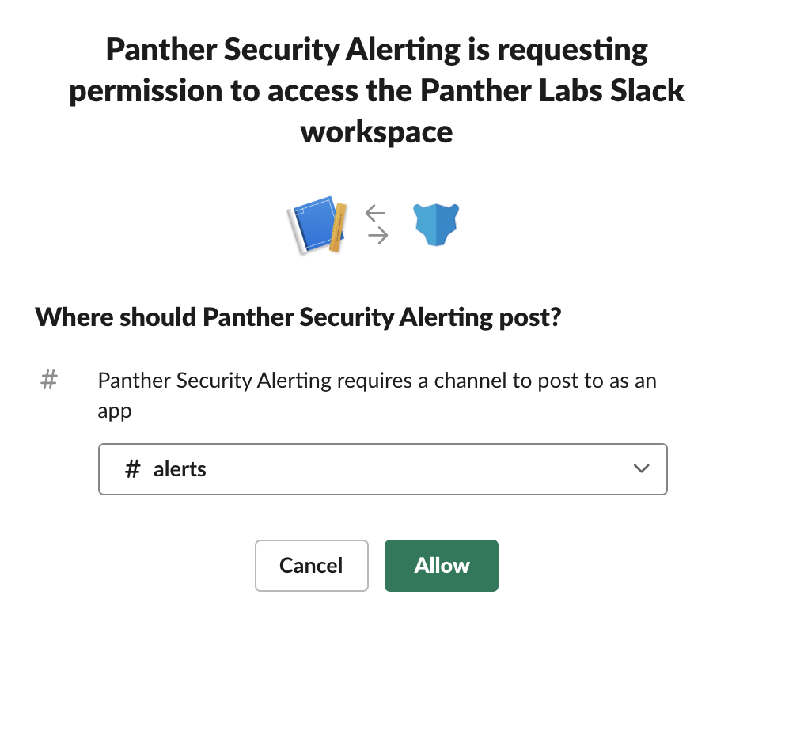
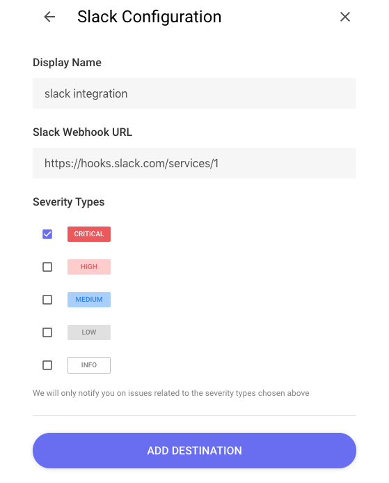

# Slack

## Step 1: Slack App Setup

Slack can be connected to Panther by creating a custom Slack app with a webhook:

Navigate to [Your Slack Apps](https://api.slack.com/apps), and select `Create New App` to create a custom app

After creating the app, an administrator will need to authorize its access and enable it to the appropriate channel.

Click `Incoming Webhooks`, then enable `Activate Incoming Webhooks`

Scroll down and click `Add New Webhook to Workspace`

Copy the generated `Webhook URL`to use in the next step. You should also see a message in the connected Slack channel indicating the integration was added.

Your Slack destination is now ready to receive alerts.

## Step 2: Add Destination to Panther

Paste the copied `Slack Webhook URL` into the Panther Destination configuration settings:

