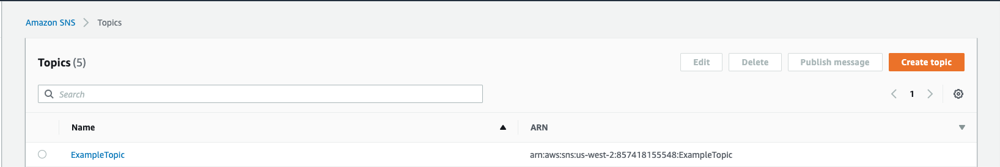
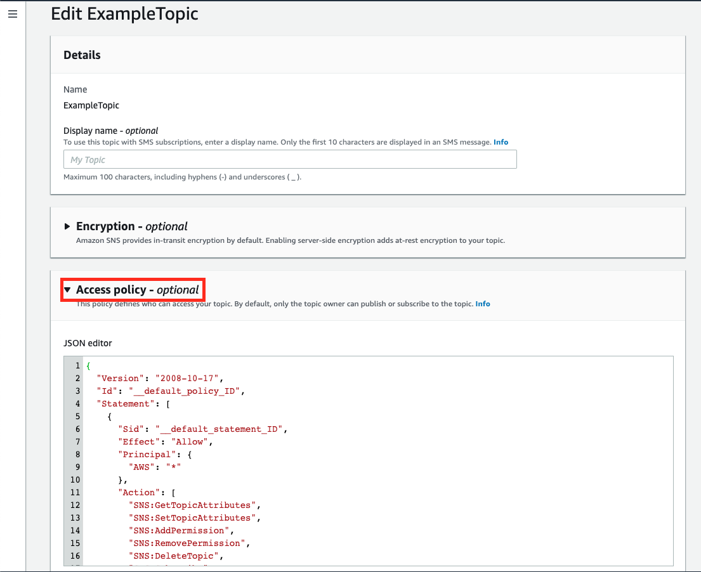

# SNS

This page will walk you through configuring SNS as a Destination for your Panther alerts. This is a simple way to send notifications to email addresses, multiple queues, and more.

The SNS Destination requires a `Topic ARN`. When an alert is forwarded to an SNS Destination, it publishes a JSON string to that topic:


From the AWS [SNS console](https://us-west-2.console.aws.amazon.com/sns/v3/home#/topics), create a new Topic or navigate to the topic you wish to add as a destination. Copy the ARN out and into the Panther Destinations configuration, then select the topic. We will be editing its permissions so Panther can publish messages to it:



After selecting the SNS topic, select the `Edit` button then scroll down and expand the `Access policy` section:



After expanding the `Access policy` section, add the following statement to the `Statement` block:

```json
    {
      "Sid": "AllowPantherAlarming",
      "Effect": "Allow",
      "Principal": {
        "AWS": "arn:aws:iam::<PANTHER-ACCOUNT-ID>:root"
      },
      "Action": "sns:Publish",
      "Resource": "arn:aws:sns:us-west-2:123456789012:example-topic"
    }
```


Be sure to replace the `Resource` field with the ARN of your own SNS Topic, and the Principal with the AWS account ID where Panther is deployed.



4. Select the `Save changes` button to confirm your changes, and your SNS Topic will now be able to receive Panther alerts
