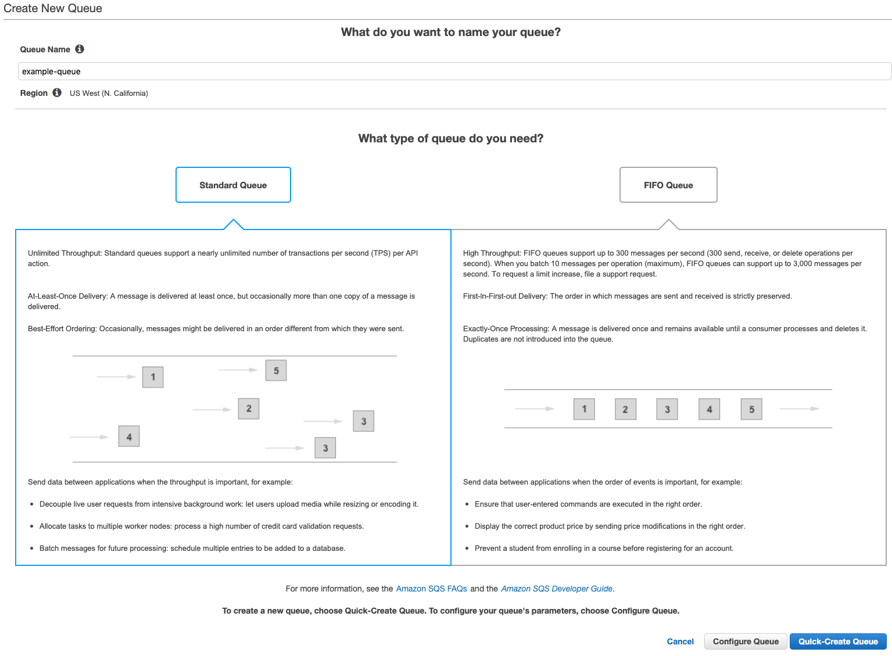
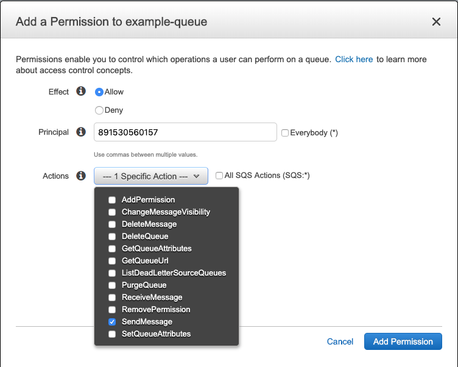
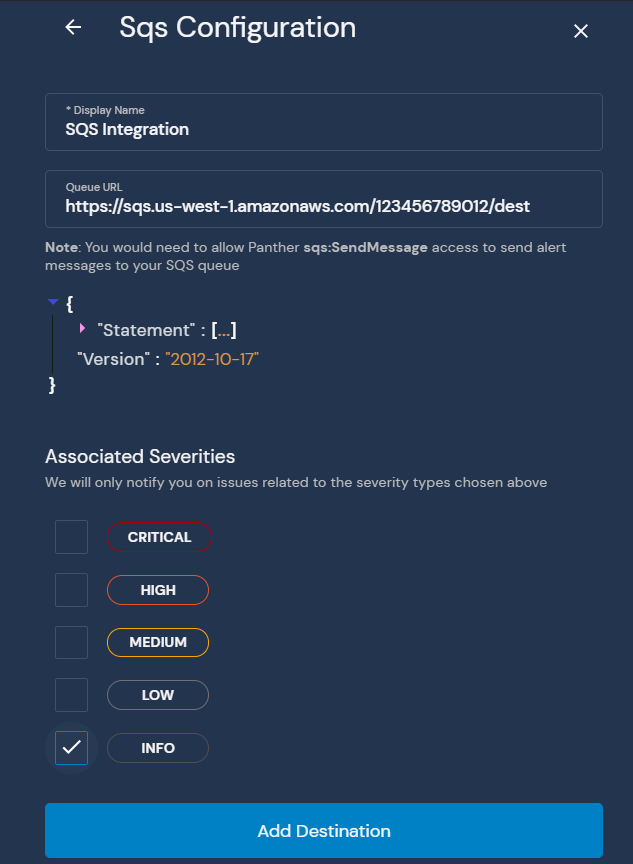

# SQS

## Step 1: SQS Queue Setup

An SQS Queue can be connected to Panther by creating a queue and granting Panther permission to send to it:

Navigate to the AWS [SQS Console](https://console.aws.amazon.com/sqs/home) and select `Create New Queue` to create a new queue. Set the name, then configure the queue or just select the `Quick-Create Queue` button. If you wish to use an existing queue, skip this step.

Select the newly created or existing queue you wish to send messages to, then select the `Permissions` tab and then the `Add a Permission` button:

Grant the `SendMessage` permission to the principal `891530560157`:

Select the `Add Permission` button and your SQS Queue is now ready to receive messages.

## Step 2: Add Destination to Panther

The SQS Queue will have a `URL` field under the `Details` tab. Paste the copied URL into the Panther Destination configuration settings:

