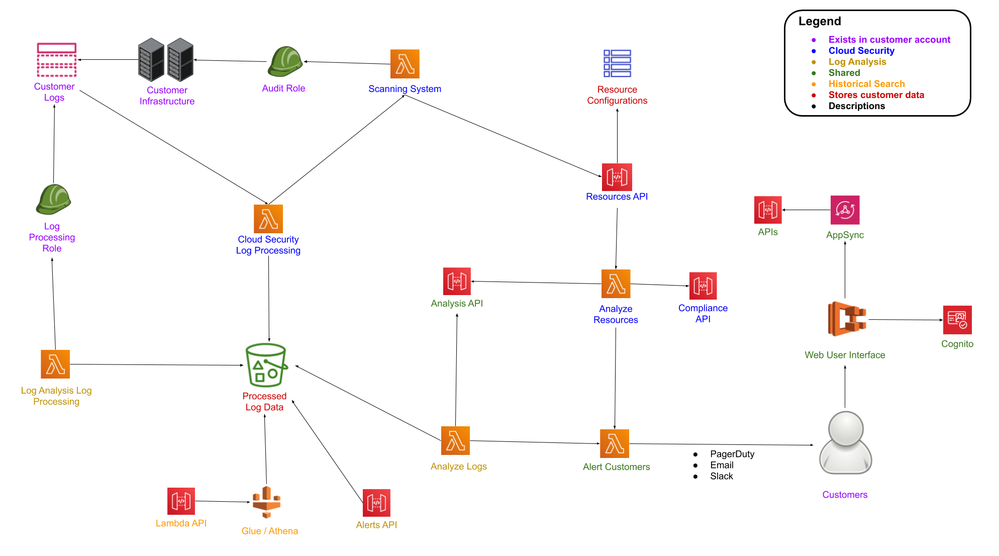
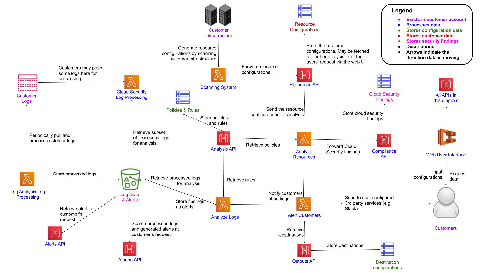

# Development

Panther is a collection of serverless applications deployed within your AWS account. The frontend is a React application which runs in a Docker container \(via ECS\), and the backend is a collection of compute \(Lambda\), storage \(DynamoDB / S3\), and other supporting services.

The sections below cover how Panther works under the hood, how to build and deploy from source, and how to extend Panther to meet your individual needs.

## Architecture Diagram

This diagram provides an overview of the core components of Panther, and how they are connected.



For a more detailed architecture diagram, see the bottom of this page.

## Environment

To deploy from source, install [Docker](https://docs.docker.com/install/) and make sure the daemon is running in the background.

For the remaining dependencies, you can either use our development image or install development dependencies locally.

### Development Image
This is the easier option, but will also lead to much slower builds.

Simply [export your AWS credentials](#aws-credentials) as environment variables, and then run `./dev.sh`
From here, run `mage setup` and you're good to go.

### Local Dependencies
To install dependencies locally (recommended for regular contributors):

* Install [Go](https://golang.org/doc/install#install) 1.13+
* Install [Node](https://nodejs.org/en/download/) 12
* Install [Python](https://www.python.org/downloads/) 3.7
* Install [Mage](https://magefile.org/#installation)

For example, on MacOS w/ Homebrew:

```bash
brew install go node@12 python3
export PATH=$HOME/go/bin:$PATH
go get github.com/magefile/mage
go get golang.org/x/tools/cmd/goimports
```

Then install the remaining development libraries:

```bash
mage setup
```


You'll need to run `mage setup` every time the dev libraries are updated. If you run into issues,
try `mage clean setup` to reset your repo and re-install all dependencies.


### Mage

Panther uses [mage](https://magefile.org/), a Go tool similar to `make` , to manage the development lifecycle.

Run `mage` from the repo root to see the list of available commands:

```text
Targets:
  build:api           Generate API source files from GraphQL + Swagger
  build:cfn           Generate CloudFormation templates in out/deployments folder
  build:lambda        Compile Go Lambda function source
  build:tools         Compile devtools and opstools
  clean               Remove dev libraries and build/test artifacts
  deploy              Deploy Panther to your AWS account
  doc                 Auto-generate specific sections of documentation
  fmt                 Format source files
  glue:sync           Sync glue table partitions after schema change
  master:deploy       Deploy single master template (deployments/master.yml) nesting all other stacks
  master:publish      Publish a new Panther release (Panther team only)
  setup               Install all build and development dependencies
  teardown            Destroy all Panther infrastructure
  test:ci             Run all required checks for a pull request
  test:integration    Run integration tests (integration_test.go,integration.py)
```

You can easily chain `mage` commands together, for example: `mage clean setup test:ci deploy`

## Repo Layout

Since the majority of Panther is written in Go, the repo follows the standard [Go project layout](https://github.com/golang-standards/project-layout):

|         Path         | Description                                                                               |
| :----------------------: | ----------------------------------------------------------------------------------------- |
| [**api**](https://github.com/panther-labs/panther/tree/master/api)   | Input/output models for communicating with Panther's backend APIs |
| [**build**](https://github.com/panther-labs/panther/tree/master/build)   | Dockerfiles for CI and deployment |
| [**cmd**](https://github.com/panther-labs/panther/tree/master/cmd)   | Go dev and ops tools |
| [**deployments**](https://github.com/panther-labs/panther/tree/master/deployments)   | CloudFormation templates for deploying Panther itself or integrating the accounts you want to scan   |
| [**docs**](https://github.com/panther-labs/panther/tree/master/docs)  | Documentation, license headers, README, images, code of conduct, etc  |
| [**internal**](https://github.com/panther-labs/panther/tree/master/internal) | Source code for all of Panther's Lambda functions  |
| [**pkg**](https://github.com/panther-labs/panther/tree/master/pkg)  | Standalone Go libraries that could be directly imported by other projects |
| [**tools**](https://github.com/panther-labs/panther/tree/master/tools)  | Magefile source and other build infrastructure  |
| [**web**](https://github.com/panther-labs/panther/tree/master/web)   | Source for the Panther web application  |

## Testing

Run our test suite: `mage test:ci`

Run integration tests against a live deployment: `mage test:integration`
   - To run tests for only one package: `PKG=./internal/compliance/compliance-api/main mage test:integration`


Integration tests will erase all Panther data stores


## Deploying

### AWS Credentials
Configure your AWS credentials and deployment region:

```bash
export AWS_REGION=us-east-1  # Any supported region
export AWS_ACCESS_KEY_ID=...
export AWS_SECRET_ACCESS_KEY=...
```


Remember to follow best security practices when handling access keys:

- Avoid storing them in plaintext files
- Use IAM roles with temporary session credentials
- Rotate access keys every 90 days
- Enforce MFA for key access

Tools like [aws-vault](https://github.com/99designs/aws-vault) can help with all the above, check out our [blog post](https://blog.runpanther.io/secure-multi-account-aws-access/) to learn more!


### Supported Regions

Panther relies on dozens of AWS services, some of which are not yet available in every region. In particular, AppSync, Cognito, Athena, and Glue are newer services not available in us-gov, china, and other regions. At the time of writing, all Panther backend components are supported in the following:

- `ap-northeast-1` (tokyo)
- `ap-northeast-2` (seoul)
- `ap-south-1` (mumbai)
- `ap-southeast-1` (singapore)
- `ap-southeast-2` (sydney)
- `ca-central-1` (canada)
- `eu-central-1` (frankfurt)
- `eu-west-1` (ireland)
- `eu-west-2` (london)
- `us-east-1` (n. virginia)
- `us-east-2` (ohio)
- `us-west-2` (oregon)

Consult the [AWS region table](https://aws.amazon.com/about-aws/global-infrastructure/regional-product-services/) for the source of truth about service availability in each region.

### Mage Deploy
Now you can run `mage deploy`

- If you're using the development image, be sure to export your AWS credentials in the environment *before* running `./dev.sh`
- If your credentials timeout, you can safely redeploy to pick up where you left off.
- If you use `aws-vault`, you must be authenticated with MFA. Otherwise, IAM role creation will fail with `InvalidClientTokenId`

This will deploy the main CloudFormation stacks independently and is optimized for development.
If instead you want to deploy the single master template: `mage master:deploy`

### From an EC2 Instance

You can also deploy from an EC2 instance with Docker and git installed in the same region you're deploying Panther to.
Instead of exporting your AWS credentials as environment variables, you will need to attach the [deployment IAM role](quick-start.md#prerequisites) to your EC2 instance profile.
We recommend at least an `m5.large` instance type, but even one as small as `t2.small` should be sufficient.

## Teardown
Run `mage teardown` to remove all Panther infrastructure, including S3 buckets that are normally retained if just the CloudFormation stack were deleted.
If you have a single top-level Panther stack, then `STACK=your-stack-name mage teardown`

In summary, teardown will:

1. Delete all Panther stacks
2. Delete all S3 buckets tagged with `Application:Panther` and `Stack:panther-bootstrap`
    - If there are too many items to delete manually, an expiration policy is set instead
3. Delete all CloudWatch log groups prefixed with `/aws/lambda/panther-`
    - Be careful running teardown if you have your own "panther" service which might be writing log groups with that prefix

## Additional Diagrams

The diagrams below can be used to understand Panther's architecture at a deeper level and provide insight into data flows.

### Detailed Architecture Diagram

This diagram provides additional detail to the high-level diagram above:


While more detailed than the overview above, this diagram also simplifies some implementation details for clarity. For example, the majority of lambdas are not invoking each other directly but instead communicating via SQS Queues or DynamoDB streams. 

### Data Flow Diagram

This diagram shows where and how your data is stored and processed:



The above arrows indicate the direction in which data is transferred, as opposed to the previous diagrams where arrows are indicating the direction that communication is being initiated.
