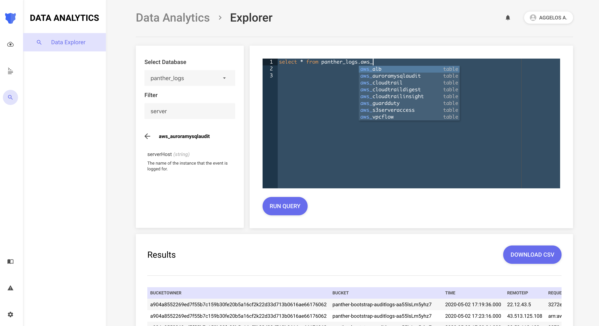

# Data Explorer
Data explorer gives Panther Enterprise deployments access to a panel where they can perform SQL queries on their Panther
data. It adds a clean UI powered by a robust backend, with persistence and autocomplete goodies that will enhance your querying experience.

With Panther Data Explorer, you are able to:

* Browse collected log data, rule matches, and search standard fields across all data
* Write SQL queries on normalized data with autocompletion on every step of the way
* View query results in a friendly way
* Share results with their team through a shareable link
* Download results in a CSV

As with all of our enterprise features, access to the Data Explorer can be limited through our [Role-Based Access Control](../rbac.md) system.
