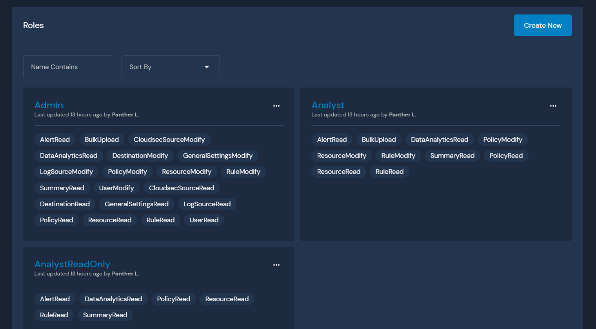
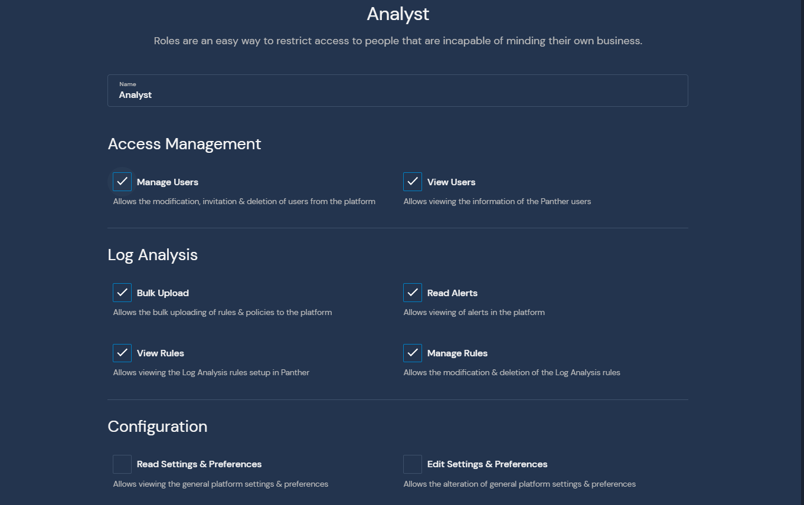

# Role-Based Access Control

Role-Based Access Control (RBAC) gives Panther Enterprise deployments fine-grained access control for their user accounts. A *role* is a configurable set of permissions and every user is assigned to exactly one role.

## Default Roles

When you first deploy Panther Enterprise, the following three roles are automatically created for you:

* The "Admin" role will be automatically assigned to all existing users when upgrading from the community edition and has all available permissions.
* The "Analyst" role can use all the cloud security and log analysis features, but can't modify settings.
* The "AnalystReadOnly" role can view resources and alerts and Python code, but can't change anything.

## Customizing Roles

All roles (including the default ones above) are fully customizable by any user with `UserModify` permissions:

* You can create as many roles as you want (see the "Create New" button in the screenshot above)
* Roles can be renamed as long as the names are unique
* Role permissions can be changed as long as at least one user has UserModify permissions
* Roles can be deleted as long as no users are currently assigned to them

When you create or edit a role, you are shown the following screen:

(There are more available permissions than the ones shown here.)


Permission changes will not take effect until the user's session expires (at most 1 hour).

