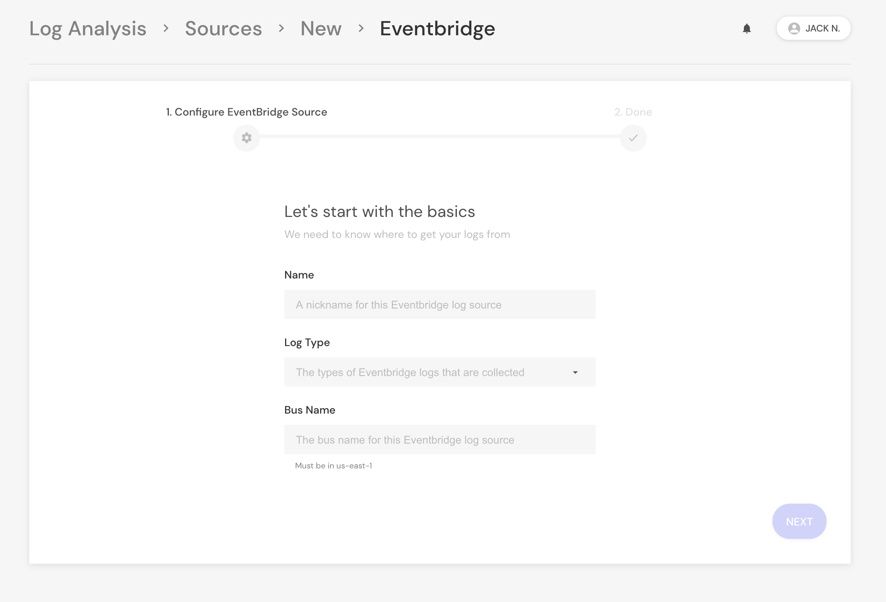

# SaaS Logs

Panther Enterprise supports pulling logs directly from SaaS platforms such as Okta, OneLogin, and more.

The two mechanisms used are direct integrations (by querying APIs) and AWS EventBridge.

## Direct

Supported direct SaaS integrations include:
* Okta
* G Suite
* Box
* More coming soon!

To set up, head to `Log Analysis` > `Sources` > `ADD SOURCE`, and select one of the integrations listed.


By default, new logs are polled each minute.


## EventBridge

Panther has direct support for pulling log data from AWS EventBridge, enabling real-time streaming and simple ingestion of [support SaaS integrations](https://aws.amazon.com/eventbridge/integrations/).

* OneLogin
* Auth0
* NewRelic
* ZenDesk

To set up, head to `Log Analysis` > `Sources` > `ADD SOURCE` and select `Amazon EventBridge`:

