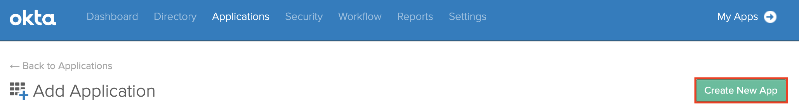
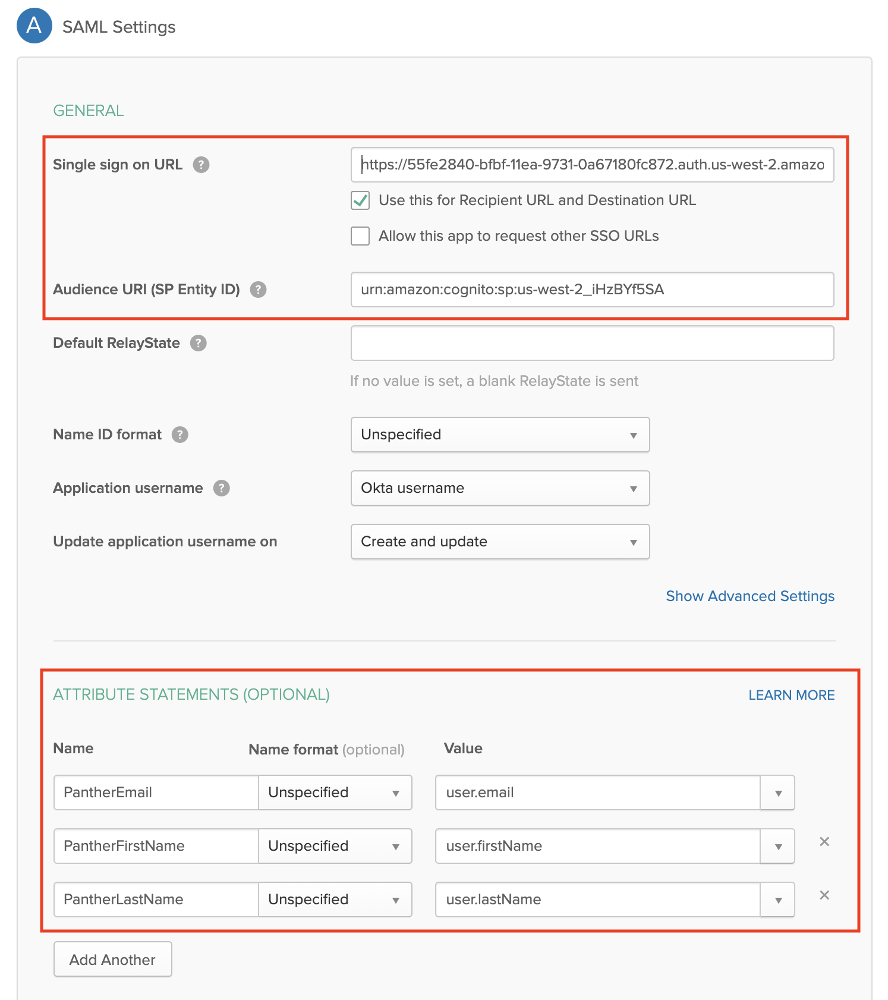
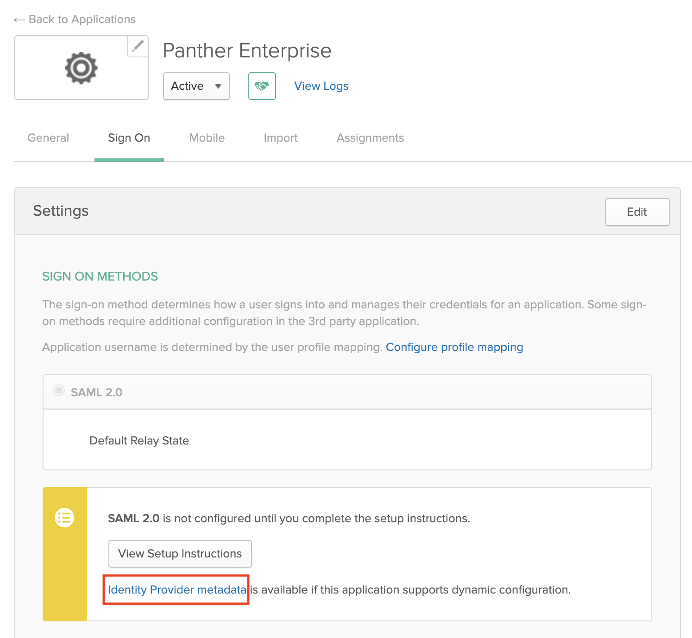

# Integrating Okta with Panther Enterprise

First, [deploy](../../quick-start.md) Panther Enterprise and go to the General Settings page. Note the values for "Audience" and "ACS URL."

## Create Okta App


We are in the process of registering an official Panther Okta app, but in the meantime follow these steps to configure an Okta app manually.


From the Okta admin console, navigate to the Applications tab

Click "Add Application"

Click "Create New App" and configure "Platform: Web" app and "Sign on method: SAML 2.0"

Click "Create" and configure the General Settings however you see fit. We recommend:

Click "Next" and configure section 2A, "SAML Settings", as follows:

* The "Single sign on URL" is of the form `https://USER_POOL_HOST/saml2/idpresponse` (copied from Panther General Settings page)
* The "Audience URI" is of the form `urn:amazon:cognito:sp:USER_POOL_ID` (copied from Panther General Settings page)

The "Group Attribute Statements" can be left blank (not shown here). Click "Next" and fill out feedback for Okta, linking to this documentation page if you like. Click "Finish."

Copy the "Identity Provider metadata" link shown on the next screen, under the Settings section of the "Sign On" tab:

This is the "issuer/metadata" link that you will need to give to Panther.

Finally, be sure to grant access to the appropriate people/groups in the "Assignments" tab.

## Configure Panther

From the Panther settings page, enable SAML with:
  * A default [Panther role](../rbac.md) of your choice
  * The Okta metadata URL you just copied
  
Click "save" and you're done! Now, the Panther login page will show a link which will authenticate via Okta.


Panther screenshots coming soon!
