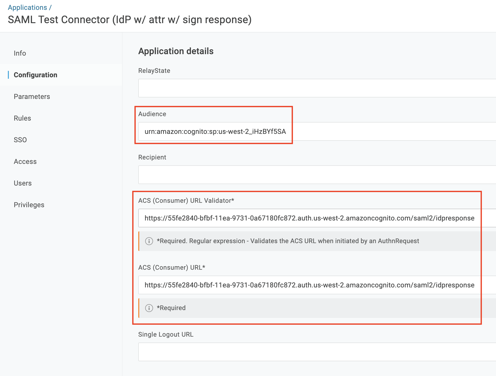
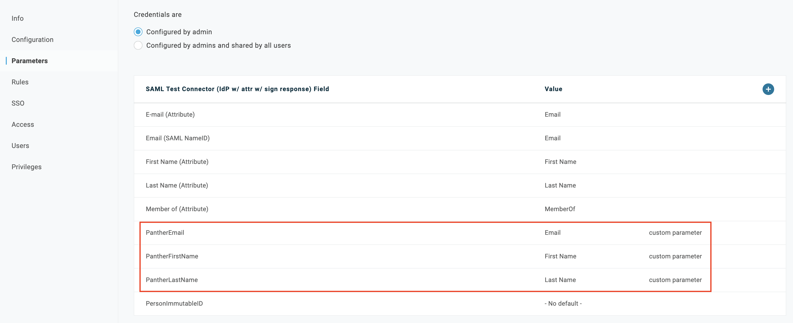
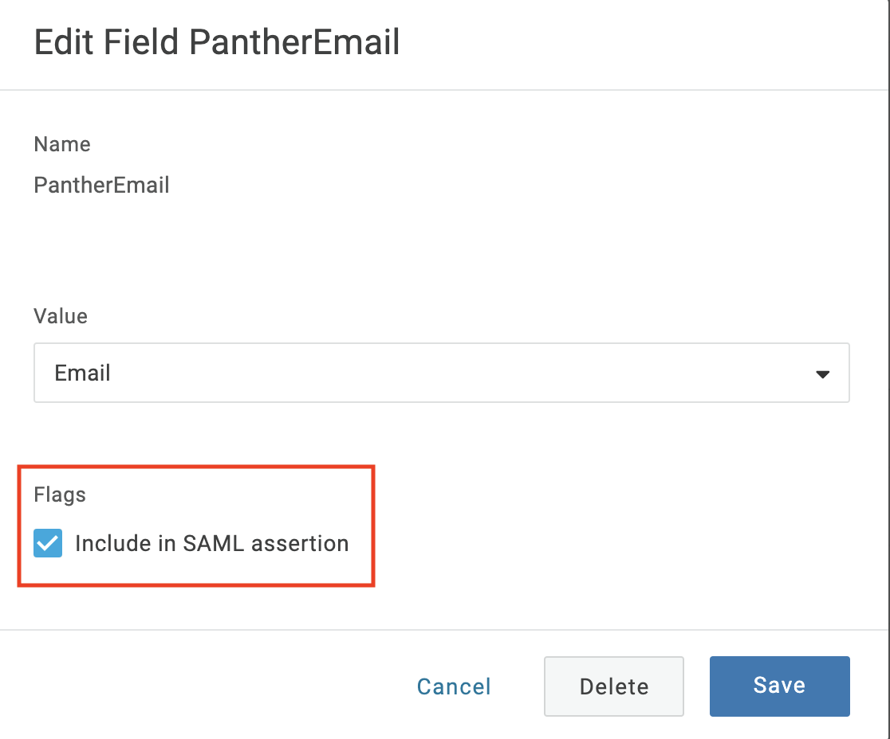

# Integrating OneLogin with Panther Enterprise

First, [deploy](../../quick-start.md) Panther Enterprise and go to the General Settings page. Note the values for "Audience" and "ACS URL."

## Create OneLogin App


We are in the process of registering an official Panther OneLogin app, but in the meantime follow these steps to configure a OneLogin app manually.


From the OneLogin admin console, navigate to the Applications tab.

Click the "Add App" button at the top of the next page, and search for "saml test connector." Choose the IdP version:

Choose a display name (e.g. "Panther Enterprise") and a logo/description, if you like. We recommend disabling
"visible in portal," since SAML logins can only be initiated from Panther. Click "Save."

Now you can edit the application configuration, filling in the "Audience" and "ACS Consumer" values you found in the Panther General Settings page a moment ago: 

* The "ACS (Consumer) URL" and "ACS (Consumer) URL Validator" is of the form `https://USER_POOL_HOST/saml2/idpresponse` (copied from Panther General Settings page)
* The "Audience" is of the form `urn:amazon:cognito:sp:USER_POOL_ID` (copied from Panther General Settings page)

Next, add Panther's custom parameters - `PantherFirstName`, `PantherLastName`, and `PantherEmail`:

For each parameter, be sure to check "include in SAML assertion":

Don't forget to grant access to the appropriate users / groups.

Finally, from the "SSO" section, set the algorithm to SHA-512 (optional) and copy the Issuer URL:

This is the URL you will need to give to Panther. Save your OneLogin application.

## Configure Panther

From the Panther settings page, enable SAML with:
  * A default [Panther role](../rbac.md) of your choice
  * The OneLogin issuer URL you just copied
  
Click "save" and you're done! Now, the Panther login page will show a link which will authenticate via OneLogin.


Panther screenshots coming soon!

