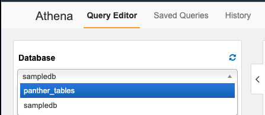
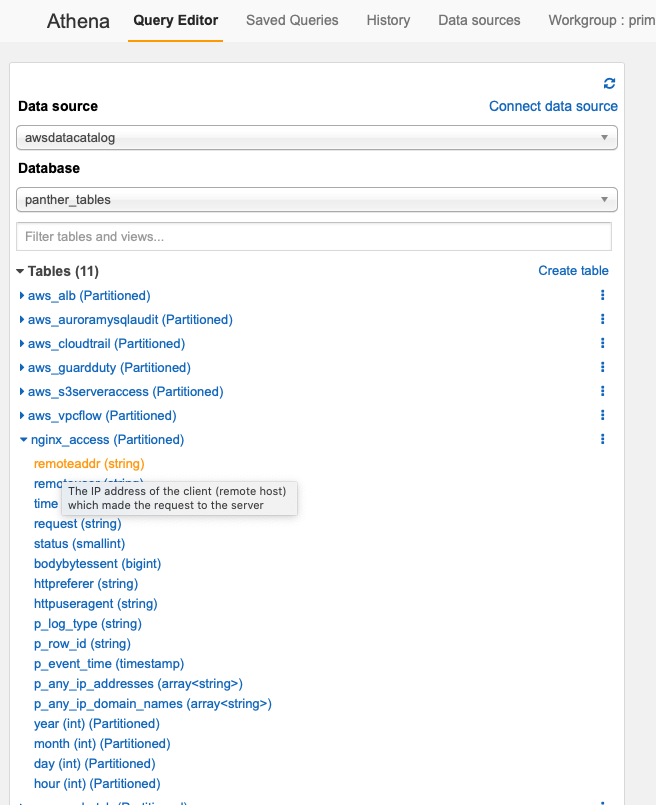
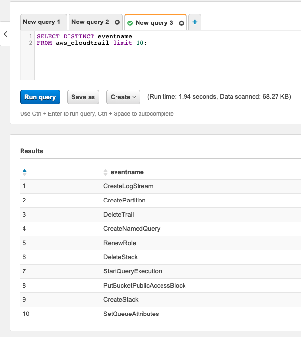

# Background

Panther's Historical Search allows for freely searching collected and normalized log data using SQL via [AWS Athena](https://aws.amazon.com/athena/).

This is helpful for investigations, baselining behaviors, writing rules, and advanced analytics on log events that operate on the context of days, weeks, or months of data.

Panther performs initial data normalization and processing to store the log data in a standard and efficient way in S3.

Additionally, any other application that can read data from S3 can also access this data either for search, business intelligence, redundancy, or anything else.

## Available Databases

The following databases are available to search from:

|         Database         | Description                                                                               |
| :----------------------: | ----------------------------------------------------------------------------------------- |
| `panther_logs`           | All data sent via Log Analysis, organized by log type   |
| `panther_rule_matches`   | Events for all triggered alerts, organized by log type         |
| `panther_views`          | Standardized fields across all logs and rule matches                   |

## Accessing Data with Athena

By navigating to the AWS [Athena](https://console.aws.amazon.com/athena/home) console, you can find a set of Panther pre-built tables under the database dropdown:

Expanding these tables will show their fields (hover your mouse over a field to see the description). You can use the in-browser query editor to run SQL like commands against the data:


If this is your first time using Athena, you will be prompted to setup a bucket to store your search results


Data can now be queried to answer common questions:

## Accessing Data with AWS Glue

All log data is stored in AWS [Glue](https://aws.amazon.com/glue/) tables. This makes the data
available in many tools such as Athena, Redshift, Glue Spark Jobs and SageMaker.

## Coming Soon

Panther Historical Search is still in it's early phases! For upcoming releases, we have planned:

- More log types
- Scheduled searches
- Even more search optimization
- Pre-canned searches
- Cross integration with Panther Cloud Security findings and more!
