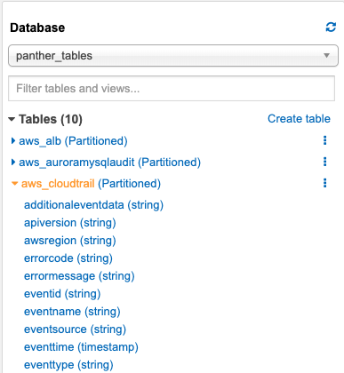

# Background

After Panther has loaded and processed log data via [Log Processing](../log-analysis/log-processing/), you are able to freely search it using SQL via [AWS Athena](https://aws.amazon.com/athena/). This is useful for investigations, baselining behaviors, and advanced analytics on log events that take operate on the context of days, weeks, or months of data.

Panther performs initial data normalization and processing to store the log data in a standard and efficient way in S3. Additionally, any other application that can read data from S3 can also access this data either for search, business intelligence, redundancy, or anything else.

### Accessing the data with Athena

By navigating to the AWS [Athena](https://console.aws.amazon.com/athena/home) console, you can find a set of Panther pre-built tables under the database dropdown.

Expanding these tables will show their fields, and you can use the in browser query editor to run SQL like commands against the data.

If this is your first time using Athena, you will be prompted to setup a bucket to store your search results in.

After that, data can be queried to answer common questions:

### Coming soon

Panther Historical Search is still very much in it's early phases! In development for this tool we have planned:

- More log types
- Scheduled searches
- Even more search optimization
- Pre-canned searches
- Cross integration with Panther Compliance findings
- and more!
