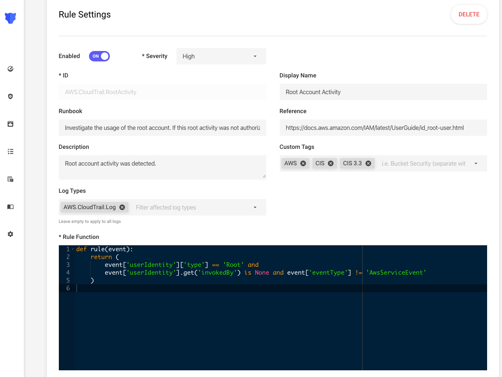

# Background

Panther enables collection, analysis, normalization, and storage of logs generated by cloud platforms, on-premises systems, laptops, or virtual machines.

**Rules** are used to identify suspicious activity and generate alerts for your team.

The example Rule below checks if any Root user activity has been observed in an AWS account:

In the next page, we'll show how to setup log analysis functionality for your logs.
