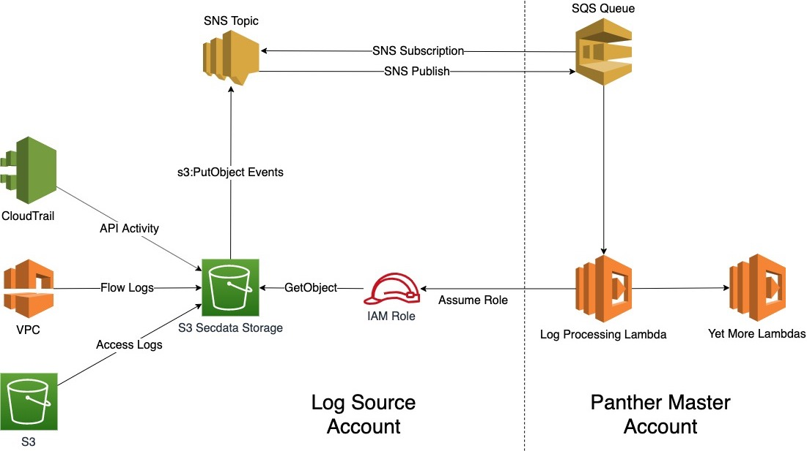
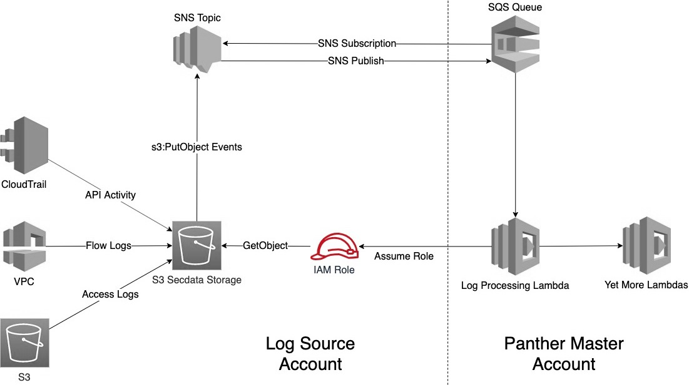
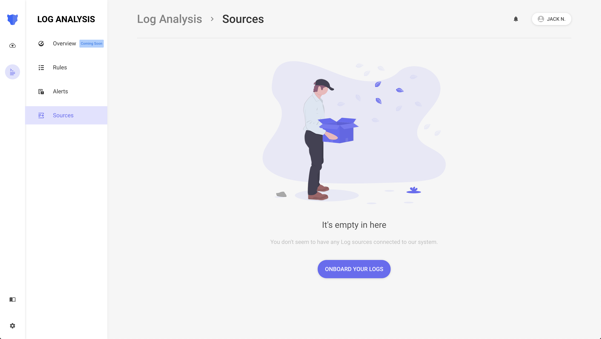
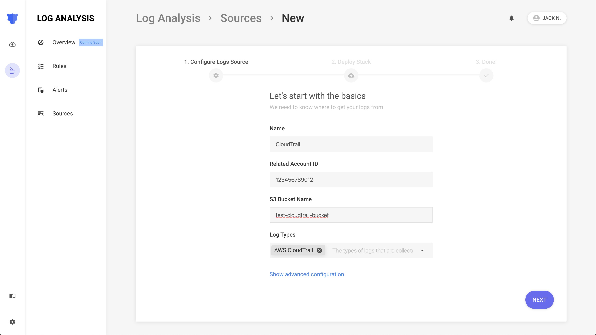
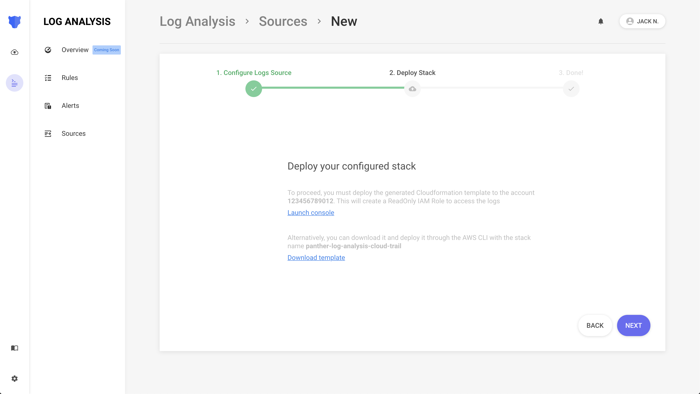
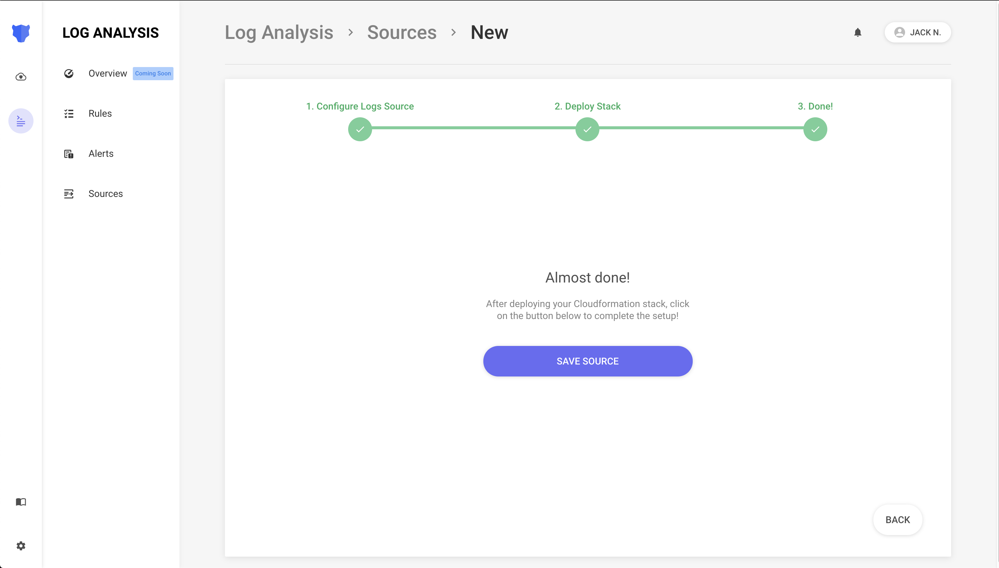
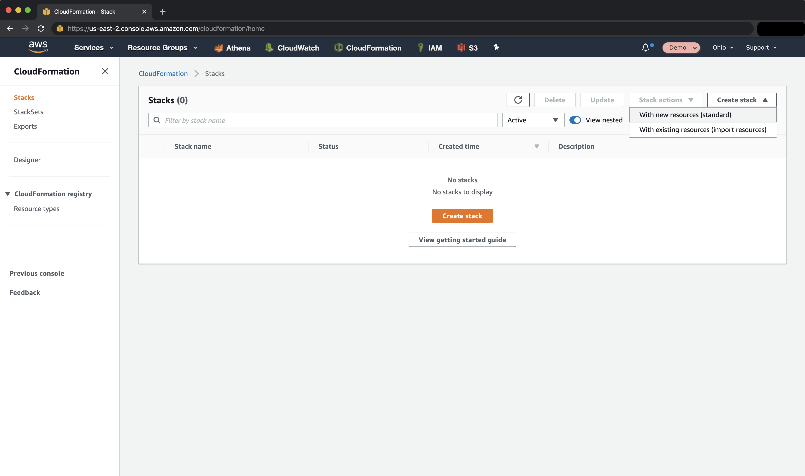

# Log Processing

## Overview

Panther's Log Analysis is designed for analyzing high volumes of events in real-time such as:

* Login/Logout
* API calls
* Network traffic
* Running processes
* System changes
* Output from IDS sensors

 In this guide, we'll walk through how to configure Panther to collect and analyze data with Python rules.

## How It Works



1. Logs are written into an S3 bucket
2. The bucket sends an S3 event notification to an SNS Topic
3. An SQS Queue in the Panther Master account receives the event notification
4. A Lambda function pulls messages off the Queue, assumes an IAM Role, and downloads the log data
6. A Lambda function sends the parsed log data for analysis

## How to Setup Log Analysis

First, the data you'd like to analyze must be sent to an S3 bucket.

We recommend organizing incoming data by using S3 folders or multiple buckets.

You can onboard as many buckets as you would like from any region.

## IAM Setup

The IAM role created below will enable access to the S3 buckets containing logs:



From **Log Analysis**, click **Sources**, then **Onboard Your Logs**:



### Step 1 - Enter the Bucket Details

|         Field         | Required? | Description                                                                                |
| :----------------------: | ----------------------------------------------------------------------------------------- | --------|
|  `Name`   | `Yes` | Friendly name of the S3 bucket |
| `Account ID`   | `Yes`  | The 12-digit AWS Account ID where the S3 buckets are located |
| `Bucket Name` | `Yes`  | The S3 Bucket ID/name to onboard |
| `Log Types`   | `Yes`  | The list of Log Types contained in the bucket  |
| `S3 Prefix Filter`   | `No`  | The path of the files to analyze, which should not start with the `/` character   |
| `KMS Key`   | `No`  | If your data is encrypted using KMS-SSE, provide the ARN of the KMS key  |



Once you have filled the required and optional advanced configurations, click **Next**.

### Step 2 - Deploy the IAM Role

You can deploy the generated IAM role by either **launching the CloudFormation Stack** in the console directly, or **downloading the template** and applying it through your own pipelines.



#### In The CloudFormation Console

When you click the **Launch console** link, a new tab will open in your browser and take you to the AWS CloudFormation Console.


Make sure you sign in the same AWS Account that was provided in the previous step.




Make sure to check the acknowledgement in the Capabilities box on the bottom


Click the **Create stack** button. After few seconds, the stack's `Status` should change to `CREATE_COMPLETE`. If there is an error creating the stack, then an IAM role with the same name may already exist in your account.

### Step 3 - Save the Source

Go back to Panther browser tab and click on **Next,** then **Save Source** to complete the setup.




Congratulations! You have granted Panther the permissions to process your logs in S3.


## SNS Notification Setup

Now that Panther has the ability to pull data from S3, you must configure your S3 buckets to send [notifications](https://docs.aws.amazon.com/AmazonS3/latest/dev/NotificationHowTo.html) on new data.

### Existing S3 Buckets

First, create an SNS Topic and SNS Subscription to notify Panther that new data is ready for processing:

#### Create Notifications SNS Topic

Log into the AWS Console of the account that owns the S3 bucket.

Select the AWS Region where your S3 buckets are located, navigate to the **CloudFormation** console, and click on **Create Stack** (with new resources).



Under the `Specify template` section, enter the following Amazon S3 URL:

```
https://panther-public-cloudformation-templates.s3-us-west-2.amazonaws.com/panther-log-processing-notifications/latest/template.yml
```


##### Specify Stack Details

|         Field         | Description                                                                                |
| :----------------------: | ----------------------------------------------------------------------------------------- |
| `Stack name`    | A name of your choice, e.g. `panther-log-processing-notifications-<bucket-label>` |
| `MasterAccountId`     | The 12 digit AWS Account ID where Panther is deployed |
| `PantherRegion`   | The region where Panther is deployed |
| `SnsTopicName`     | The name of the SNS topic receiving the notification, by default is `panther-notifications-topic`  |

##### Create Stack

Click on **Next** and again **Next**. Click on **Create Stack**. This stack has one output named `SnsTopicArn`.

#### Configure Event Notifications

Now with the SNS Topic created, we must enable notifications from the S3 buckets.

##### Using the Console

Navigate to the AWS [S3 Console](https://s3.console.aws.amazon.com/s3/home), select the relevant bucket, and click the `Properties` tab.

From there, find the `Events` card under the `Advanced settings` section. Click `+ Add notification` and use the following settings:

|         Field         | Value                                                                                |
| :----------------------: | ----------------------------------------------------------------------------------------- |
| `Name`    | `PantherEventNotifications` |
| `Events`     | `All object create events` |
| `Send to`   | `SNS Topic` |
| `SNS`     | `panther-notifications-topic`  |
| `Suffix`   | (optional) limits notifications to objects with keys that end in matching characters  |
| `Prefix`   | (optional) limits notifications to objects with keys that start with matching characters  |

Click `Save`.

##### Using CloudFormation

This can also be accomplished using CloudFormation with the following examples:

```yaml
Resources:
 CloudTrailBucket:
   Type: AWS::S3::Bucket
   Properties:
     BucketName: <my-cloudtrail-bucket>
     NotificationConfiguration:
       TopicConfigurations:
         - Topic: arn:aws:sns:<PantherRegion>:<MasterAccountId>:panther-notifications-topic
           Event: s3:ObjectCreated:*
```

```json
{
 "Resources": {
   "CloudTrailBucket": {
     "Type": "AWS::S3::Bucket",
     "Properties": {
       "BucketName": "my-cloudtrail-bucket",
       "NotificationConfiguration": {
         "TopicConfigurations": {
           "Topic": "SNS-TOPIC-ARN",
           "Event": "s3:ObjectCreated:*"
         }
       }
     }
   }
 }
}
```

### Existing S3 Buckets and SNS Topics

Follow the steps below if you already have an S3 bucket configured to send `All object create events` to an SNS Topic.

#### Modify SNS Access Policy

Create a subscription between your SNS topic and Panther's log processing SQS queue.

1. Log into the AWS Console for the account where your S3 bucket exists
2. Navigate to the [SNS Console](https://us-west-2.console.aws.amazon.com/sns/v3/home#/topics) and select the SNS Topic currently receiving events
3. Take Note the ARN of this SNS topic
4. Select the `Edit` button and scroll down to the `Access Policy` card
5. Add the statement shown below to the topic's `Access Policy`. Populate `<MasterAccountId>` with the 12-digit account ID where Panther is deployed. Populate `SNS-TOPIC-ARN` with the ARN you noted on step \#3:

```yaml
Sid: CrossAccountSubscription
Effect: Allow
Principal:
  AWS: arn:aws:iam::<MasterAccountId>:root
Action: sns:Subscribe,
Resource: <SNS-TOPIC-ARN>
```

```json
{
  "Sid": "CrossAccountSubscription",
  "Effect": "Allow",
  "Principal": {
    "AWS": "arn:aws:iam::<MasterAccountId>:root"
  },
  "Action": "sns:Subscribe",
  "Resource": "<SNS-TOPIC-ARN>"
}
```

#### Create SNS Subscription

Finally, create the subscription to the Panther Master Account's SQS Queue.

From the SNS Console, select the `Create subscription` button:

1. `Protocol`: `Amazon SQS`
2. `Endpoint`: `arn:aws:sns:<PantherRegion>:<MasterAccountId>:panther-input-data-notifications-queue`
3. Select the `Create subscription` button

## Log Processing Advanced Configurations

These are just two basic configurations to integrate with Panther Log Processing.

There are other variations and advanced configurations available for more complex use cases and considerations. For example, instead of using S3 event notifications for CloudTrail data you may have CloudTrail directly notify SNS of the new data.

## Viewing the Logs

After log analysis is setup, your data can be searched with [Historical Search](../../historical-search/README.md)!
