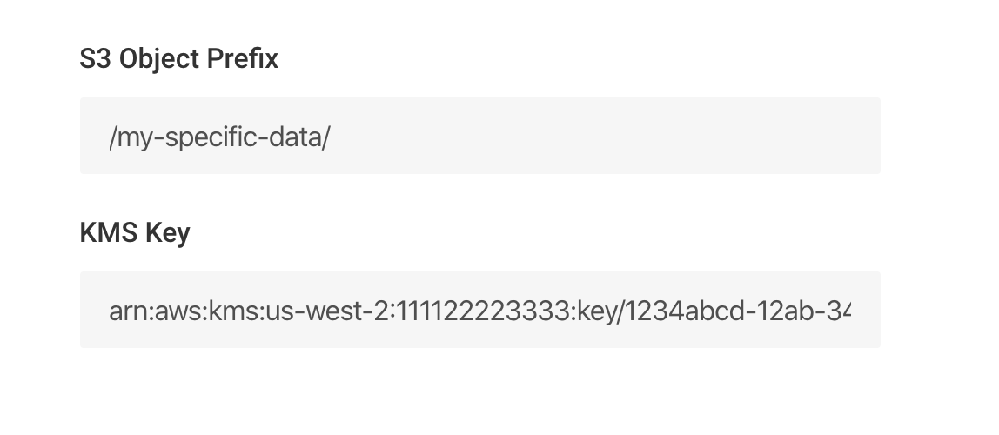

# IAM Setup

The first step is creating the IAM role to allow access to the S3 buckets containing logs:

## Setup

From **Log Analysis**, click **Sources**, then **Onboard Your Logs**:

Enter the details for the logs:

|         Field         | Required? | Description                                                                                |
| :----------------------: | ----------------------------------------------------------------------------------------- | --------|
|  `Name`   | `Yes` | Friendly name of the S3 bucket |
| `Account ID`   | `Yes`  | The 12-digit AWS Account ID where the S3 buckets are located |
| `Bucket Name` | `Yes`  | The S3 Bucket ID/name to onboard |
| `Log Types`   | `Yes`  | The list of Log Types contained in the bucket  |
| `S3 Prefix Filter`   | `No`  | The path of the files to analyze   |
| `KMS Key`   | `No`  | If your data is encrypted using KMS-SSE, provide the ARN of the KMS key  |

And the optional advanced configuration:

Once you have filled the information, click on **Next**.

From here, you can deploy the generated IAM role by either **Launching the CloudFormation Stack** console directly, or **downloading the template** and applying it through your own pipelines.

If you click the **Launch Stack** button, a new tab will open in your browser and take you to the AWS CloudFormation Console. Make sure you sign in the same AWS Account that was provided in the previous step.


Make sure to check the acknowledgement in the Capabilities box on the bottom


Click the **Create stack** button. After few seconds, the stack's `Status` should change to `CREATE_COMPLETE`. If there is an error creating the stack, then an IAM role with the same name may already exist in your account.

Go back to Panther browser tab and click on **Next,** then **Save Source** to complete the setup.


Congratulations! You have granted Panther the permissions to process your logs in S3.


The next sections we will detail how to configure SNS notifications so Panther can analyze new logs as they are delivered to S3.
