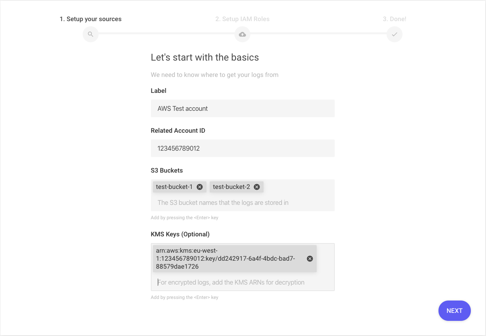
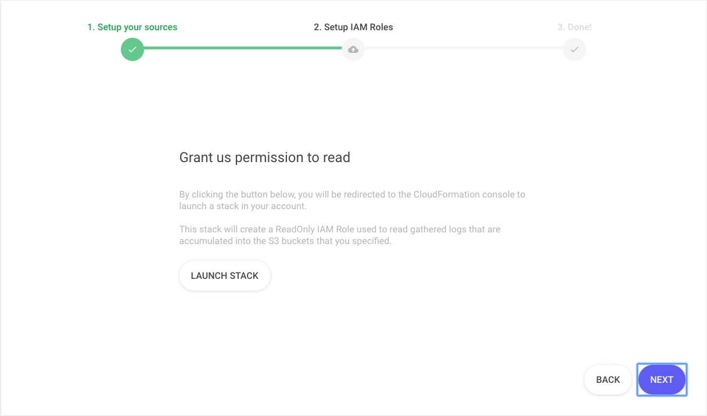
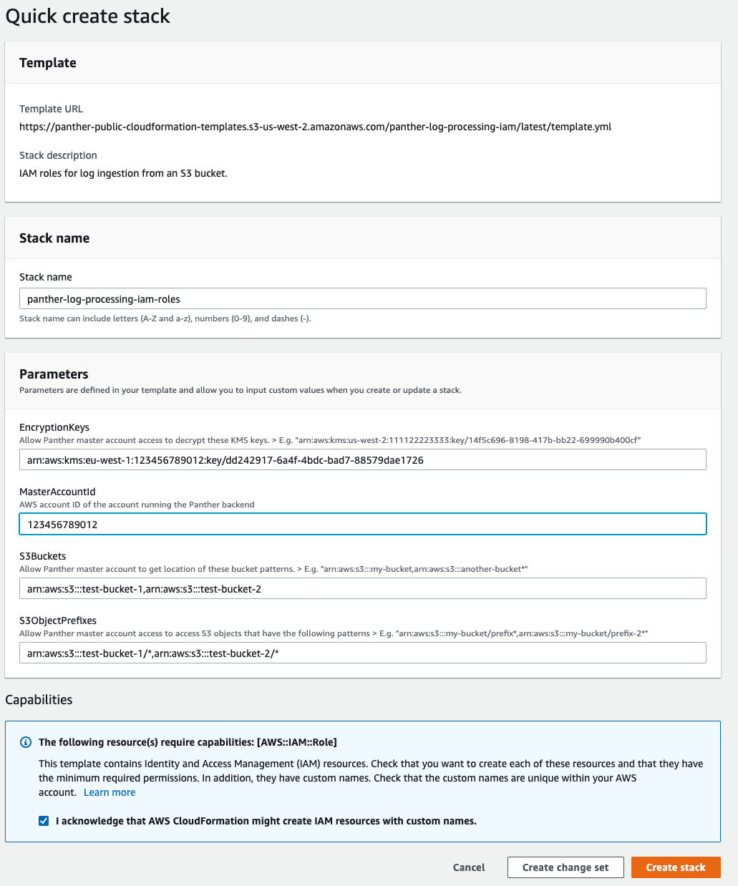
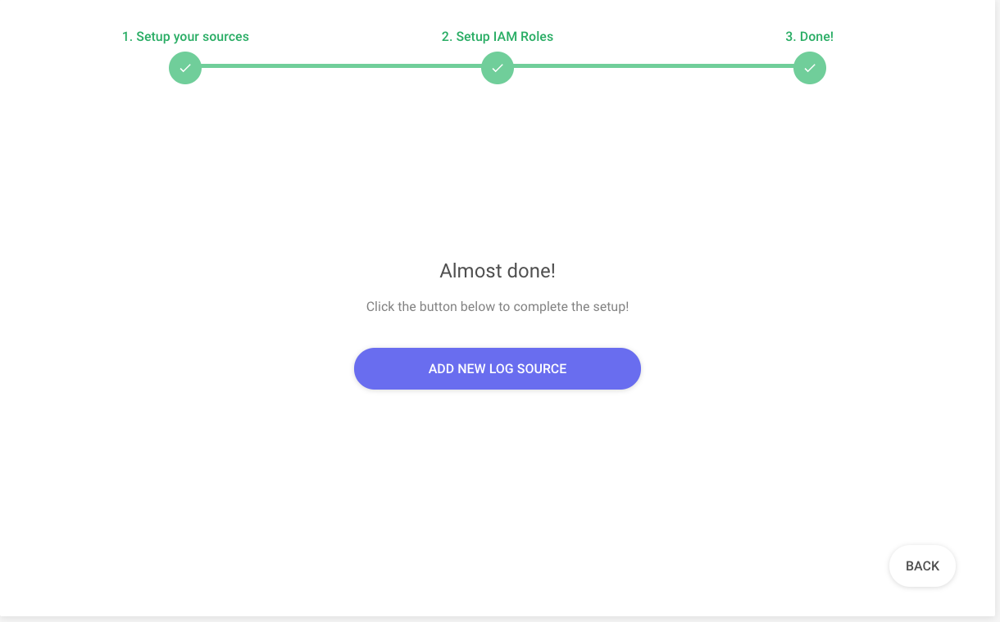

# IAM Setup

The first step is creating the IAM role with access to the S3 buckets containing logs:

## Setup

From **Settings**, click **Sources**, then click **ADD SOURCE** under **Log Sources.**

Enter the details for the logs:

- `Label`: Required. Friendly name of the AWS Account
- `Related Account ID` : Required. The 12-digit AWS Account ID where the S3 buckets are located
- `S3 Buckets`: Required. The names of the S3 buckets that contain the logs
- `KMS Keys`: Optional. In case your data are encrypted using KMS-SSE, provide the ARNs of the KMS keys that the data were encrypted with

Once you have filled the information, click on **Next**.

Click the **Launch Stack** button to deploy the CloudFormation stack giving Panther Read permissions

When you click the **Launch Stack** button, a new tab will open in your browser and take you to the AWS Console. Make sure you sign in the AWS Account that was provided in the step above.


Check the acknowledgement in the Capabilities box in the Create stack page


Click the **Create stack** button. After few seconds, the stack's `Status` should change to `CREATE_COMPLETE`. If there is an error creating the stack, then an IAM role with the same name may already exist in your account.

Get back to Panther browser tab and click on **Next,** then **Add New Source** to complete the setup.


Congratulations! You have granted Panther the permissions to process your logs in S3.


The next sections we will detail how to configure SNS notifications so Panther can analyze new logs as they are delivered to S3.
