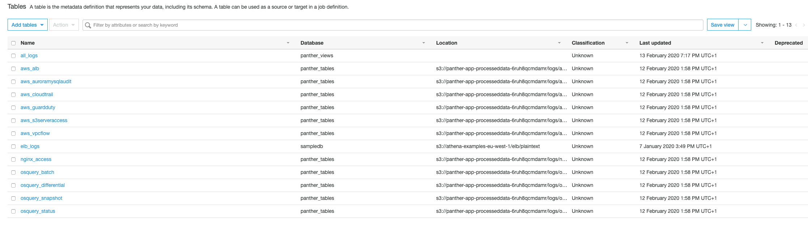

# Writing a New Parser

You can add support for a new log type by writing a custom **Parser**, which controls how Panther converts a raw string into a parsed event to be used by the rules engine. The instructions below provide a developer's guide for writing new Parsers.

## Getting Started

Each parser must be created inside of the [parsers](https://github.com/panther-labs/panther/tree/master/internal/log_analysis/log_processor/parsers) folder.

- If it belongs to an existing family of parsers (e.g. aws, osquery) add the parser in the existing package
- If not, create a new package and place the parser within

## Developing

Write the parser! Use the [CloudTrail parser](https://github.com/panther-labs/panther/blob/master/internal/log_analysis/log_processor/parsers/awslogs/cloudtrail.go) as an example.

Pick the right [datatype](https://github.com/panther-labs/panther/blob/master/internal/log_analysis/log_processor/parsers/awslogs/cloudtrail.go#L55) for each field, which is generally a pointer.

### Fields

Use the `validate` tag wherever possible. If the field is mandatory, mark is as `required`.

Include a `description` tag with a short summary of each field

### Methods and Structure

The Parser must include the following methods:

- [New()](https://github.com/panther-labs/panther/blob/master/internal/log_analysis/log_processor/parsers/awslogs/cloudtrail.go#L122)
- [Parse()](https://github.com/panther-labs/panther/blob/master/internal/log_analysis/log_processor/parsers/awslogs/cloudtrail.go#L127)
- [LogType()](https://github.com/panther-labs/panther/blob/master/internal/log_analysis/log_processor/parsers/awslogs/cloudtrail.go#L151)
- [Description()](https://github.com/panther-labs/panther/blob/master/internal/log_analysis/log_processor/parsers/awslogs/cloudtrail.go#L32)

All parsers also have common fields, make sure to include them, such as with this example.

Be sure to populate the fields.

### Finalizing

To enable the new parser, first add it to the [parser registry](https://github.com/panther-labs/panther/blob/master/internal/log_analysis/log_processor/registry/registry.go#L37).

### Before making a pull-request

* Write [unit tests](https://github.com/panther-labs/panther/blob/master/internal/log_analysis/log_processor/parsers/awslogs/cloudtrail_test.go) for your parser.
* Ensure your code is formatted, run `mage fmt`
* Ensure all tests pass `mage test:ci`
* Be sure to checkin the documentation that will be automatically generated and 
update [SUMMARY.md](https://github.com/panther-labs/panther/blob/master/docs/gitbook/SUMMARY.md) if you add a new type of log.
* Deploy Panther. You should be able to see a new table with your added parser in Glue Data Catalog! 

* Do an end to end test. You can use [s3queue](../../operations/ops-home.md#tools) to copy test files 
into the `panther-bootstrap-auditlogs-<id>` bucket to drive log processing or use the 
development tool `./out/bin/devtools/<os>/<arch>/logprocessor` to read files from the local file system.
Query Athena to confirm your data is available.
* Update the [constants](https://github.com/panther-labs/panther/blob/master/web/src/constants.ts#L79) table to register with UI.
