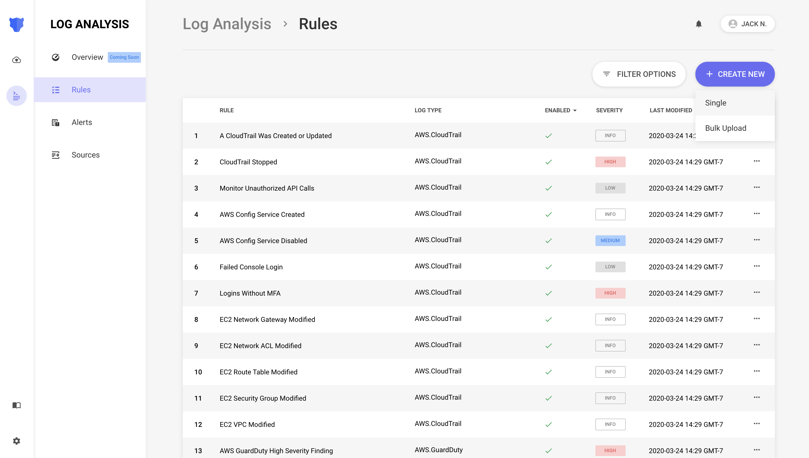
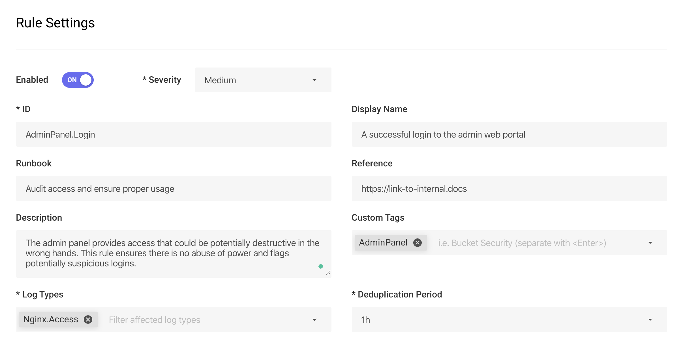
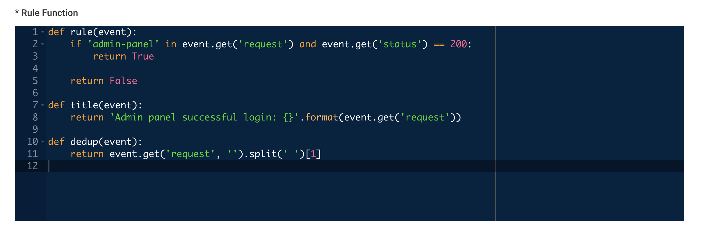
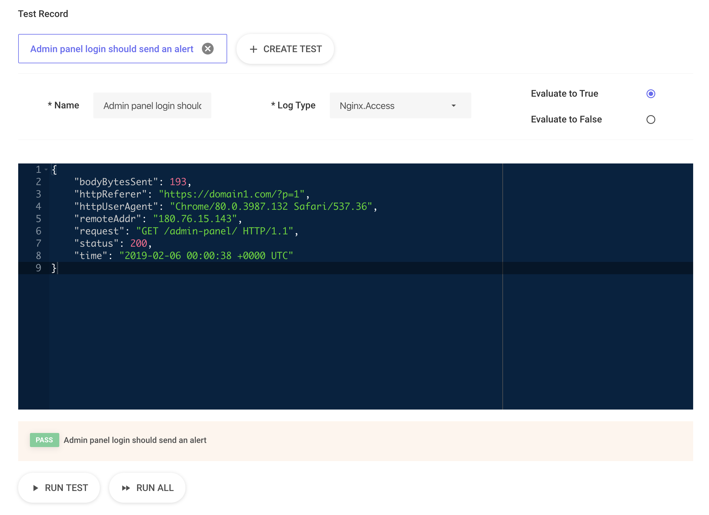

# Rules

Panther enables easy aggregation, normalization, analysis, and storage of security logs. **Rules** are Python3 functions used to identify suspicious activity and generate alerts for your team to triage.

## Rule Components

- A `rule` function with an `event` argument that returns `True` if the rule should send an alert, or `False` if it should not
- Optionally, a `dedup` function to control how alerts are grouped together
- Optionally, a `title` function to define the message shown in the alert
- Metadata containing context for triage
- An association with a specific Log Type

As an example, the rule below checks if unauthenticated access occurred on an S3 bucket:

```python
# A set of S3 buckets all access should be authenticated
AUTH_BUCKETS = {'example-bucket'}


def rule(event):
    if event.get('bucket') not in AUTH_BUCKETS:
        return False

    return 'requester' not in event


def dedup(event):
    return event.get('bucket')


def title(event):
    return 'Unauthenticated Access to S3 Bucket  {}'.format(event.get('bucket'))
```

- This rule will group alerts by the bucket name
- Alerts will have a title such as `Unauthenticated Access to S3 Bucket my-super-secret-data`

## Rule Packs

By default, rules are pre-installed from Panther's [open-source packs](https://github.com/panther-labs/panther-analysis) and cover baseline detections and examples across supported log types:

- AWS CIS
- AWS Best Practices
- AWS Samples (VPC, S3, CloudTrail, and more)
- Osquery CIS
- Osquery Samples

## Workflow

Panther rules can be written, tested, and deployed either with the UI or the [panther_analysis_tool](https://github.com/panther-labs/panther_analysis_tool) CLI utility.

Each rule takes an `event` input of a given log type from the [supported logs](../log-processing/supported-logs) page.

### Rule Body

The rule body MUST:
* Be valid Python3
* Define a `rule()` function that accepts one argument
* Return a `bool` from the rule function

```python
def rule(event):
  return False
```

The Python body SHOULD:
* Name the argument to the `rule()` function `event`

The Python body MAY:
* Import standard Python3 libraries
* Import from the user defined `aws_globals` file
* Define additional helper functions as needed
* Define variables and classes outside the scope of the rule function
* Define a `dedup` function that accepts one argument and returns a `string`
* Define a `title` function that accepts one argument and returns a `string`

Using the schemas in [supported logs](../log-processing/supported-logs) provides details on all available fields in events. When accessing event fields, it's recommend to always use `.get()` since empty key/values are omitted from the event.

#### Example Rule

For example, let's write a rule on an [NGINX Access](../log-processing/supported-logs/Nginx.md) log:

```json
{
  "bodyBytesSent": 193,
  "httpReferer": "https://domain1.com/?p=1",
  "httpUserAgent": "Chrome/80.0.3987.132 Safari/537.36",
  "remoteAddr": "180.76.15.143",
  "request": "GET /admin-panel/ HTTP/1.1",
  "status": 200,
  "time": "2019-02-06 00:00:38 +0000 UTC"
}
```

This example rule alerts on successful admin panel logins:

```python
def rule(event):
  if 'admin-panel' in event.get('request') and event.get('status') == 200:
    return True
  return False
```

In the `rule()` body, returning a value of `True` indicates an alert should send. Returning a value of `False` indicates the log is not suspicious.

### Alert Deduplication

To avoid a flood of alerts, events are grouped together within a given time period and associated with a single `alertID`.

By default, events are merged by the key `defaultDedupString:${RuleID}` over a period of `1h`. Each of these options are fully configurable.


The deduplication string is limited to `1000` characters and will be truncated if it goes over.


To modify the merge key, use the `dedup()` function in your rule body. The same parsed log `event` is passed into this function, and you may use any logic desired to return the `dedupString`. If a Falsy value is returned from `dedup()`, then the default string will be used.

The `dedupPeriodMinutes` may be set to either `15m`, `30m`, `1h`, `3h`, `12h`, or `24h`.

To keep with the previous example, all events will merge on the requested webpage:

```python
def dedup(event):
  return event.get('request', '').split(' ')[1]
```

### Alert Titles

Alert titles, sent to our destinations, are by default `New Alert: ${Rule Description}`. To override this message, use the `title()` function:

```python
def title(event):
  return 'successful /admin-panel/ logins'
```

The title can also be interpolated by using event attributes:

```python
def title(event):
  return 'successful logins to {}'.format(event.get('request').split(' ')[1])
```

## First Steps with Rules

When starting your rule writing/editing journey, your team should decide between a UI or CLI driven workflow.

Then, configure the built in rules by searching for the `Configuration Required` tag. These rules are designed to be modified by you, the security professional, based on your organization's business logic.

## Writing Rules in the Panther UI

Navigate to Log Analysis > Rules, and click `Create New` in the top right corner. You have the option of creating a single new rule, or uploading a zip file containing rules created with the `panther_analysis_tool`.



### Set Attributes

Keeping with the NGINX example above, set all the necessary rule attributes:



### Write Rule Body

Then write our rule function with the `rule()`, `title()`, and `dedup()` functions.



### Configure Tests

Finally, configure test cases to ensure our rule works as expected:



And click `Create` to save the rule.

Now, when any `NGINX.Access` logs are sent to Panther this rule will automatically analyze and alert upon admin panel activity.

## Writing Rules with the Panther Analysis Tool

The `panther_analysis_tool` is a Python command line interface  for testing, packaging, and deploying Panther Policies and Rules. This enables teams to work in a more developer oriented workflow and track detections with version control systems such as `git`.

### Installation

The `panther_analysis_tool` is available on pip!

Simply install with:

```bash
pip3 install panther-analysis-tool
```

### Running Tests

```bash
panther_analysis_tool test --path <path-to-python-code>
```

### Uploading to Panther

Make sure to configure your environment with valid AWS credentials prior to running the command below.

```bash
panther_analysis_tool upload --path <path-to-your-rules> --out tmp
```


Rules with the same ID are overwritten. Locally deleted rules will not automatically delete in the rule database and must be removed manually.


### File Organization

Navigate to the repository/path for your custom detections. We recommend grouping detections based on purpose, such as `suricata_rules` or `internal_pci`. Use the open source [Panther Analysis](https://github.com/panther-labs/panther-analysis) packs as a reference.

Each new rule consists of a Python file (`<my-rule>.py`) containing your rule, dedup, and title functions, and a YAML/JSON specification (`<my-rule>.yml`) with rule attributes.

### Rule Body

Write your rule as you would above, and save it as `folder/my_new_rule.py`.

### Rule Attributes

The specification file MUST:

* Be valid JSON/YAML
* Define an `AnalysisType` field with the value `rule`

Define the additional following fields:
* `Enabled`
* `FileName`
* `RuleID`
* `LogTypes`
* `Severity`

An example specification file:

```yml
AnalysisType: rule
Enabled: true
Filename: my_new_rule.py
RuleID: Category.Behavior.MoreInfo
LogTypes:
  - Log.Type.Here
Severity: Info|Low|Medium|High|Critical
DisplayName: Example Rule to Check the Format of the Spec
Tags:
  - Tags
  - Go
  - Here
Runbook: Find out who changed the spec format.
Reference: https://www.link-to-info.io
```

### Unit Tests

In our spec file, add the following key:

```yml
Tests:
  -
    Name: Name to describe our first test.
    LogType: Log.Type.Here
    ExpectedResult: true/false
    Log:
      Key: Values
      For: Our Log
      Based: On the Schema
```

## Runtime Libraries

Python provides high flexibility in defining your rules, and the following libraries are available to be used in Panther's runtime environment:

| Package          | Version   | Description                 | License   |
| :--------------- | :-------- | :-------------------------- | :-------- |
| `boto3`          | `1.10.46` | AWS SDK for Python          | Apache v2 |
| `policyuniverse` | `1.3.2.1` | Parse AWS ARNs and Policies | Apache v2 |
| `requests`       | `2.22.0`  | Easy HTTP Requests          | Apache v2 |

To add more libraries, edit the `PipLayer` below in the `panther_config.yml`:

```yaml
PipLayer:
  - boto3==1.11.16
  - policyuniverse==1.3.2.1
  - requests==2.22.0
```

Alternatively, you can override the runtime libraries by attaching a Lambda layer in the `panther_config.yml`:

```yaml
BackendParameterValues:
  PythonLayerVersionArn: 'arn:aws:lambda:us-east-2:123456789012:layer:my-layer:3'
```
