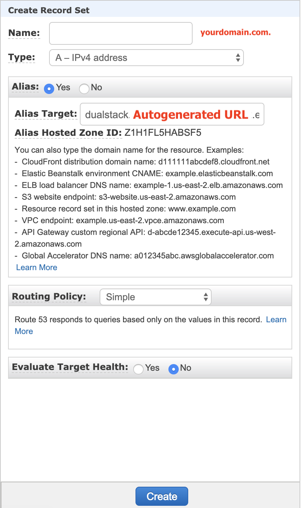

# Advanced Setup Options

## Configuring a Custom Domain

Out of the box, Panther ships with a self-signed certificate generated at deployment time. While this setup is better than not having SSL/TLS enabled at all on the web server, it is still far from best practice especially for a security tool. Panther *strongly* recommends you replace this self-signed certificate with a proper certificate before using Panther in a production environment.

Setting up a custom domain for the Panther app is fairly easy, and is takes four main steps:

  1. Register a domain
  2. Get a signed certificate for your domain into AWS
  3. Configure Panther
  4. Setup an alias from the domain to the auto-generated load balancer URL
  
All of these steps can be completed from within the AWS ecosystem, and the first three can also be mostly completed outside of the AWS ecosystem if that is preferred. This guide will walk through configuring a custom domain totally within the AWS ecosystem, and should take ~45 minutes and cost less than $20/year.

### Register a domain

In this guide we'll walk through registering a domain through AWS Route53, although any domain registrar should work. If you already have a domain registered, or perhaps an internal CA that manages certificates for your organization, this step can be skipped.

  1. Navigate to the [Route53](https://console.aws.amazon.com/route53/home) console on AWS and click the `Registered domains` tab.
  2. Click the `Register domain` button, and enter the name of the domain you'd like to register. Click the `Check` button, and AWS will verify the domain is available and suggest alternatives.
  3. After verifying the domain is available, click `Add to cart` and then `Continue`. On the next form, fill in the contact information. Be sure you can receive email at the email specified so that you can verify the domain in a future step. When you're done, click `Continue`.
  4. Agree to the terms and conditions, and click `Complete order`. If you have not registered a domain through route53 before, you will receive a confirmation email.
  
After that, the domain will take between ten minutes and an hour to complete registration. Fortunately, we can continue with the setup while we wait.

### Get a signed certificate into AWS

Now that you have a domain registered, you need to get a certificate for it.

  1. Navigate to the [ACM](https://console.aws.amazon.com/acm/home) console on AWS. Be sure you are in the same region that Panther was deployed in.
  2. Click either `Request a certificate` or `Import a certificate`, depending on your preferred workflow. In this example, we will be going through the `Request a certificate` workflow. If you are using a private CA, you will need to follow the `Import a certificate`  workflow.
  3. Make sure the `Request a public certificate` option is selected and click `Request a certificate`.
  4. Enter the name of the domain registered above, and click `Next`.
  5. Click either `DNS Validation` or `Email validation`. In this example, we will use `Email validation`. Click the `Next` button.
  6. Optionally add tags. Adding the tag `Application:Panther` will help group this certificate with the rest of the Panther product. When you are done adding tags, click the `Review` button.
  7. Verify everything looks correct, then click the `Confirm and request` button.
  8. You will receive an email shortly requesting verification of the certificate, with a link to a verify button that will confirm the certificate.
  9. After verifying the certificate request, you will see the status of the certificate switch from `Pending validation` to `Issued`. Be sure to note down the ARN of the newly created certificate for the next step.
  
### Configure Panther

At this point, it is time to configure Panther to use your custom certificate and domain. This can be done to either an active Panther deployment or to a new Panther deployment. Simply navigate to your Panther deployment directory and open the `deployments/panther_config.yml` file in your preferred text editor, then edit the following two configuration options:

  - `WebApplicationCertificateArn` - in this field, put the full ARN of the ACM certificate created in step two. This can be retrieved from the ACM console.
  - `CustomDomain` - in this field, put the domain name you registered in step one.
  
That's it, now simply run the `mage deploy` command (in the container if needed) and the update/installation will start. An update should only take a few minutes to process.

### Create an alias

Finally, you will need to create an alias or CNAME on your domain pointing to the load balancers auto generated URL. If you're not using a domain registered within route53, you should still generally be able to follow along with the steps below but through your registrars web console.

  1. Navigate to the Hosted zones tab of Route53, and click the Hosted zone for your new domain
  2. Click the `Create Record Set` button.
  3. In the popup, fill in the fields as follows: 
  
    - Leave the `name` field empty
    - Leave the `Type` field set to `A - IPv4 address`
    - For the `Alias` field, select `Yes`
    - In the `Alias Target` field, select the name of the ELB load balancer from your Panther deployment. It will be under the `ELB Application load balancers` section. You can find this in CloudFormation by going to the `panther-app` stack and looking through resources if you can't find it.
      Note: the name will automatically be prefixed with "dualstack.", leave this in place
    - Leave the `Routing Policy` field set to `Simple`
    - Leave the `Evaluate Target Health` field set to `No`
    - Click the `Create` button

    
After this, your setup is complete. You can now navigate to your new domain and reach the Panther web application over a signed and secure HTTPS connection.
