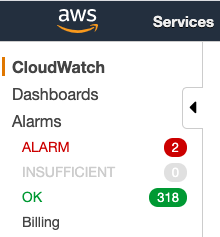
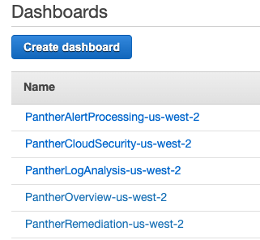
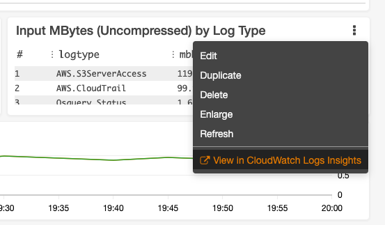
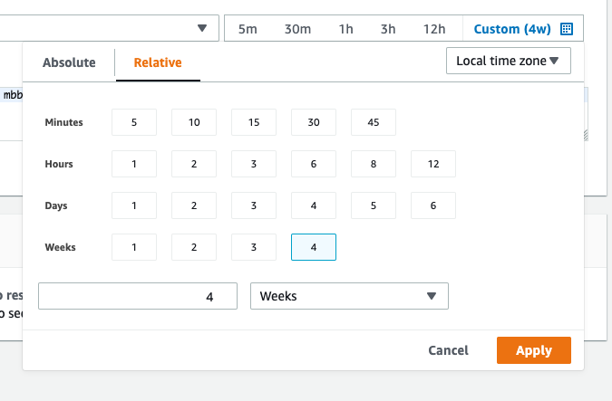
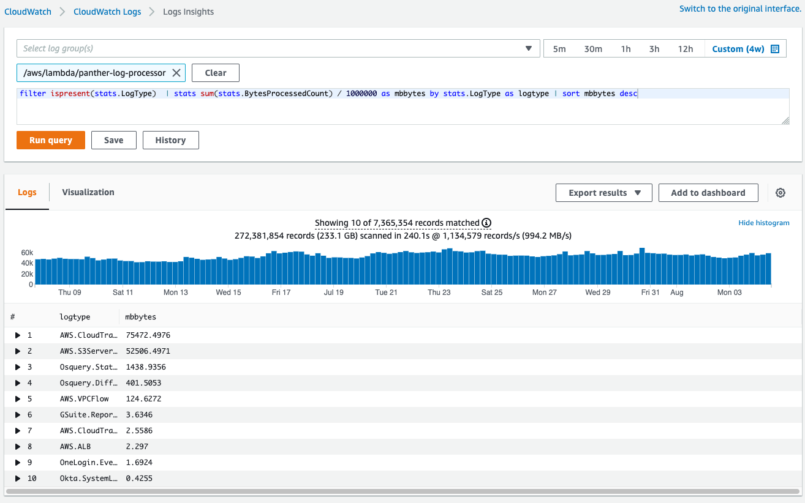

# Background

## Monitoring 

### Visibility
Panther has 5 CloudWatch dashboards to provide visibility into the operation of the system:

- **PantherOverview** An overview all errors and performance of all Panther components.
- **PantherCloudSecurity**: Details of the components monitoring infrastructure for CloudSecurity.
- **PantherAlertProcessing**: Details of the components that relay alerts for CloudSecurity and Log Processing.
- **PantherLogAnalysis**: Details of the components processing logs and running rules.
- **PantherRemediation**: Details of the components that remediate infrastructure issues.


### Alarms
Panther uses CloudWatch Alarms to monitor the health of each component. Edit the `deployments/panther_config.yml`
file to associate an SNS topic you have created with the Panther CloudWatch alarms to receive notifications. If this value is
blank then Panther will associate alarms with the default Panther SNS topic called `panther-alarms`:

```yaml
MonitoringParameterValues:
  # This is the arn for the SNS topic you want associated with Panther system alarms.
  # If this is not set alarms will be associated with the SNS topic `panther-alarms`.
  AlarmSNSTopicARN: 'arn:aws:sns:us-east-1:05060362XXX:MyAlarmSNSTopic'
```

To configure alarms to send to your team, follow the guides below:

- [SNS Email and SMS Integration](https://docs.aws.amazon.com/sns/latest/dg/sns-user-notifications.html)
- [PagerDuty Integration](https://support.pagerduty.com/docs/aws-cloudwatch-integration-guide)

### Assessing Data Ingest Volume
The Panther log analysis CloudWatch dashboard provides deep insight into operationally relevant aspects of log processing.
In particular, understanding the ingest volume is critically important to forecast the cost of running Panther.
One of the panes in the dashboard will show ingest volume by log type. This can be used, in combination with your AWS bill,
to forecast costs as you scale your data. We suggest you use a month of data to estimate your costs. 

The steps to view the dashboard:
* Login to the AWS Console
* Select `CloudWatch` from the Services menu
* Select `Dashboards` from the left pane of the CloudWatch console 

    
* Select the dashboard beginning with `PantherLogAnalysis`

    
* Select the vertical `...` of the pane entitled `Input MBytes (Uncompressed) by Log Type` and select from the menu `View in CloudWatch Insights`

    
* Set the time period for 4 weeks and click `Apply`

    
* Click `Run Query`

    

## Tools
Panther comes with some operational tools useful for managing the Panther infrastructure. These are statically compiled
executables for linux, mac (aka darwin) and windows. They can be copied/installed onto operational support hosts. 
To build from source:

```yaml
mage build:tools
```

They are also available pre-compiled for each release as assets associated with the github release.

* **compact**: a tool to back fill JSON to Parquet conversion of log data (used when upgrading to Panther Enterprise)
* **gluesync**: a tool to update glue table and partition schemas
* **requeue**: a tool to copy messages from a dead letter queue back to the originating queue for reprocessing
* **s3queue**: a tool to list files under an S3 path and send to the log processor input queue for processing (useful for back fill of data)

To see usage, execute the tool with the `-h` flag.
