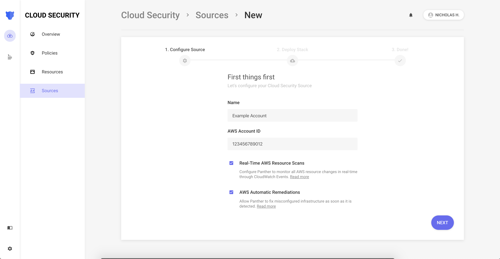

# Automatic Remediation

## Overview

Panther supports Automatic Remediation of non-compliant resources to ensure that your infrastructure is as secure as possible. This works by:

- Associating a remediation with a given Policy
- When a Policy failure occurs, the `aws-remediation` Lambda assumes a role in the target account with the offending resource and performs the remediation

The following diagram shows how Panther supports Automatic Remediation:

## Setup

Enabling automatic remediation for a Cloud Security source is simple. The only requirement is to check the `AWS Automatic Remediations` checkbox while onboarding the Cloud Security source, and the prerequisite role will be deployed as part of the onboarding stack.

To enable automatic remediation on an existing source, go to your sources list and edit the existing source for which you wish to enable automatic remediation. This will bring you to the same setup wizard as above, with instructions on how to deploy the updated stack template.
