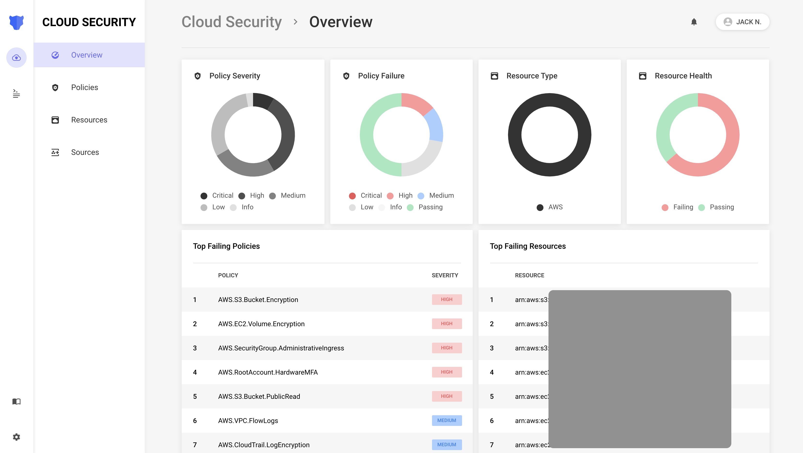

# Background

To analyze and detect misconfigured cloud resources, Panther scans AWS accounts, models the **Resources** within them, and uses **Policies** to evaluate their desired secure state.

Panther's Cloud Security capabilities can be used to detect security issues such as:

- S3 Buckets missing encryption
- VPCs allowing inbound SSH traffic from `0.0.0.0/0`
- Access Keys are older than 90 days
- IAM policies are too permissive

## System Overview

The Cloud Security overview page displays a visual of your infrastructure health, along with pointers on where to direct your attention:

## Setup

Cloud Security scanning can be configured either by onboarding CloudTrail data or CloudWatch events from various accounts. You can use a combination of each as well.

* Follow the [scanning instructions](scanning/README.md) to onboard new accounts
* [Configure, write, and tune your policies](policies/README.md)
* [Configure automatic remediation](automatic-remediation/README.md) (optional)
