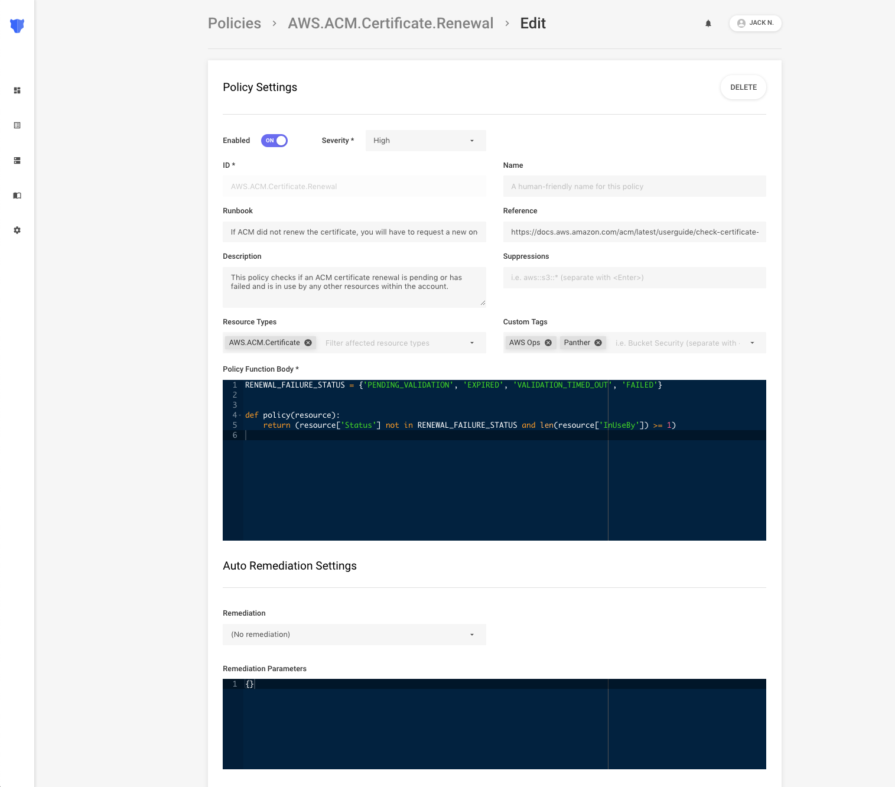

# Background

To detect misconfigured cloud resources, Panther can scan AWS accounts, model the **Resources** within them, and then use **Policies** to evaluate their desired secure state.

For example, Panther can be used to detect the following common security issues:

- S3 Buckets do not have encryption enabled
- VPCs allows inbound SSH traffic from `0.0.0.0/0`
- Access Keys are older than 90 days
- IAM policies are too permissive

The screenshot below is an example Policy to check if AWS ACM Certificate renewal has failed:

A Policy contains:

- Metadata to provide the analyst context
- An association with a specific [Resource Type](resources/)
- A `policy` function with a `resource` argument to analyze resource attributes
- Returning `True` if the resource is compliant or `False` if non-compliant

Python provides high flexibility in defining your Policy logic, and the following libraries are supported:

| Package          | Version   | Description                 | License   |
| :--------------- | :-------- | :-------------------------- | :-------- |
| `boto3`          | `1.10.46` | AWS SDK for Python          | Apache v2 |
| `policyuniverse` | `1.3.2.1` | Parse AWS ARNs and Policies | Apache v2 |
| `requests`       | `2.22.0`  | Easy HTTP Requests          | Apache v2 |

By default, Policies are loaded from Panther's [open-source packs](https://github.com/panther-labs/panther-analysis/tree/master/analysis/policies) which cover the CIS Benchmark. You can easily write your own policies based on specific internal use cases.

In the next page, we'll show how to setup a scan functionality and perform periodic scans of your AWS accounts.
