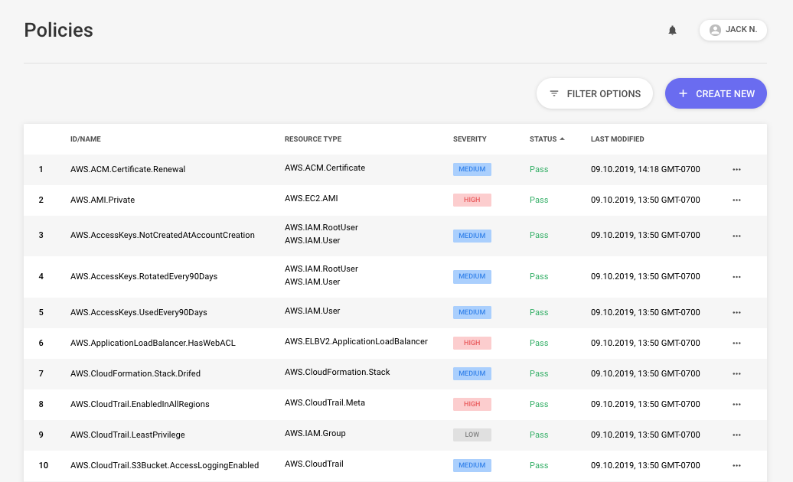

# Policies

Each page in this section describes the purpose and reasoning for the AWS related policies distributed by Panther. They also include guidance on how to remediate policy failures, along with recommended steps and security best practices.

## Listing Policies

To view all Policies in the Panther UI, click the `Policies` button on the sidebar. Policies can be filtered and sorted based on:

- Name
- Resource Type
- Severity
- Status
- Tags

## Viewing Failing Policies

Initially, a Policy's `status` will be `Insufficient data` until an event matching the given log type is analyzed. Once it's analyzed, Alerts will dispatch via the configured Output for the policy's severity and will show up in the Policy Dashboard.

To display an overview of all `Failing` Policies, click the Panther Icon in the top left to open the Dashboard. The Dashboard allows Policies to be sorted by Severity on the top right, to allow for easier drill-downs into failing Policies.
