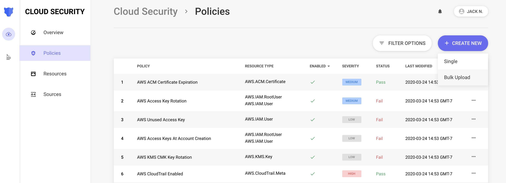
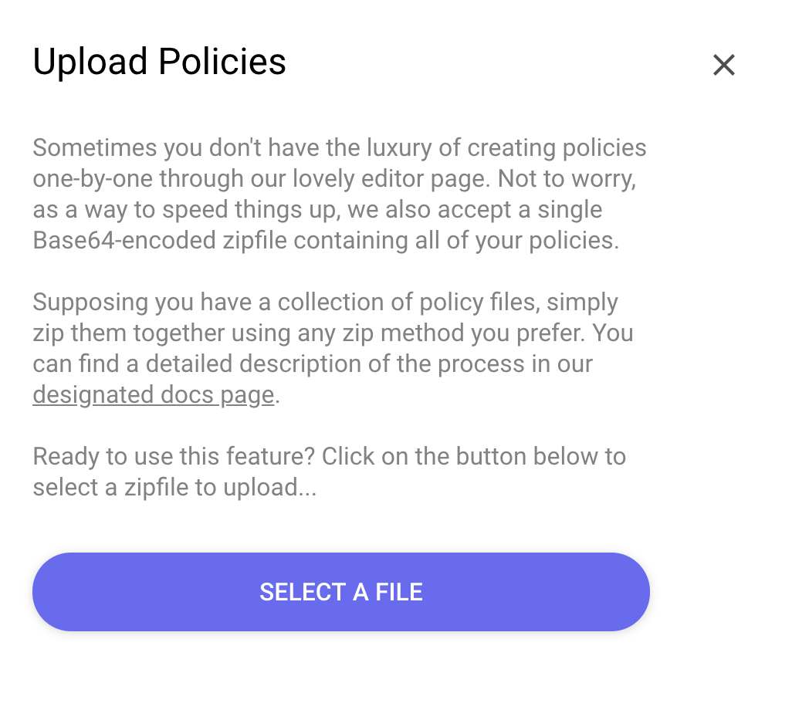

# Uploading Policies

When developing policies locally, or pulling policies from a curated list somewhere, you will need to upload them to Panther at some point.

This upload functionality allows you to quickly upload hundreds of policies without having to copy/paste code or manually set configurations.

## Packaging

Before uploading your policies, they must be packaged.

This is done as a simple zip archive containing the polices and their JSON/YAML specifications.

We highly recommend using the `panther_analysis_tool` tool available [here](https://github.com/panther-labs/panther_analysis_tool).

Using the tool will allow you to easily validate the policy specifications as defined [here](writing.md), as well as run unit tests.

Installation and usage of the tool is documented in the README. After installing, simply run the following command to package a directory containing your policies:

```bash
$ panther_analysis_tool zip --policies path/to/policies --output-path path/to/output
```

The tool will recursively traverse the provided directory. After running unit tests for the policies, this command will output a zip file at the specified output path named `panther-policies-timestamp.zip`, which can then be uploaded to Panther.

## Uploading

Uploading the policies once packaged is simple!

Navigate to `Cloud Security` > `Policies`, and select the `Create New` button. A dropdown will show an option to `Bulk Upload`:





Select your zip-file, and after confirming the validity of the policies, you will be presented with:
* A count of how many policies were successfully uploaded
* How many were modifications to existing policies
* How many were new policies


It's important to remember that when uploading a policy with the same `policyID` as a policy already in your environment, the uploaded policy will be treated as an update to the existing policy.


 Changes to meta data fields such as `Description` and `DisplayName` will not cause these policies to be re-evaluated, but changes to configuration fields \(i.e. `Severity` or `Enabled`\) and changes to the policy body will cause the policy to be re-evaluated, and will cause alarms and auto remediations to trigger if configured.
