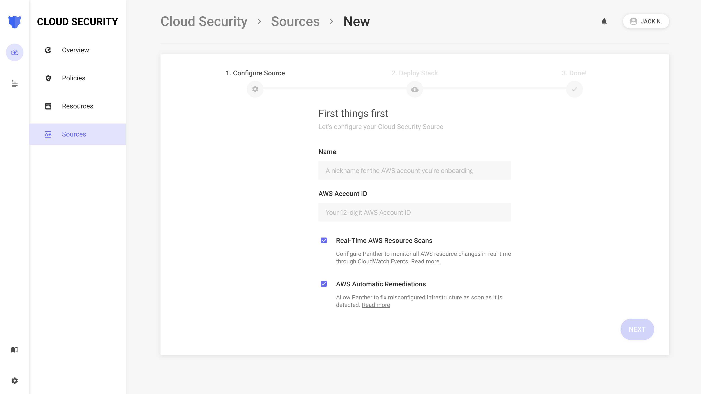
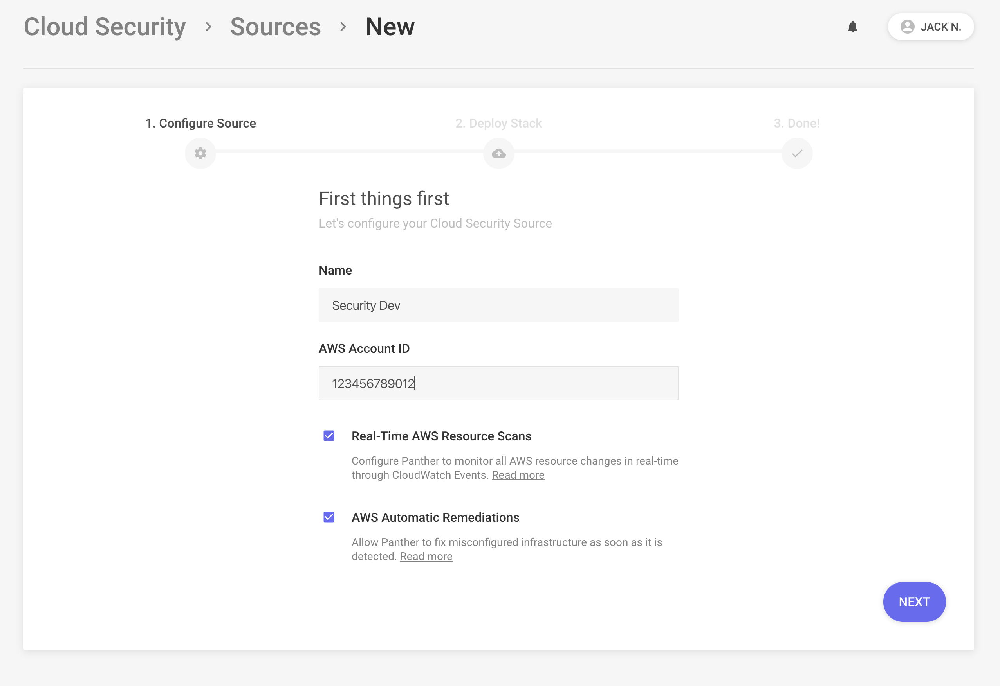
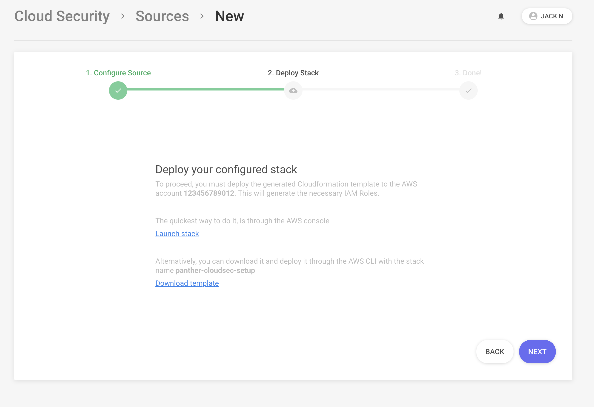
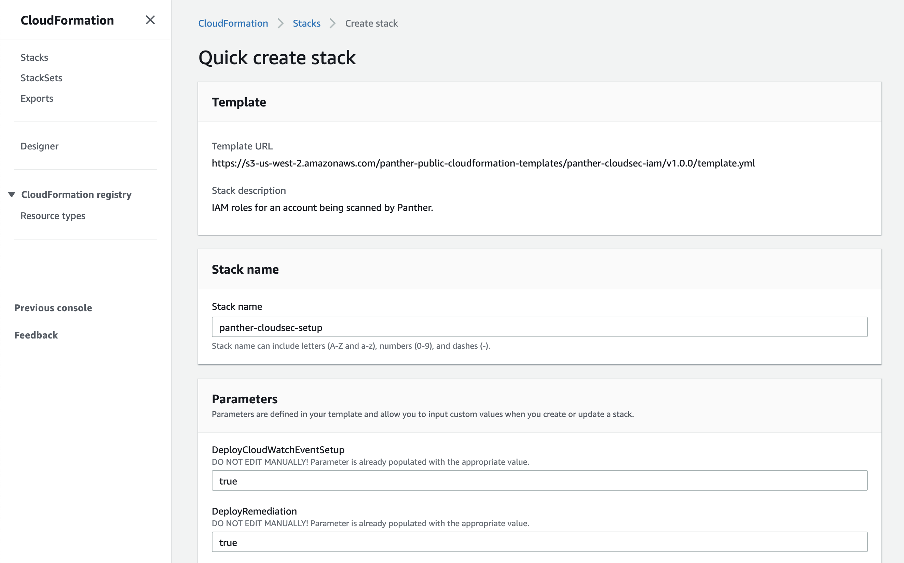
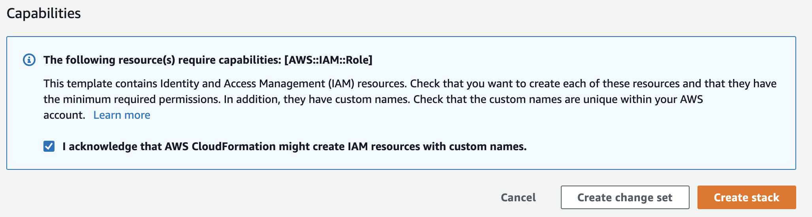
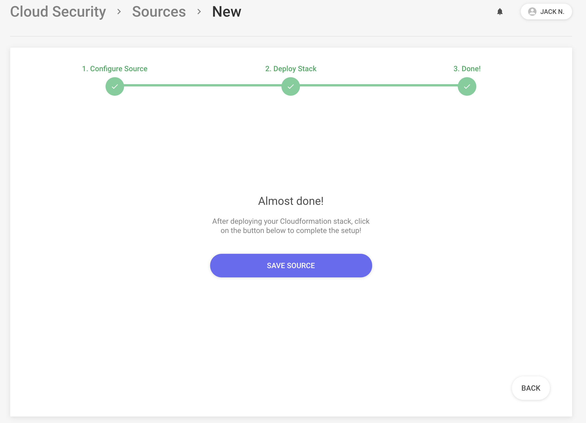

# Cloud Security

Panther's Cloud Security works by scanning AWS accounts, modeling the **Resources** within them, using **Policies** to detect misconfigurations, and optionally remediating resources.

Common security misconfigurations include:

- S3 Buckets without encryption
- Security Groups allowing inbound SSH traffic from `0.0.0.0/0`
- Access Keys being older than 90 days
- IAM policies that are too permissive

## How It Works


When adding a new AWS account for infrastructure monitoring, Panther first conducts a baseline scan and models resources in your account.

Scans run daily on your account to ensure the most consistent state possible. This works by using an assumable IAM Role with ReadOnly permissions.

Resources can also be tracked in real-time using CloudTrail or [CloudWatch Events](https://docs.aws.amazon.com/AmazonCloudWatch/latest/events/WhatIsCloudWatchEvents.html).

## Setup

Panther can scan as many AWS accounts as you would like.

Each resource is associated with the account's label \(Prod, Dev, Test, etc\).

## Add Your Account

The first step is adding a new AWS account source by going to `Cloud Security` > `Sources` > `Add Account`:



Enter your account `Name` and `AWS Account ID`.


If you want to enable real-time scans or automatic remediation, make sure to tick the boxes here!




Click `Next`, and then download the generated template or click directly into the CloudFormation Console:



Clicking the `Launch Stack` button which open [CloudFormation](https://aws.amazon.com/cloudformation/) in the AWS account you are currently logged into with pre-populated stack variables:




Make sure to check the acknowledgement in the `Capabilities`box




Click the `Create stack` button. After about 15 seconds, the stack's `Status` should change to `CREATE_COMPLETE`. If there is an error creating the stack, then an IAM role with the same name may already exist in your account.


Back in the UI, click `Next`, and then `Save Source` to complete this setup:



## Real-Time Events

The next section will detail how to monitor changes to AWS resources in real-time.

### Prerequisites

To configure real-time events to Panther from multiple regions and accounts, we can use [AWS CloudFormation StackSets](https://docs.aws.amazon.com/AWSCloudFormation/latest/UserGuide/what-is-cfnstacksets.html).

The following diagram illustrates this with an example model:


### Plan Your Account Layout

In this case, the account running Panther will act as the `Administrator` account to manage stack creation and updates.

All other accounts to onboard will act as `Target` accounts to send CloudWatch logs to Panther.


The `Administrator` account may also be the `Target` account. To run and scan a single AWS account, this will always be the case, and both IAM roles are required.


### Setup Administrator Account

By default, Panther deployments create a CloudFormation StackSet "Admin" role called:

```
PantherCloudFormationStackSetAdminRole-<PantherRegion>
```

For example, if Panther is deployed in `us-west-2`:

```
PantherCloudFormationStackSetAdminRole-us-west-2
```

This IAM role allows the StackSet to assume roles in target accounts to orchestrate the creation of real-time events in as many regions as you would like:

```json
{
    "Version": "2012-10-17",
    "Statement": [
        {
            "Action": "sts:AssumeRole",
            "Resource": "arn:aws:iam::*:role/PantherCloudFormationStackSetExecutionRole-<PantherRegion>",
            "Effect": "Allow"
        }
    ]
}
```


This IAM Role is only assumable by the Panther Deployment account.


### Onboard Accounts


In order for target accounts to be onboarded, you must have checked the box during the account setup above!


Login to the `Administrator` account's AWS Console, and open the [CloudFormation StackSets](https://us-west-2.console.aws.amazon.com/cloudformation/home?region=us-west-2#/stacksets) page


Click the `Create StackSet` button on the top right, select `Template is ready`, and enter the following `Amazon S3 URL`:

```
https://s3-us-west-2.amazonaws.com/panther-public-cloudformation-templates/panther-cloudwatch-events/latest/template.yml
```

Click `Next`

Name the StackSet `panther-real-time-events`

Enter the 12-digit AWS Account ID where Panther is deployed in the `MasterAccountId` field.

In the `QueueArn` field, paste the following \(substituting the AWS account ID of the account running panther\):

```
arn:aws:sqs:<PantherRegion>:<PantherAccountID>:panther-aws-events-queue
```

Click `Next`


Under the Permissions tab, add IAM admin role name:

```
PantherCloudFormationStackSetAdminRole-<MASTER_ACCOUNT_REGION>
```

And the IAM execution role name:

```
PantherCloudFormationStackSetExecutionRole-<MASTER_ACCOUNT_REGION>
```

Click `Next`


Type the AWS Account IDs of the Target Accounts in the Account numbers field, separated by commas.

Select `Add all regions` or a list of desired regions, set `Maximum concurrent accounts` to 5, and click `Next`.

Click `Submit` at the bottom of the page to create the StackSet

To check on the status of the StackSet, check the `Operations` tab:



Awesome! You should now have real-time CloudWatch events sending to Panther.


### Adding Additional Accounts

To add more accounts to the StackSet above, use the following steps:


Make sure you have at least one AWS Account Source configured with the `DeployCloudWatchEventSetup`set to`true`


1. Login to the `Administrator` account's AWS Console
2. On the [CloudFormation StackSets](https://us-west-2.console.aws.amazon.com/cloudformation/home?region=us-west-2#/stacksets) page, select the `panther-real-time-events` StackSet
3. Select the `Actions` button on the top right and select `Add new stacks to StackSet`
4. Add the new AWS account ID's into the Account numbers field, specify regions, and click through to the `Submit` button
