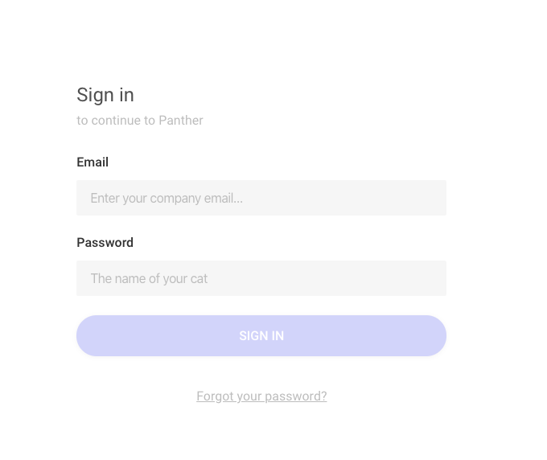
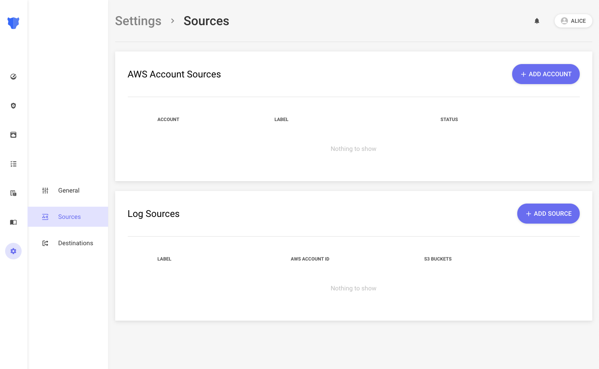
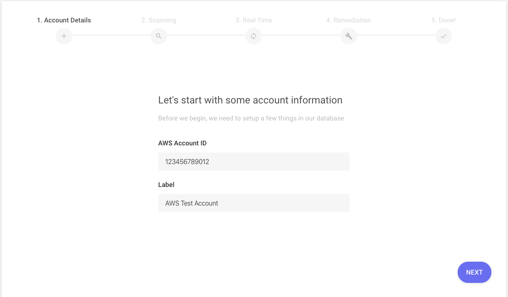
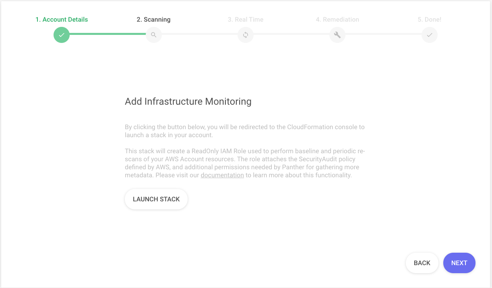
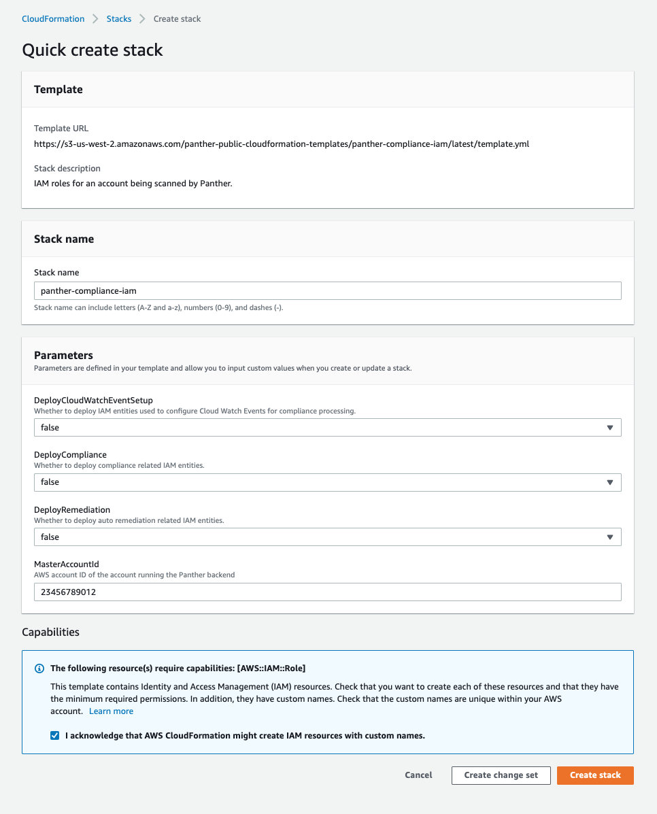
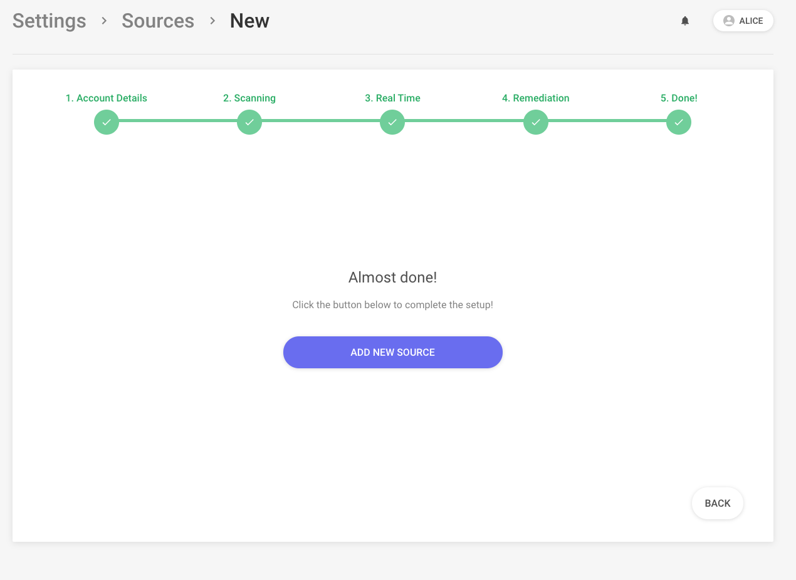

# Account Setup

The first step in configuring Panther's compliance scans is adding a new AWS account.

The CloudFormation stack below creates an IAM role with the AWS managed policy called `SecurityAudit`. This policy is designed specifically for scanning AWS accounts for security vulnerabilities. Panther will assume this role to ensure your AWS account is compliant and secure.

## IAM Role Setup

Login to your Panther Dashboard.

From Settings, click **Sources**, and then click **ADD ACCOUNT** under **AWS Account Sources**

Enter your account details and then click **NEXT**

Click the **Launch Stack** button, which will open [CloudFormation](https://aws.amazon.com/cloudformation/) in the AWS account you are currently logged into.

- Select **true** under the `DeployCloudWatchEventSetup` \*\*\*\*parameter, which will create an additional IAM Role needed to consume real-time events.
- Enter the `MasterAccountId`, which is the 12-digit AWS Account ID where Panther is deployed


Make sure to check the acknowledgement in the `Capabilities`box


Click the **Create stack** button. After about 15 seconds, the stack's `Status` should change to `CREATE_COMPLETE`. If there is an error creating the stack, then an IAM role with the same name may already exist in your account.

Click through to the last page and select **ADD NEW SOURCE** as shown in the following screenshot:

The next section will detail how to monitor changes to AWS resources in real-time.
