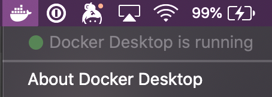

# Quick Start

## Prerequisites

What you'll need:

1. An AWS Account to deploy Panther into
2. An IAM user or role with permissions to create and manage the necessary resources

Use the code samples below to create the deployment roles:

- [AWS CloudFormation Template](https://github.com/panther-labs/panther/tree/master/deployments/auxiliary/cloudformation/panther-deployment-role.yml) and [S3 URL](https://panther-public-cloudformation-templates.s3-us-west-2.amazonaws.com/panther-deployment-role/latest/template.yml)
- [Terraform](https://github.com/panther-labs/panther/tree/master/deployments/auxiliary/terraform/panther-deployment-role.tf)


We recommend deploying Panther into a dedicated AWS account via [AWS Organizations](https://aws.amazon.com/blogs/security/how-to-use-aws-organizations-to-automate-end-to-end-account-creation/). This ensures that detection infrastructure is contained within a single place.


## Deployment

Get started with 3 quick steps!

#### Step 1

Clone the latest release of [Panther](https://github.com/panther-labs/panther):

```bash
git clone https://github.com/panther-labs/panther --depth 1 --branch v1.1.1
cd panther
```

[Install and run Docker 17+](https://docs.docker.com/install/), then verify the service is up:

 ```bash
 docker info
 ```

 The status bar will also display the Docker Icon (on macOS):



For customized deployment options, [click here](quick-start.md#deployment-options).

#### Step 2


Note: Your AWS credentials _must_ be exported as environment variables before running the next command.


Start the development environment:

```bash
./dev.sh
```

#### Step 3

Run the following command to deploy Panther:

```bash
mage setup deploy
```

- Optionally, you can run `mage setup test:ci` before deploying to confirm that all tests are passing (`setup` only needs to be run once in the repo).
- The initial deployment will take ~10 minutes with a fast internet connection. If your credentials timeout, you can safely redeploy to pick up where you left off.
- At the end of the deploy command, you'll be prompted for your first/last name and email to setup the first Panther user account.
- You'll get an email from `no-reply@verificationemail.com` with your temporary password. If you don't see it, be sure to check your spam folder.
- If you use `aws-vault`, you must be authenticated with MFA. Otherwise, IAM role creation will fail with `InvalidClientTokenId`

#### First Login

Now you can sign into Panther! The URL is sent in the welcome email and also printed in the terminal at the end of the deploy command.


By default, Panther generates a self-signed certificate, which will cause most browsers to present a warning page:


Your connection _is_ encrypted, and it's generally safe to continue if the domain matches the output of the deploy command. However, the warning exists because self-signed certificates do not protect you from man-in-the-middle attacks; for this reason production deployments should provide their own ACM certificate in the `deployments/panther_config.yml` file.


## Onboarding

Congratulations! You are now ready to use Panther.

Follow the steps below to complete your setup:

1. Invite your team in `Settings` > `Users` > `Invite User`
1. Configure [destinations](destinations/setup/) to receive generated alerts
2. Onboard data for [real-time log analysis](log-analysis/log-processing/)
3. Write custom [detection rules](log-analysis/rules/) based on internal business logic
4. Onboard accounts for [cloud security scans](policies/scanning/)
5. Write [policies](policies/cloud-security-overview.md) for supported [AWS resources](policies/resources/)
6. Query collected logs with [historical search](historical-search/README.md)

## Deployment Options

Rather than deploying from within a docker container, you can instead configure your [development environment](development.md#dependencies) locally. This will take more time initially but will lead to faster deployments.

You can also deploy from an EC2 instance with Docker and git installed in the same region you're deploying Panther to. This is typically the fastest option since it minimizes the latency when communicating with AWS services. Instead of exporting your AWS credentials as environment variables, you will need to attach the [deployment IAM role](#prerequisites) to your EC2 instance profile. Your EC2 instance needs at least 1 vCPU and 2GB of memory; the cheapest suitable instance type is a `t2.small`.

### Supported Regions

Panther relies on dozens of AWS services, some of which are not yet available in every region. In particular, AppSync, Cognito, Athena, and Glue are newer services not available in us-gov, china, and other regions. At the time of writing, all Panther backend components are supported in the following:

- `ap-northeast-1` (tokyo)
- `ap-northeast-2` (seoul)
- `ap-south-1` (mumbai)
- `ap-southeast-1` (singapore)
- `ap-southeast-2` (sydney)
- `ca-central-1` (canada)
- `eu-central-1` (frankfurt)
- `eu-west-1` (ireland)
- `eu-west-2` (london)
- `us-east-1` (n. virginia)
- `us-east-2` (ohio)
- `us-west-2` (oregon)

Consult the [AWS region table](https://aws.amazon.com/about-aws/global-infrastructure/regional-product-services/) for the source of truth about service availability in each region.

### AWS Credentials

Configure your AWS credentials and deployment region:

```bash
export AWS_REGION=us-east-1  # Choose your region from the list above
export AWS_ACCESS_KEY_ID=...
export AWS_SECRET_ACCESS_KEY=...
```

If you've already configured your credentials with the AWS CLI (you have a `~/.aws/credentials` file), you can easily add them to the environment:

```bash
export AWS_ACCESS_KEY_ID=`aws configure get aws_access_key_id`
export AWS_SECRET_ACCESS_KEY=`aws configure get aws_secret_access_key`
```


Remember to follow best security practices when handling access keys:

- Avoid storing them in plaintext files
- Use IAM roles with temporary session credentials
- Rotate access keys every 90 days
- Enforce MFA for key access

Tools like [aws-vault](https://github.com/99designs/aws-vault) can help with all of the above, check out our [blog post](https://blog.runpanther.io/secure-multi-account-aws-access/) to learn more!

