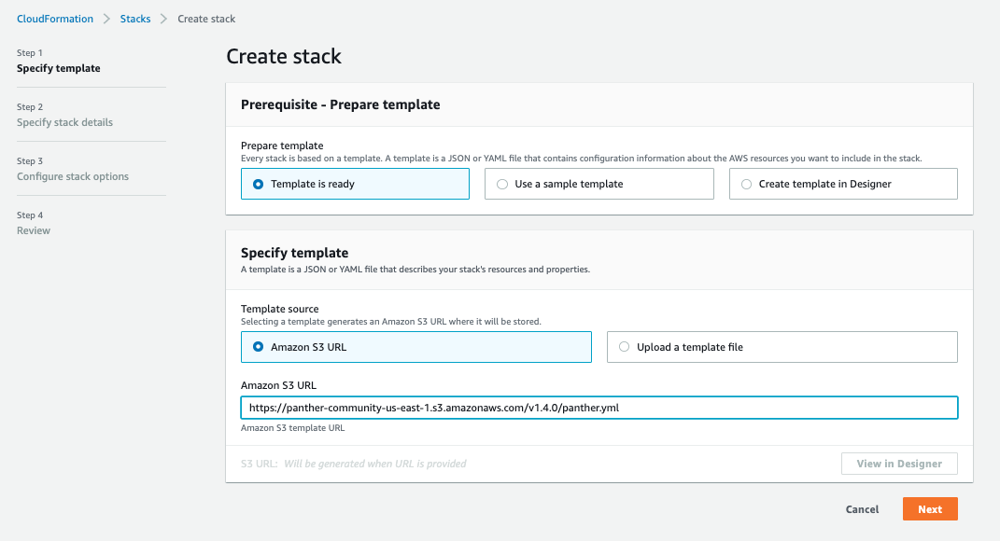
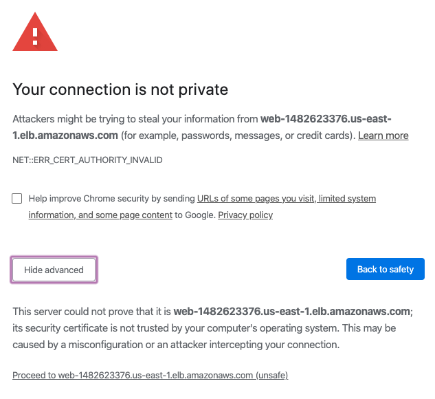

# Quick Start

To get started with Panther, you'll need:

1. An AWS account (preferably dedicated to Panther)
2. An IAM user/role with permissions to create and manage the necessary resources

We've provided the following IAM roles for least privilege deployments:

- [AWS CloudFormation Template](https://github.com/panther-labs/panther/blob/master/deployments/auxiliary/cloudformation/panther-deployment-role.yml)
- [Terraform](https://github.com/panther-labs/panther/tree/master/deployments/auxiliary/terraform/panther_deployment_role)


We recommend deploying Panther into its own dedicated AWS account.


The steps below use a preconfigured CloudFormation template to deploy Panther. To deploy from source, follow the instructions [here](development.md#deploying).

## Deployment

First, navigate to the AWS CloudFormation console and create a new stack.

Use the following template URL to install the latest version in the us-east-1 region:

```
https://panther-community-us-east-1.s3.amazonaws.com/v1.6.0/panther.yml
```

The template URL is of the following form:

```
https://panther-<EDITION>-<REGION>.s3.amazonaws.com/<VERSION>/panther.yml
```

Where:

* EDITION is `community` or `enterprise`
* REGION is one of: `us-east-1`, `us-east-2`, or `us-west-2`
    * Be sure the template region matches the region in which you are deploying Panther
    * [Additional](development.md#supported-regions) regions are available when [deploying from source](development.md#deploying)
* VERSION is the latest [tagged release](https://github.com/panther-labs/panther/releases)



On the next page, choose a stack name (e.g. "panther") and configure the name and email for the first Panther user:


This is the initial admin user account. You can edit the user and invite additional users after Panther is deployed. You can also set the `CompanyDisplayName` here if you like. All other parameters can be ignored.

On the next page, you can skip all the advanced stack settings. Acknowledge the warnings and deploy the stack.


Alternatively, you can deploy Panther using a nested stack in your own CloudFormation pipeline, using a Terraform template, or by building and deploying from [source](development.md#deploying).

### Using a Nested CloudFormation Stack

```yaml
AWSTemplateFormatVersion: 2010-09-09
Description: My Panther deployment

Resources:
  Panther:
    Type: AWS::CloudFormation::Stack
    Properties:
      TemplateURL: !Sub https://panther-community-${AWS::Region}.s3.amazonaws.com/v1.6.0/panther.yml
      Parameters:
        CompanyDisplayName: AwesomeCo
        FirstUserEmail: user@example.com
        FirstUserGivenName: Alice
        FirstUserFamilyName: Jones
```

When deploying this template, you will need to include all capabilities:

```
aws cloudformation deploy --template-file template.yml --stack-name panther --capabilities CAPABILITY_IAM CAPABILITY_NAMED_IAM CAPABILITY_AUTO_EXPAND
```

### Using Terraform

```hcl
resource "aws_cloudformation_stack" "panther" {
  name = "panther"
  template_url = "https://panther-community-<REGION>.s3.amazonaws.com/v1.6.0/panther.yml"
  capabilities = ["CAPABILITY_IAM", "CAPABILITY_NAMED_IAM", "CAPABILITY_AUTO_EXPAND"]
  parameters = {
    CompanyDisplayName = "AwesomeCo"
    FirstUserEmail = "user@example.com"
    FirstUserGivenName = "Alice"
    FirstUserFamilyName = "Jones"
  }
}
```

## First Login

Once the deployment has finished, you will get an invitation email from `no-reply@verificationemail.com` with your temporary login credentials. If you don't see it, be sure to check your spam folder.


By default, Panther generates a self-signed certificate, which will cause most browsers to present a warning page:



Your connection _is_ encrypted, and it's generally safe to continue. However, the warning exists because self-signed certificates do not protect you from man-in-the-middle attacks; for this reason production deployments should provide their own `CertificateArn` parameter value.


## Onboarding

Congratulations! You are now ready to use Panther. Follow the steps below to complete your setup:

1. Invite your team in `Settings` > `Users` > `Invite User`
2. Configure [destinations](destinations) to receive generated alerts
3. Onboard data for [real-time log analysis](log-analysis/setup.md)
4. Write custom [rules](log-analysis/rules) based on internal business logic
5. Onboard AWS accounts for [cloud security scans](cloud-security)
6. Write custom [policies](cloud-security/policies) for supported [AWS resources](cloud-security/resources)
7. Enterprise Only: Query collected logs with [data explorer](enterprise/data-analytics)

## Removing Panther
To uninstall Panther, simply delete the main "panther" stack (substituting whatever stack name you chose during deployment).
This will automatically remove everything except S3 buckets and the data they contain.

You can easily find and delete these manually, or you can run `mage teardown` (see [development](development.md#teardown)).
