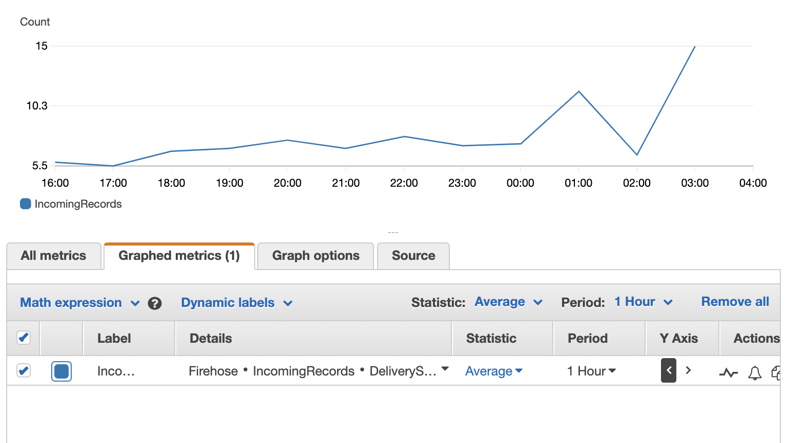
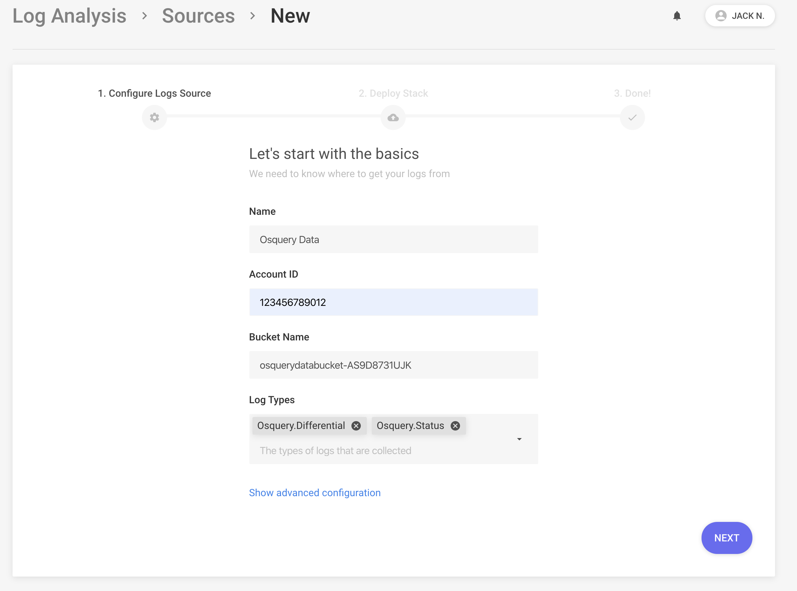

# Tutorial: Osquery Log Analysis


## Overview

[Osquery](https://osquery.io/) is a powerful, host-based application that exposes the operating system as a set of SQLite tables. Security teams use osquery to track activity in their fleet such as user logins, installed programs, running processes, network connections, or system log collection.

In this tutorial, we will walk through how to configure osquery with Panther to create an end-to-end security alerting pipeline to send logs for analysis and then notifying your team on a specific activity. Panther also comes with pre-installed rules based on default query packs, which provides value for most osquery deployments.

For the purpose of this tutorial, we will assume an osquery installation on Ubuntu 18.04.

## Installation

To install osquery, follow the instructions [here](https://osquery.io/downloads/official/4.3.0). Osquery can be installed on Mac, Linux, or Windows.

## How It Works

Osquery periodically reports data by querying [specific tables](https://osquery.io/schema/4.3.0) and sending results in JSON format to the configured `logger_plugin(s)`, which can be the filesystem, a TLS endpoint, or AWS. The `osquery.conf` controls these settings, including other daemon (`osqueryd`) behaviors.

For example, the following query output can display all currently logged in users:

```
osquery> SELECT * FROM logged_in_users WHERE type ='user';
+------+--------+-------+----------------+------------+-------+
| type | user   | tty   | host           | time       | pid   |
+------+--------+-------+----------------+------------+-------+
| user | ubuntu | pts/0 | 228.192.69.179 | 1585784433 | 19761 |
+------+--------+-------+----------------+------------+-------+
```

To schedule this query, we add it into the `schedule` in our `osquery.conf`:

```json
{
  "schedule": {
    "logged_in_users": {
      "query": "SELECT * FROM logged_in_users WHERE type ='user'",
      "interval": 3600
    }
  }
}
```

When this query runs (every `3600` seconds), it will report results in a JSON log:

```json
      {
        "name": "logged_in_users",
        "action": "added",
        "hostIdentifier": "prod-host-01",
        "columns": {
          "type": "user",
          "user": "ubuntu",
          "tty": "pts/0",
          "host": "228.192.69.179",
          "time": "1585784433",
          "pid": "19761"
        }
      }
```

* `columns` are the results of the query we see above
* `name` is the descriptor for the scheduled query
* `action` indicates if this result is being added or removed
* `hostIdentifier` is the hostname which reported the log

When Panther receives the log, it will be parsed, extracted, and normalized based on fields such as IPs/domains to enable quick searches in the data warehouse and flexibility in rules. For the complete list of all fields parsed by Panther, check out the [Osquery.Differential reference](../log-analysis/log-processing/supported-logs/Osquery.md#osquery-differential).

## Configuration

Let’s assume that we are sending osquery data from an Ubuntu machine in an AWS VPC.

To send to Panther, we will use the `aws_firehose` logger plugin. To provide the correct credentials, we will also use an IAM role and a Firehose Delivery Stream which will end up in an S3 bucket. The template [here](https://github.com/panther-labs/panther/blob/master/deployments/auxiliary/cloudformation/osquery-firehose.yml) can be used to create the necessary infrastructure to enable this flow.

The `/var/osquery/osquery.conf` example below can be used to get started:

```json
{
  "options": {
    "config_plugin": "filesystem",
    "logger_plugin": "aws_firehose",
    "aws_firehose_stream": "<NAME-OF-FIREHOSE-DELIVERY-STREAM>",
    "aws_region": "<AWS-REGION>",
    "aws_sts_arn_role": "<AWS-IAM-ROLE-ARN>",
    "aws_sts_region": "<AWS-REGION-TO-ASSUME-ROLE>",
    "aws_sts_session_name": "<STS-SESSION-NAME>",
    "schedule_splay_percent": "10",
    "utc": "true"
  },
  "schedule": {
    "logged_in_users": {
      "query": "SELECT * FROM logged_in_users WHERE type ='user'",
      "interval": 3600
    }
  },
  "decorators": {
    "load": [
      "SELECT uuid AS host_uuid FROM system_info;",
      "SELECT user AS username FROM logged_in_users ORDER BY time DESC LIMIT 1;"
    ]
  },
  "packs": {
    "osquery-monitoring": "/usr/share/osquery/packs/osquery-monitoring.conf",
    "incident-response": "/usr/share/osquery/packs/incident-response.conf",
    "it-compliance": "/usr/share/osquery/packs/it-compliance.conf",
    "vuln-management": "/usr/share/osquery/packs/vuln-management.conf",
    "hardware-monitoring": "/usr/share/osquery/packs/hardware-monitoring.conf",
    "ossec-rootkit": "/usr/share/osquery/packs/ossec-rootkit.conf"
  }
}
```

This configuration:
Loads sample `packs` to provide a great baseline across many tables
Adds `decorations` to all logs, which provides additional helpful context
Assumes an IAM role, and sends to a Firehose delivery stream periodically

This pattern is easily scalable across a fleet of *thousands* of AWS VMs and can be customized to meet your needs.

To add your own queries, either write your own pack or simply add new queries to the `schedule` in the configuration above.

## Sending to Panther

Follow this procedure to send Osquery data to Panther.

### Daemon Status

Once your desired `osquery` configuration is in place, make sure to restart the osquery daemon. Also ensure that  it is running with no errors. On Ubuntu, this looks like:

```
 sudo systemctl status osqueryd.service
● osqueryd.service - The osquery Daemon
   Loaded: loaded (/usr/lib/systemd/system/osqueryd.service; disabled; vendor preset: enabled)
   Active: active (running) since Thu 2020-03-26 00:58:11 UTC; 6 days ago
 Main PID: 6071 (osqueryd)
    Tasks: 15 (limit: 1152)
   CGroup: /system.slice/osqueryd.service
           ├─6071 /usr/bin/osqueryd --flagfile /etc/osquery/osquery.flags --config_path /etc/osquery/osquery.conf
           └─6077 /usr/bin/osqueryd
```

In the CloudWatch dashboard, you would begin to see metrics for the created `DeliveryStream` for `IncomingRecords`:



### Onboard Data

Now with data flowing, let’s onboard the S3 bucket containing osquery data into Panther.

From `Log Analysis` > `Sources`, click `Add Source`:




Note the Log Types in the screenshot above. If you plan to send Osquery logs either in Batch or Snapshot mode, make sure to add the log types in the initial screen.


Follow the instructions to create the IAM role to allow Panther to pull the data.

Then, save the source, and [enable the notifications](../log-analysis/setup.md) to onboard osquery data.

### Validate

If everything is working, you should now see data in the `”panther_logs”.”osquery_differential”` table in Athena:

```sql
SELECT DISTINCT name
FROM "panther_logs"."osquery_differential"
WHERE month=4 AND day=1;
```

```
1	 pack_osquery-monitoring_osquery_info
2	 pack_it-compliance_mounts
3	 pack_it-compliance_deb_packages
4	 pack_incident-response_last
5	 pack_osquery-monitoring_schedule
6	 pack_incident-response_process_memory
7	 pack_incident-response_open_files
8	 pack_incident-response_process_env
9	 pack_incident-response_shell_history
10 pack_vuln-management_deb_packages
```


It may take up 15 minutes before data is searchable in Athena.


## Analyzing Osquery Logs

Before writing any rules against osquery data, make sure to configure your [alert destinations](../destinations/README.md). This will provide a quick feedback loop on the rules written.

### Log Types

Panther supports four types of osquery log schemas:

|         Type         | Description                                                                               |
| :----------------------: | ----------------------------------------------------------------------------------------- |
|  `Differential`   | New results from the last time the query was sent   |
|       `Status`       | Information on the osquery daemon         |
|      `Snapshot`      | A mimic of the differential format, except all query results are sent in a single log                    |
| `Batch` | If a query identifies multiple state changes, the batched format will include all results in a single log line |

For most installations, `Differential` and `Status` will be the main two formats used unless specifically set in the configuration. Check out the [osquery docs](https://osquery.readthedocs.io/en/stable/deployment/logging/) to learn more.

## Writing Rules

Panther ships by default with several built-in example osquery rules that can also be used as a guide while writing your own.

There are two methods of analyzing osquery logs: alerting on any query results or analyzing the output of a query.

### Alert on any query results

Generally, this method is used when a very specific query is written, for example:

```sql
SELECT *
  FROM users
JOIN chrome_extensions
USING (uid)
  WHERE identifier='hinehnlkkmckjblijjpbpamhljokoohh'
```

Note: This query is taken from the `MacOSInstallCore` query in the `unwanted-chrome-extensions` pack that ships with osquery.

When analyzing results from this pack, we can assume that any result would be suspicious or have a higher likelihood of being a true positive. Thus, we can write the subsequent Panther rule:

```python
def rule(event):
    return ('unwanted-chrome-extensions' in event['name'] and
            event['action'] == 'added')


def dedup(event):
    return event['hostIdentifier']


def title(event):
    return 'Unwanted chrome extension(s) detected on {}'.format(
            event['hostIdentifier'])
```

The rule is analyzing that query results came from a query in the `unwanted-chrome-extensions` pack and the `action` is in the `”added”` state, meaning that new data was detected.

### Analyzing query output

The second method of osquery log analysis is making a generic query, and using Python to further filter the output and identify something potentially suspicious.

For example, in the built-in `incident-response` pack for Linux, there’s a `crontab` query:

```sql
SELECT *
FROM crontab;
```

And some example output:

```
osquery> SELECT command,path FROM crontab;
+---------------------------------------------------------------------------------------------------------------------------------------------------------+--------------------------------+
| command                                                                                                                                                 | path                           |
+---------------------------------------------------------------------------------------------------------------------------------------------------------+--------------------------------+
| root cd / && run-parts --report /etc/cron.hourly                                                                                                        | /etc/crontab                   |
| root test -x /usr/sbin/anacron || ( cd / && run-parts --report /etc/cron.daily )                                                                        | /etc/crontab                   |
| root test -x /usr/sbin/anacron || ( cd / && run-parts --report /etc/cron.weekly )                                                                       | /etc/crontab                   |
| root test -x /usr/sbin/anacron || ( cd / && run-parts --report /etc/cron.monthly )                                                                      | /etc/crontab                   |
| root if [ -x /usr/share/mdadm/checkarray ] && [ $(date +\%d) -le 7 ]; then /usr/share/mdadm/checkarray --cron --all --idle --quiet; fi                  | /etc/cron.d/mdadm              |
| root [ -x /usr/lib/php/sessionclean ] && if [ ! -d /run/systemd/system ]; then /usr/lib/php/sessionclean; fi                                            | /etc/cron.d/php                |
| root test -x /etc/cron.daily/popularity-contest && /etc/cron.daily/popularity-contest --crond                                                           | /etc/cron.d/popularity-contest |
| smmsp test -x /etc/init.d/sendmail && test -x /usr/share/sendmail/sendmail && test -x /usr/lib/sm.bin/sendmail && /usr/share/sendmail/sendmail cron-msp | /etc/cron.d/sendmail           |
+---------------------------------------------------------------------------------------------------------------------------------------------------------+--------------------------------+
```

Let’s write a rule to detect a cron that loads something from `/tmp/` (which is typical for malware):

```python
def rule(event):
    # Make sure we are analyzing the right query output
    if 'crontab' not in event['name']:
        return False

    # Check that a command is provided
    command = event['columns'].get('command')
    if not command:
        return False

    # Analyze any presence of the string /tmp/ in the rule
    if '/tmp/' in command:
        return True

    # If these conditions aren’t satisfied, do not trigger an alert
    return False


def dedup(event):
    return event.get('hostIdentifier')


def title(event):
    return 'Suspicious cron found on {}'.format(event.get('hostIdentifier'))
```

This is just a simple implementation. The beauty of Python is that you can get as sophisticated as you would like. This includes using libraries like `shlex` to look deeper at the cron commands and much more.

### Edge cases

There are a couple of caveats when writing rules on osquery data:

The first is that it’s entirely possible that we will miss certain activity between the query windows. One way around this limitation is to shorten the query window. The downside is that it has a potential performance hit, especially at scale. Another solution is to use tables that hook into process events.

The other caveat is that you may run into a situation where osquery is sending “old” logs, either from shell_history or last. One way around this limitation is by analyzing the epoch time, and making sure it’s within the last 24h or whatever your query window is set to (plus/minus about 30 minutes to account for splay + data landing in S3).
