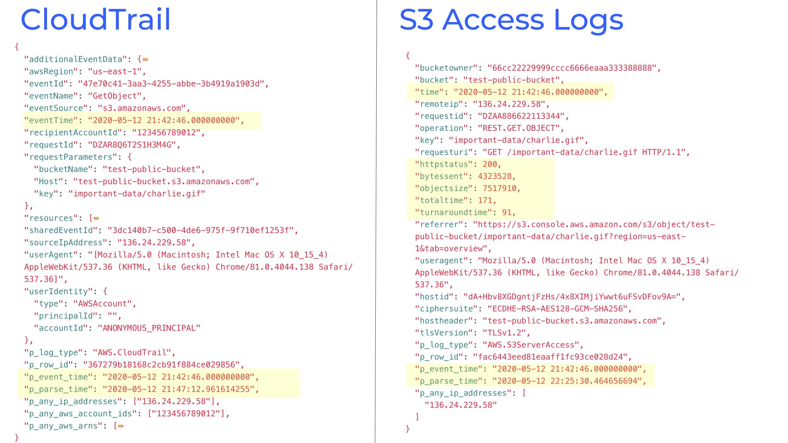
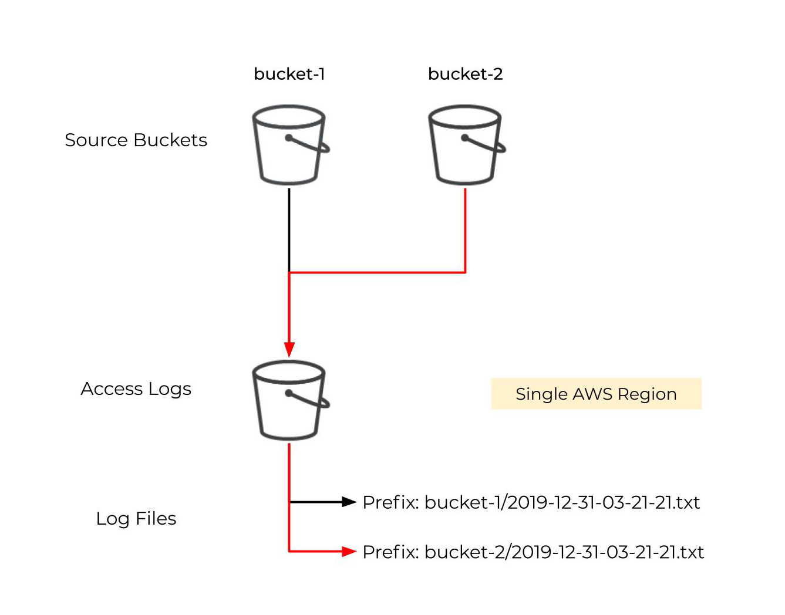

# Tutorial: Amazon S3 Bucket Security Monitoring with Panther

In the cloud, object storage is a ubiquitous and necessary service. It powers our digital applications and environments and contains financial data, personally identifiable information (PII), user analytics, and more.

In the last several years, attackers have continued to discover vulnerabilities in AWS S3 configurations that compromise user trust and cost businesses billions of dollars. As a cloud user, you are **always** responsible for your service configurations, while the provider is responsible for everything abstracted (hypervisor, hardware, etc).

In this tutorial, we will walk through strategies to monitor your most sensitive data in S3 using Panther with the goal of providing complete visibility on how your data is accessed.

At the end of this tutorial, you will have:

1. A pipeline to detect and alert on unauthorized access to your S3 buckets
2. An understanding of your S3 security posture
3. A Normalized, centralized, and searchable catalog of S3 log data

The examples below will use Panther’s [open source rules and policies](https://github.com/panther-labs/panther-analysis).

## Getting Started

Prerequisites:
- A [Panther](quick-start.md) deployment
- An existing CloudTrail
- A set of buckets to monitor
- [Configured alert destinations](https://docs.runpanther.io/setup)

Approach:
* Enable S3 access logging
* Create Python-based detections
* Scan buckets for misconfigurations

## Bucket Logging Overview

The first step is to configure monitoring for all S3 bucket activity, including GET, LIST, and DELETE calls, which can be used to determine unauthorized access to our data.

Amazon provides two mechanisms for monitoring S3 bucket calls: CloudTrail (via Data Events) and S3 Server Access Logs. CloudTrail is a service to monitor all API calls focused around infrastructure changes and management. S3 Server Access Logs provide a more detailed, web-style log on traffic to our objects and buckets. The most notable differences between the two are:

| CloudTrail          | S3 Server Access Logs |
| :------------------ | :-------------------- |
| JSON format | Space-separated fields |
| Low latency (15 minutes) | Higher latency (several hours) |
| $0.10 per 100,000 events + S3 storage cost | Only pay storage cost  |
| Monitor buckets in any region | Must be configured in each region as the source bucket |
| Can monitor an entire bucket, a prefix, or all buckets | Monitors traffic only to specified buckets |
| Easy to send across multiple accounts | Must configure replication across accounts and regions |
| Object Lock and S3 Select properties | - |
| - | HTTP Ref, Turn-Around Time, Total Time, and Object Size fields |
| - | Logs for auth failures and lifecycle transitions |

### Comparing CloudTrail and S3 Server Access Logs

Given the same request, we saw about a 40 minute difference between S3 Server Access logs and CloudTrail. The logs below show the difference in the data collected:



### Choosing an Approach

If you are sensitive to price and need to monitor buckets at a high-scale, S3 Server Access Logs may be the best option for you. If you need lower latency/overhead, easy centralization of data, and don’t mind spending the extra money, CloudTrail would work best for you.

You can also use a hybrid of both!

Next, let’s walk through the setup and analysis of these logs.

## Configuring Data Events in CloudTrail

To configure CloudTrail for monitoring S3 buckets, you will need to add `EventSelectors` to a new or existing CloudTrail that configures the bucket(s) to monitor. This setting also specifies whether the read or write events should be captured.

The CloudFormation template below can be used for creating a new CloudTrail with the proper settings:

```yml
Resources:
  CloudTrail:
    Type: AWS::CloudTrail::Trail
    Properties:
      TrailName: TestTrail
      S3BucketName: !Ref CloudTrailBucket
      IsLogging: true
      IsMultiRegionTrail: true
      SnsTopicName: panther-notifications
      IncludeGlobalServiceEvents: true
      EnableLogFileValidation: true
      EventSelectors:
        - ReadWriteType: All
          DataResources:
            - Type: AWS::S3::Object
              Values:
                # Specific buckets/prefixes
                - arn:aws:s3:::your-bucket-name/a-specific-prefix
                - arn:aws:s3:::your-bucket-name/
                # All buckets
                - arn:aws:s3:::

  CloudTrailBucket:
    Type: AWS::S3::Bucket
    Properties:
      BucketEncryption:
        ServerSideEncryptionConfiguration:
          - ServerSideEncryptionByDefault:
              SSEAlgorithm: AES256
      PublicAccessBlockConfiguration:
        BlockPublicAcls: true
        BlockPublicPolicy: true
        IgnorePublicAcls: true
        RestrictPublicBuckets: true
      AccessControl: Private
      VersioningConfiguration:
        Status: Enabled

  CloudTrailBucketPolicy:
    Type: AWS::S3::BucketPolicy
    Properties:
      Bucket: !Ref CloudTrailBucket
      PolicyDocument:
        Version: 2012-10-17
        Statement:
          - Sid: AWSCloudTrailAclCheck
            Effect: Allow
            Principal:
              Service: cloudtrail.amazonaws.com
            Action: s3:GetBucketAcl
            Resource: !GetAtt CloudTrailBucket.Arn
          - Sid: AWSCloudTrailWrite
            Effect: Allow
            Principal:
              Service: cloudtrail.amazonaws.com
            Action: s3:PutObject
            Resource: !Sub ${CloudTrailBucket.Arn}/AWSLogs/${AWS::AccountId}/*
            Condition:
              StringEquals:
                s3:x-amz-acl: bucket-owner-full-control
```

Once your CloudTrail bucket is configured, walk through the steps [here](https://docs.runpanther.io/log-processing) to complete your setup.

## Configuring S3 Access Logs

Alternatively, you may use S3 Server Access logging, which provides a slightly different set of data. By default, we would recommend turning on S3 Server Access logs for most of your buckets.

To configure S3 Access Logging, you’ll need a bucket to receive the data in _each region_ where your buckets exist.



Use the template below to create the bucket for receiving data:

```yml
Resources:
  AccessLogsBucket:
    Type: AWS::S3::Bucket
    Properties:
      PublicAccessBlockConfiguration:
        BlockPublicAcls: true
        BlockPublicPolicy: true
        IgnorePublicAcls: true
        RestrictPublicBuckets: true
      BucketEncryption:
        ServerSideEncryptionConfiguration:
          - ServerSideEncryptionByDefault:
              SSEAlgorithm: AES256
      AccessControl: LogDeliveryWrite
      VersioningConfiguration:
        Status: Enabled
      NotificationConfiguration:
        TopicConfigurations:
          - Topic: !Sub arn:aws:sns:${AWS::Region}:${AWS::AccountId}:panther-notifications-topic
            Event: s3:ObjectCreated:*
```

Note: We have configured the new event notifications to send into the SNS topic created by your Panther installation. For SaaS customers, the account ID can be gathered from the General Settings page.

For each bucket you plan to capture logs from, add the `LoggingConfiguration` setting as shown below:

```yml
  TestPublicBucket:
    Type: AWS::S3::Bucket
    Properties:
      AccessControl: PublicRead
      VersioningConfiguration:
        Status: Enabled
      LoggingConfiguration:
        DestinationBucketName: !Ref AccessLogsBucket
        LogFilePrefix: test-public-bucket/
```

Once data begins to flow, you’ll start to see raw logs landing in the access log bucket. Luckily, Panther takes care of normalization into JSON:

Format before:

```
66cc22229999cccc6666eaaa333388888 test-public-bucket [11/May/2020:00:52:45 +0000] 184.72.185.254
arn:aws:sts::123456789012:assumed-role/PantherAuditRole-us-east-1/1589158343562318259 19D3A798F843E581
REST.GET.PUBLIC_ACCESS_BLOCK - "GET /?publicAccessBlock= HTTP/1.1" 404 NoSuchPublicAccessBlockConfiguration 375 - 4
- "-" "aws-sdk-go/1.30.7 (go1.13.6; linux; amd64) exec-env/AWS_Lambda_go1.x" - 5x5+sskYHUpl1/
3W4mCDeoS95dEFEWliPpv1cuhUb+Zbdwt0Inlq8ZvQ44eQJI42VUqanS7YlbM= SigV4 ECDHE-RSA-AES128-GCM-SHA256 AuthHeader test-
public-bucket.s3.amazonaws.com TLSv1.2
```

Format after:

```json
  {
    "bucketowner": "66cc22229999cccc6666eaaa333388888",
    "bucket": "test-public-bucket",
    "time": "2020-05-12 21:42:46.000000000",
    "remoteip": "136.24.229.58",
    "requestid": "DZAA886622113344",
    "operation": "REST.GET.OBJECT",
    "key": "important-data/charlie.gif",
    "requesturi": "GET /important-data/charlie.gif HTTP/1.1",
    "httpstatus": 200,
    "bytessent": 4323528,
    "objectsize": 7517910,
    "totaltime": 171,
    "turnaroundtime": 91,
    "referrer": "https://s3.console.aws.amazon.com/s3/object/test-public-bucket/important-data/charlie.gif?region=us-east-1&tab=overview",
    "useragent": "Mozilla/5.0 (Macintosh; Intel Mac OS X 10_15_4) AppleWebKit/537.36 (KHTML, like Gecko) Chrome/81.0.4044.138 Safari/537.36",
    "hostid": "dA+Hbv8XGDgntjFzHs/4x8XIMjiYwwt6uFSvDFov9A=",
    "ciphersuite": "ECDHE-RSA-AES128-GCM-SHA256",
    "hostheader": "test-public-bucket.s3.amazonaws.com",
    "tlsVersion": "TLSv1.2",
    "p_log_type": "AWS.S3ServerAccess",
    "p_row_id": "fac6443eed81eaaff1fc93ce028d24",
    "p_event_time": "2020-05-12 21:42:46.000000000",
    "p_parse_time": "2020-05-12 22:25:30.464656694",
    "p_any_ip_addresses": [
      "136.24.229.58"
    ]
  }
```

To complete this setup, onboard your newly created access logs bucket [here](https://docs.runpanther.io/log-processing#iam-setup).

## S3 Analysis with Python Rules

Now that data is flowing, let’s use several built-in detections to alert us if something suspicious happens.

For the context of the rules below, all logs are coming from S3 Access Logs. This data tends to provide richer information for security monitoring purposes.

When writing rules, here are several common patterns to monitor for:

1. Identifying “known-bad” traffic flows
1. Finding insecure access to buckets
1. Detecting access errors on buckets

The examples below use Panther’s open source rules.

### Known-Good Traffic Flows

For buckets that should only ever be interacted with automation and applications, you can use the rule below to model this behavior:

```python
from fnmatch import fnmatch
# pylint: disable=line-too-long
BUCKET_ROLE_MAPPING = {
    'panther-bootstrap-processeddata-*': [
        'arn:aws:sts::*:assumed-role/panther-log-analysis-AthenaApiFunctionRole-*/panther-athena-api',
        'arn:aws:sts::*:assumed-role/panther-cloud-security-EventProcessorFunctionRole-*/panther-aws-event-processor',
        'arn:aws:sts::*:assumed-role/panther-log-analysis-RulesEngineFunctionRole-*/panther-rules-engine'
    ]
}
# pylint: enable=line-too-long


def _unknown_requester_access(event):
    for bucket_pattern, role_patterns in BUCKET_ROLE_MAPPING.items():
        if not fnmatch(event['bucket'], bucket_pattern):
            continue
        if not any([
                fnmatch(event['requester'], role_pattern)
                for role_pattern in role_patterns
        ]):
            return True
    return False
```

To add your own internal flows, add your bucket pattern to the `BUCKET_ROLE_MAPPING` with the value being a list of IAM role patterns. By default, Panther monitors itself, and if you try to access the data directly as an IAM user or with another role, an alert will be generated.

Additionally, to monitor on an IP level, the rule below can be used:

```python
from ipaddress import ip_network
BUCKETS_TO_MONITOR = {
    # Example bucket names to watch go here
}
WHITELIST_NETWORKS = {
    # IP addresses (in CIDR notation) indicating approved IP ranges for accessing S3 buckets}
    ip_network('10.0.0.0/8'),
}


def rule(event):
    if BUCKETS_TO_MONITOR:
        if event['bucket'] not in BUCKETS_TO_MONITOR:
            return False

    if 'remoteIP' not in event:
        return False

    cidr_ip = ip_network(event['remoteIP'])
    return not any(
        cidr_ip.subnet_of(approved_ip_range)
        for approved_ip_range in WHITELIST_NETWORKS)
```

This can be used when expecting bucket objects to only be reachable from a CDN or from a specific subnet from within a VPC.

### Insecure Access

If bucket data was accessed without SSL, there's potential that an attacker could intercept the traffic in plaintext to get to your sensitive data. The rule below will detect if any such connections occurred within your buckets:

```python
def rule(event):
    return 'ciphersuite' not in event or 'tlsVersion' not in event
```

### Error Monitoring

Monitoring S3 request errors can help identify enumeration from attackers attempting to get to your data. This rule will fire an alert if any of the HTTP status codes are seen when attempting to GET, PUT, or DELETE objects in your buckets:

```python
from fnmatch import fnmatch

# https://docs.aws.amazon.com/AmazonS3/latest/API/ErrorResponses.html
HTTP_STATUS_CODES_TO_MONITOR = {
    400,  # Bad Request
    403,  # Forbidden
    405,  # Method Not Allowed
}


def rule(event):
    return (fnmatch(event['operation'], 'REST.*.OBJECT') and
            event['httpstatus'] in HTTP_STATUS_CODES_TO_MONITOR)
```

## Searching Collected Logs

To better inform our real-time rules, Panther has a mechanism to search through collected data using SQL. In [Panther Enterprise](https://runpanther.io/pricing), this happens from within the UI directly, and offers performance improvements such as Parquet compaction.

The structure of data falls in 3 main databases:
1. panther_logs: All parsed and incoming logs
1. panther_rule_matches: All events associated with generated alerts (copies)
1. panther_views: A set of metadata that allows for quick lookups on standard fields (e.g. IP address)

As an example, the equivalent SQL search to the error monitoring rule above in the Panther Data Lake would be:

```sql
SELECT DISTINCT requester, httpstatus, errorcode, COUNT(*) as err_count
FROM panther_logs.aws_s3serveraccess
WHERE errorcode IS NOT NULL
AND month=5 AND day>=10
AND httpstatus IN (400, 403, 405)
GROUP BY requester, httpstatus, errorcode
ORDER BY err_count DESC
```


The output of this search can be incorporated into your Python rule above to ensure the output does not have too many results for certain patterns.


## Bucket Hardening

Let's wrap up by ensuring your S3 buckets have secure configurations. This includes data encryption, public access blocks, bucket policies, and more. You may also want to define additional policies based on your internal business logic.

Panther can natively scan your accounts to discover any low hanging fruit in your environment that could be easily exploitable. Cloud Security scans provide helpful context during an incident because vulnerable configurations can reveal root cause to attacker behaviors.

Follow the instructions [here](policies/scanning/README.md) to configure Cloud Security scans for a helpful baseline.

By default, Panther is pre-installed with the following S3 policies:

* Bucket Encryption: Secure the data at rest with AWS SSE or KMS
* Bucket Logging: Monitor all traffic in and out of the bucket
* MFA Delete: Require multi-factor authentication prior to issuing delete calls
* Public Access Blocking: Prevent buckets from becoming publicly accessible
* Public Read or Write ACLs: Detect buckets with publicly-accessible ACLs
* Bucket Versioning: Provides multiple variants of bucket objects
* Secure Access: Enforce encrypted connections to buckets

These policies can be found in the open-source [panther-analysis repository here](https://github.com/panther-labs/panther-analysis/tree/master/aws_s3_policies). You may also disable the checks that are not applicable to your use cases.

### Writing Custom Checks

Panther uses Python to express detections and policies as code. Resources are expressed as JSON resources, such as:

```json
{
  "AccountId": "123456789012",
  "Arn": "arn:aws:s3:::s3-data-customers-us-east-1",
  "EncryptionRules": [
    {
      "ApplyServerSideEncryptionByDefault": {
        "KMSMasterKeyID": null,
        "SSEAlgorithm": "AES256"
      }
    }
  ],
  "Grants": [
    {
      "Grantee": {
        "DisplayName": "panther-tutorials",
        "EmailAddress": null,
        "ID": "06cc2211999998f0ddbe777c168154da2bb23f3c1896ef",
        "Type": "CanonicalUser",
        "URI": null
      },
      "Permission": "FULL_CONTROL"
    },
    {
      "Grantee": {
        "DisplayName": null,
        "EmailAddress": null,
        "ID": null,
        "Type": "Group",
        "URI": "http://acs.amazonaws.com/groups/global/AllUsers"
      },
      "Permission": "READ"
    }
  ],
  "LifecycleRules": null,
  "LoggingPolicy": {
    "TargetBucket": "access-logs-us-east-1",
    "TargetGrants": null,
    "TargetPrefix": "tutorials/"
  },
  "MFADelete": null,
  "Name": "s3-data-customers-us-east-1",
  "ObjectLockConfiguration": null,
  "Owner": {
    "DisplayName": "panther-tutorials",
    "ID": "06cc2211999998f0ddbe777c168154da2bb23f3c1896ef"
  },
  "Policy": null,
  "PublicAccessBlockConfiguration": null,
  "Region": "us-east-1",
  "ResourceId": "arn:aws:s3:::s3-data-customers-us-east-1",
  "ResourceType": "AWS.S3.Bucket",
  "Tags": {
    "aws:cloudformation:logical-id": "TestPublicBucket",
    "aws:cloudformation:stack-id": "arn:aws:cloudformation:us-east-1:123456789012:stack/tutorials/a29132d0-9321-11ea-b03d-0ac7f938abd6",
    "aws:cloudformation:stack-name": "tutorials"
  },
  "TimeCreated": "2020-05-11T00:52:42.000Z",
  "Versioning": "Enabled"
}
```

As an example - here's a policy to ensure all S3 buckets enforce KMS encryption:

```python

def policy(resource):
    for encryption_rule in resource['EncryptionRules'] or []:
        encryption_setting = encryption_rule.get('ApplyServerSideEncryptionByDefault', {})
        if encryption_setting:
            return encryption_setting.get('KMSMasterKeyID') is not None

    return False
```

This will trigger alerts to send to our team for the remediation of our resources.

## Conclusion

In this tutorial, we reviewed:

* the various methods of collecting S3 access logs
* creating a handful of detections
* searching through collected data
* and improving the cloud security posture of your buckets.

The result is a more secure environment with added visibility.

### References

* https://docs.aws.amazon.com/AmazonS3/latest/dev/logging-with-S3.html
* https://docs.aws.amazon.com/AmazonS3/latest/dev/ServerLogs.html
* https://docs.aws.amazon.com/AmazonS3/latest/dev/security-best-practices.html
